# 计网笔记

<!--本文文内标题中不能有中文符号、-->

【概要】本文仅为对2023王道计算机网络学习指导的整理笔记，不属于王道计算机网络学习指导的内容。本笔记仅供参考，不构成任何商业上的依据。如有任何疑问，请联系QQ：1625369372。</td></tr></table>

## 1. 计算机网络体系结构

## 2. 物理层

### 2.1. 通信基础

#### 2.1.1. 基本概念

##### 2.1.1.1. 数据 信号 码元

**通信**的目的是传送信息,如文字、图像和视频等。

**数据**是指传送信息的实体。

**信号**则是数据的电气或电磁表现，是数据在传输过程中的存在形式。

$$
\begin{cases}
连续变化的数据称为模拟数据\\
离散变化的数据称为数字数据\\
\end{cases}
$$

$$
数据传输方式
\begin{cases}
串行传输\\
并行传输\\
\end{cases}
$$

**串行传输**: 1比特1比特地按照时间顺序传输
(远距离通信通常采用串行传输)  
**并行传输**: 若干比特通过多条通信信道同时传输。

**码元**是指用一个固定时长的信号波形（数字脉冲）表示一位k进制数字，代表不同离散数值的基本波形，是数字通信中数字信号的计量单位，这个时长内的信号称为k进制码元,而该时长称为码元宽度。

##### 2.1.1.2. 信源 信进 信宿

**数据通信**是指数字计算机或其他数字终端之间的通信。

一个数据通信系统主要划分为**信源**、**信道**和**信宿**三部分。  

**信源**是产生和发送数据的源头。  
**信宿**是接收数据的终点，它们通常都是计算机或其他数字终端装置。
>发送端信源发出的信息需要通过变换器转换成适合于在信道上传输的信号，而通过信道传输到接收端的信号先由反变换器转换成原始信息，再发送给信宿。

**信道**是信号的传输媒介,与电路并不等同。
>一个信道可视为一条线路的逻辑部件，一般用来表示向某个方向传送信息的介质，因此一条通信线路往往包含一条发送信道和一条接收信道。

信道的**极限容量**是指信道的最高码元传输速率或信道的极限信息传输速率。

**噪声源**是信道上的噪声（即对信号的干扰）及分散在通信系统其他各处的噪声的集中表示。

$$
信道分类
\begin{cases}
按传输信号形式分类
\begin{cases}
模拟信道（传输宽频信号）\\
数字信道（传输基带信号）\\
\end{cases}\\
按传输介质分类
\begin{cases}
无线信道\\
有线信道\\
\end{cases}\\
\end{cases}
$$

$$
信号分类
\begin{cases}
基带信号\\
宽带信号\\
\end{cases}
$$

**基带信号**:将数字信号1和0直接用两种不同的电压表示，然后送到数字信道上传输（称为基带传输）。
**宽带信号**:宽带信号将基带信号进行调制后形成频分复用模拟信号，然后送到模拟信道上传输（称为宽带传输）。

$$
通信双方信息交互方式
\begin{cases}
单向通信\\
半加工通信\\
全加工通信\\
\end{cases}
$$

**单向通信**：只有一个方向的通信而没有反方向的交互，仅需要一条信道。  
**半加工通信**：通信的双方都可以发送或接收信息，但任何一方都不能同时发送和接收信息，需要两条信道。
**全加工通信**：通信双方可以同时发送和接收信息,也需要两条信道。

##### 2.1.1.3. 速率 波特 带宽

**速率**：也称数据率，指的是数据传输速率，表示单位时间内传输的数据量。

$$
速率表示方式的分类
\begin{cases}
码元传输速率\\
信息传输速率\\
\end{cases}
$$

**码元传输速率**：又称波特率，它表示单位时间内数字通信系统所传输的码元个数（也可称为脉冲个数或信号变化的次数），单位是波特（Baud）。1波特表示数字通信系统每秒传输一个码元。码元可以是多进制的，也可以是二进制的，码元速率与进制数无关。
**信息传输速率**：又称信息速率、比特率等，它表示单位时间内数字通信系统传输的二进制码元个数（即比特数），单位是比特/秒（b/s）。

码元传输速率（波特率）和信息传输速率（比特率）的关系
>若一个码元携带n比特的信息量
则M波特率的码元传输速率所对应的信息传输速率为Mn比特/秒
反之，则Mn比特/秒的码元传输速率所对应的信息传输速率为M
$\Longrightarrow$ 码元传输速率（波特率） $\times$ 单个码元平均携带信息量 = 信息传输速率（比特率）

#### 2.1.2. 奈奎斯特定理与香农定理

**码间串扰**：具体的信道所能通过的频率范围总是有限的。信号中的许多高频分量往往不能通过信道，否则在传输中会衰减，导致接收端收到的信号波形失去码元之间的清晰界限。

##### 2.1.2.1. 奈奎斯特定理

**奈奎斯特定理**：又称作奈氏准则，规定在理想低通（没有噪声、带宽有限）的信道中，为了避免码间串扰，极限码元传输速率为 2W 波特，其中 W 是理想低通信道的带宽。
>信道带宽是信道能通过的最高频率和最低频率之差，在这里单位是Hz。

W：理想低通信道的带宽
V：每个**码元离散电平**的数目
>码元的离散电平数目是指有多少种不同的码元，比如有16种不同的码元，则需要4个二进制位，因此数据传输速率是码元传输速率的4倍

$$
理想低通信道下的极限数据传输率 = 2W\ast\log_2(V)（单位为b/s）
$$

对于奈氏准则，可以得出以下结论：

1. 在任何信道中，码元传输速率是有上限的。若传输速率超过此上限，就会出现严重的码间串扰问题,使得接收端不可能完全正确识别码元。
2. 信道的频带越宽（即通过的信号高频分量越多），就可用更高的速率进行码元的有效传输。
3. 奈氏准则给出了码元传输速率的限制，但并未对信息传输速率给出限。即未对一个码元可以对应多少个二进制位给出限制。
4. 由于码元传输速率受奈氏准则的制约，所以要提高数据传输速率，就必须设法使每个码元携带更多比特的信息量，此时就需要采用多元制的调制方法。

##### 2.1.2.2. 香农定理

香农（Shannon）定理给出了带宽受限且有高斯白噪声干扰的信道的极限数据传输速率，当用此速率进行传输时，可以做到不产生误差。

W：信道的带宽
S: 信道所传输信号的平均功率
N：信道内部高斯噪声功率
S/N：信噪比，即信号的平均功率与噪声的平均功率之比，信噪比 = $10\log_2(S/N)$，单位为dB
> 例如，信道带宽为10MHz，信号的平均功率为10W，噪声的平均功率为1W，则信噪比为10dB。

**香农定理**定义为：

$$
信道的极限数据传输速率 = W\ast\log_2(V)（单位为b/s）
$$

对于香农定理，可以得出以下结论：

1. 信道的带宽或信道中的信噪比越大，信息的极限传输速率越高。
2. 对一定的传输带宽和一定的信噪比，信息传输速率的上限是确定的。
3. 只要信息传输速率低于信道的极限传输速率凤就能找到某种方法来实现无差错的传输。
4. 香农定理得出的是极限信息传输速率，实际信道能达到的传输速率要比它低不少。

##### 2.1.2.3. 奈氏准则 VS 香农定理

#### 2.1.3. 编码与调制

> 数据 $\longrightarrow$ 数字信号 称作编码
数据 $\longrightarrow$ 模拟信号 称作调制

##### 2.1.3.1. 数字数据编码为数字信号

1. **归零编码**：在归零编码（RZ）中用高电平代表1、低电平代表0（或者相反），每个时钟周期的中间均跳变到低电平（归零），接收方根据该跳变调整本方的时钟基准，这就为传输双方提供了自同步机制。由于归零需要占用一部分带宽，因此传输效率受到了一定的影响。
2. **非归零编码**：非归零编码（NRZ）与RZ编码的区别是不用归零，一个周期可以全部用来传输数据。但NRZ编码无法传递时钟信号，双方难以同步，因此若想传输高速同步数据,则需要都带有时钟线。
3. **反向非归零编码**：反向非归零编码（NRZI）与NRZ编码的区别是用信号的翻转代表0、信号保持不变代表1。翻转的信号本身可以作为一种通知机制。这种编码方式集成了前两种编码的优点，既能传输时钟信号，又能尽量不损失系统带宽。USB2.0通信的编码方式就是NRZI编码。
4. **曼彻斯特编码**：曼彻斯特编码。曼彻斯特编码（Manchester Encoding）将一个码元分成两个相等的间隔，前一个间隔为高电平而后一个间隔为低电平表示码元1;码元0的表示方法则正好相反。当然，也可采用相反的规定。该编码的特点是，在每个码元的中间出现电乎跳变，位中间的跳变既作为时钟信号（可用于同步）。又作为数据信号但它所占的频带宽度是原始基带宽度的两倍。
*是以太网使用的编码方式*
5. **差分曼彻斯特编码**：差分曼彻斯特编码。差分曼彻斯特编码常用于局域网传输，其规则是:若码元为1，则前半个码元的电平与上一码元的后半个码元的电平相同;若码元为0，则情形相反。该编码的特点是，在每个码元的中间都有一次电平的跳转，可以实现自同步，且抗干扰性较好。
6. 4B/5B编码：4B/5B编码。将欲发送数据流的每4位作为一组，然后按照4B/5B编码规则将其转换成相应的5位码。5位码共32种组合，但只采用其中的16种对应16种不同的4位码，其他16种作为控制码（帧的开始和结束、线路的状态信息等）或保留。

##### 2.1.3.2. 数字数据调制为模拟信号

数字数据调制技术在发送端将数字信号转换为模拟信号，而在接收端将模拟信号还原为数字信号，分别对应于调制解调器的调制和解调过程。

基本的数字调制方法有如下几种:

1. 幅移键控（ASK）。通过改变载波信号的振幅来表示数字信号1和0，而载波的频率和相位都不改变。比较容易实现，但抗干扰能力差。
2. 频移键控（FSK）。通过改变载波信号的频率来表示数字信号1和0，而载波的振幅和相位都不改变。容易实现，抗干扰能力强，目前应用较为广泛。
3. 相移键控（PSK）。通过改变载波信号的相位来表示数字信号1和0，而载波的振幅和频率都不改变。它又分为绝对调相和相对调相。
4. 正交振幅调制（QAM）。在频率相同的前提下，将ASK与PSK结合起来，形成叠加信号。设波特率为B，采用m个相位，每个相位有n种振幅，则该QAM技术的数据传输速率R为
$$
R = B\ast\log_2(mn)\quad单位为b/s
$$

> 图 2.3 所示是二进制幅移键控、频移键控和相移键控的例子。2ASK中用载波有幅度和无幅度分别表示数字数据的1和0；2FSK中用两种不同的频率分别表示数字数据1和0；2PSK中用相位О和相位$\pi$分别表示数字数据的1和0，是一种绝对调相方式。

##### 2.1.3.3. 模拟数据编码为数字信号

这种编码方式最典型的例子是常用于对音频信号进行编码的脉码调制（PCM）。它主要包括三个步骤，即采样、量化和编码。

1. **采样**：采样是指对模拟信号进行周期性扫描，把时间上连续的信号变成时间上离散的信号。根据采样定理，当采样的频率大于等于模拟数据的频带带宽（最高变化频率）的两倍时，所得的离散信号可以无失真地代表被采样的模拟数据。
2. **量化**：量化是把采样取得的电平幅值按照一定的分级标度转化为对应的数字值并取整数，这样就把连续的电平幅值转换为了离散的数字量。采样和量化的实质就是分割和转换。
3. **编码**：编码是把量化的结果转换为与之对应的二进制编码。

##### 2.1.3.4. 模拟数据训制为模拟信号

为了实现传输的有效性，可能需要较高的频率。这种调制方式还可以使用频分复用（FDM）技术，充分利用带宽资源。电话机和本地局交换机采用模拟信号传输模拟数据的编码方式，模拟的声音数据是加载到模拟的载波信号中传输的。

#### 2.1.4. 数据交换

##### 2.1.4.1. 电路交换

在进行数据传输前，两个结点之间必须先建立一条专用（双方独占）的物理通信路径（由通信双方之间的交换设备和链路逐段连接而成），该路径可能经过许多中间结点。这一路径在整个数据传输期间一直被独占，直到通信结束后才被释放。

$$
电路交换技术分为三个阶段\begin{cases}
\text{1.} \text{连接建立} \\
\text{2.} \text{数据传输} \\
\text{3.} \text{连接释放} \\
\end{cases}
$$

从通信资源的分配角度来看，"交换"就是按照某种方式动态地分配传输线路的资源。电路交换的**关键点**是，在数据传输的过程中，用户始终占用端到端的固定传输带宽。

**电路交换技术优点**：

1. **通信时延小**。由于通信线路为通信双方用户专用，数据直达，因此传输数据的时延非常小。当传输的数据量较大时，这一优点非常明显。
2. **有序传输**。双方通信时按发送顺序传送数据,不存在失序问题。
3. **没有冲突**。不同的通信双方拥有不同的信道，不会出现争用物理信道的问题。
4. **适用范围广**。电路交换既适用于传输模拟信号，又适用于传输数字信号。
5. **实时性强**。通信双方之间的物理通路一旦建立,双方就可以随时通信。
6. **控制简单**。电路交换的交换设备（交换机等）及控制均较简单。

**电路交换技术缺点**：

1. **建立连接时间长**。电路交换的平均连接建立时间对计算机通信来说太长。
2. **线路独占**，使用效率低。电路交换连接建立后，物理通路被通信双方独占，即使通信线路空闲，也不能供其他用户使用，因而信道利用率低。
3. **灵活性差**。只要在通信双方建立的通路中的任何一点出了故障，就必须重新拨号建立新的连接,这对十分紧急和重要的通信是很不利的。
4. **难以规格化**。电路交换时，数据直达，不同类型、不同规格、不同速率的终端很难相互进行通信，也难以在通信过程中进行差错控制。

>注意，电路建立后，除源结点和目的结点外，电路上的任何结点都采取“直通方式”接收数据和发送数据，即不会存在存储转发所耗费的时间。

##### 2.1.4.2. 报文交换

数据交换的单位是**报文**，报文携带有目标地址、源地址等信息。报文交换在交换结点采用的是**存储转发**的传输方式。

**报文交换技术优点**：

1. **无须建立连接**。报文交换不需要为通信双方预先建立一条专用的通信线路，不存在建立连接时延，用户可以随时发送报文。
2. **动态分配线路**。当发送方把报文交给交换设备时，交换设备先存储整个报文，然后选择一条合适的空闲线路，将报文发送出去。
3. **提高线路可靠性**。如果某条传输路径发生故障，那么可重新选择另一条路径传输数据，因此提高了传输的可靠性。
4. **提高线路利用率**。通信双方不是固定占有一条通信线路，而是在不同的时间一段一段髭部分占有这条物理通道，因而大大提高了通信线路的利用率。
5. **提供多目标服务**。一个报文可以同时发送给多个目的地址，这在电路交换中是很难实现的。

**报文交换技术的缺点**如下:

1. 由于数据进入交换结点后要经历存储、转发这一过程，因此会引起转发时延（包括接收报文、检验正确性、排队、发送时间等）。
2. 报文交换对报文的大小没有限制，这就要求网络结点需要有较大的缓存空间。

##### 2.1.4.3. 分组交换

同报文交换一样，分组交换也采用**存储转发**方式，但解决了报文交换中大报文传输的问题。分组交换限制了每次传送的数据块大小的上限，把大的数据块划分为合理的小数据块，再加上一些必要的控制信息（如源地址、目的地址和编号信息等），构成分组（Packet）。网络结点根据控制信息把分组送到下一个结点，下一个结点接收到分组后，暂时保存并排队等待传输，然后根据分组控制信息选择它的下一个结点，直到到达目的结点。

分组交换的优点如下：

1. **无建立时延**。不需要为通信双方预先建立一条专用的通信线路，不存在连接建立时延，用户可随时发送分组。
2. **线路利用率高**。通信双方不是固定占有一条通信线路，而是在不同的时间一段一段地部分占有这条物理通路，因而大大提高了通信线路的利用率。
3. **简化了存储管理**（相对于报文交换）。因为分组的长度固定，相应的缓冲区的大小也固定，在交换结点中存储器的管理通常被简化为对缓冲区的管理，相对比较容易。
4. **加速传输**。分组是逐个传输的，可以使后一个分组的存储操作与前一个分组的转发操作并行，这种流水线方式减少了报文的传输时间。此外，传输一个分组所需的缓冲区比传输一次报文所需的缓冲区小得多，这样因缓冲区不足而等待发送的概率及时间也必然少得多。
5. **减少了出错概率和重发数据量**。因为分组较短其出错概率必然减小,所以每次重发的数据量也就大大减少，这样不仅提高了可靠性，也减少了传输时延。

分组交换的缺点如下：

1. **存在传输时延**。尽管分组交换比报文交换的传输时延少，但相对于电路交换仍存在存储转发时延，而且其结点交换机必须具有更强的处理能力。
2. **需要传输额外的信息量**。每个小数据块都要加上源地址、目的地址和分组编号等信息，从而构成分组，因此使得传送的信息量增大了5%~10%，一定程度上降低了通信效率，增加了处理的时间，使控制复杂，时延增加。
3. 当分组交换采用数据报服务时，可能会出现失序、丢失或重复分组，分组到达目的结点时，要对分组按编号进行排序等工作，因此很麻烦。若采用虚电路服务，虽无失序问题，但有呼叫建立、数据传输和虚电路释放三个过程。

分组交换根据其通信子网向端点系统提供的服务，还可进一步分为**面向连接**的虚电路方式和**无连接**的数据报方式。这两种服务方式都由**网络层**提供。

$$
分组交换方式\begin{cases}
数据报\\
虚电路\\
\end{cases}
$$

###### 2.1.4.3.1. **数据报**

作为通信子网用户的端系统发送一个报文时，在端系统中实现的高层协议先把报文拆成若干带有序号的数据单元，并在网络层加上地址等控制信息后形成数据报分组（即网络层的PDU）。中间结点存储分组很短一段时间，找到最佳的路由后，尽快转发每个分组。不同的分组可以走不同的路径，也可以按不同的顺序到达目的结点。

假定主机A要向主机B发送分组，以下是**数据报的传送过程**。

1. 主机A先将分组逐个发往与它直接相连的交换结点A，交换结点A缓存收到的分组。
2. 然后查找自己的转发表。由于不同时刻的网绍状态不同，因此转发表的内容可能不完全相同，所以有的分组转发给交换结点C，有的分组转发给交换结点D。
3. 网络中的其他结点收到分组后，类似地转发分组，直到分组最终到达主机B.

>当分组正在某一链路上传送时，分组并不占用网络的其他部分资源。因为采用存储转发技术，资源是共享的，所以主机A在发送分组时，主机B也可同时向其他主机发送分组。

**数据报服务的特点**：

1. 发送分组前不需要建立连接。发送方可随时发送分组，网络中的结点可随时接收分组。
2. 网络尽最大努力交付，传输不保证可靠性，所以可能丢失；为每个分组独立地选择路由，转发的路径可能不同，因而分组不一定按序到达目的结点。
3. 发送的分组中要包括发送端和接收端的完整地址，以便可以独立传输。
4. 分组在交换结点存储转发时，需要排队等候处理，这会带来一定的时延。通过交换结点的通信量较大或网络发生拥塞时，这种时延会大大增加，交换结点还可根据情况丢弃部分分组。
5. 网络具有冗余路径，当某个交换结点或一条链路出现故障时，可相应地更新转发表，寻找另一条路径转发分组，对故障的适应能力强。
6. 存储转发的延时一般较小，提高了网络的吞吐量。
7. 收发双方不独占某条链路，资源利用率较高。

###### 2.1.4.3.2. **虚电路**

虚电路方式试图将数据报方式与电路交换方式结合起来，充分发挥两种方法的优点，以达到最佳的数据交换效果。在分组发送之前，要求在发送方和接收方建立一条逻辑上相连的虚电路,并且连接一旦建立，就固定了虚电路所对应的物理路径。与电路交换类似，整个通信过程分为三个阶段：虚电路建立、数据传输与虚电路释放。

>在虚电路方式中，端系统每次建立虚电路时，选择一个未用过的虚电路号分配给该虚电路，以区别于本系统中的其他虚电路。在传送数据时，每个数据分组不仅要有分组号、校验和等控制信息，还要有它要通过的虚电路号，以区别于其他虚电路上的分组。在虚电路网络中的每个结点上都维持一张虚电路表，表中的每项记录了一个打开的虚电路的信息，包括在接收链路和发送链路上的虚电路号、虚电路的源结点和目的结点。数据的传输是双向进行的，上述信息是在虚电路的建立过程中确定的。

>上图的数据传输过程是**有确认的传输**（由高层实现），主机B收到分组后要发回相应分组的确认。网络中的传输是否有确认与网络层提供的两种服务没有任何关系。

**虚电路的连接过程**：

1. 为进行数据传输，主机A与主机B之间先建立一条逻辑通路，主机A发出一个特殊的“呼叫请求”分组，该分组通过中间结点送往主机B，若主机B同意连接，则发送“呼叫应答”分组予以确认。
2. 虚电路建立后，主机A就可向主机B发送数据分组。当然，主机B也可在该虚电路上向主机A发送数据。
3. 传送结束后主机A通过发送“释放请求”分组来拆除虚电路，逐段断开整个连接。

通过上面的例子，可以总结出**虚电路服务具有如下特点**:

1. 虚电路通信链路的建立和拆除需要时间开销，对交互式应用和小量的短分组情况显得很浪费，但对长时间、频繁的数据交换效率较高。
2. 虚电路的路由选择体现在连接建立阶段，连接建立后，就确定了传输路径。
3. 虚电路提供了可靠的通信功能，能保证每个分组正确且有序到达。此外，还可以对两个数据端点的流量进行控制，当接收方来不及接收数据时，可以通知发送方暂缓发送。
4. 虚电路有一个致命的弱点，即当网络中的某个结点或某条链路出现故障而彻底失效时，所有经过该结点或该链路的虚电路将遭到破坏。
5. 分组首部不包含目的地址，包含的是虚电路标识符，相对于数据报方式，其开销小。

>虚电路乙所以是“虚”的，是因为这条电路不是专用的，每个结点到其他结点之间的链路可能同时有若干虚电路通过，也可能同时与多个结点之间建立虚电路。（每条虚电路支持特定的两个端系统之间的数据传输，两个端系统之间也可以有多条虚电路为不同的进程服务，这些虚电路的实际路由可能相同也可能不同。

##### 2.1.4.4. 三种交换方式的比较

要传送的数据量很大且其传送时间远大于呼叫时间时，采用[电路交换](#2141-电路交换)较为合适。端到端的通路由多段链路组成时，采用[分组交换](#2143-分组交换)传送数据较为合适。从提高整个网络的信道利用率上看，[报文交换](#2142-报文交换)和分组交换优于电路交换，其中分组交换比报文交换的时延小，尤其适合于计算机之间的**突发式数据通信**。

---

### 2.2. 传输介质

传输介质也称传输媒体，它是数据传输系统中发送设备和接收设备之间的物理通路。

传输介质 $\begin{cases}导向传输介质\\非导向传输介质\\\end{cases}$
在**导向传输介质**中，电磁波被导向沿着固体媒介（铜线或光纤）传播，而**非导向传输介质**可以是空气、真空或海水等。

#### 2.2.1. 导向传输介质

##### 2.2.1.1. 双绞线

**双绞线**是最常用的古老传输介质，它由两根采用一定规则并排绞合的、相互绝缘的铜导线组成。绞合可以减少对相邻导线的电磁干扰。

双绞线 $\begin{cases}屏蔽双绞线\\非屏蔽双绞线\\\end{cases}$
为了进一步提高抗电磁干扰的能力，可在双绞线的外面再加上一层，即用金属丝编织成的**屏蔽层**，这就是**屏蔽双绞线**（STP）。无屏蔽层的双绞线称为**非屏蔽双绞线**（UTP）。

>双绞线的价格便宜，是最常用的传输介质之一，在局域网和传统电话网中普遍使用。双绞线的带宽取决于铜线的粗细和传输的距离。模拟传输和数字传输都可使用双绞线，其通信距离一般为几千米到数十千米。距离太远时，对于模拟传输，要用放大器放大衰减的信号；对于数字传输，要用中继器将失真的信号整形。

##### 2.2.1.2. 同轴电缆

**同轴电缆**由内导体、绝缘层、网状编织屏蔽层和塑料外层构成，如下图所示。按特性阻抗数值的不同，通常将同轴电缆分为两类：50$\Omega$同轴电缆和75$\Omega$同轴电缆。其中，50$\Omega$同轴电缆主要用于传送基带数字信号，又称基带同轴电缆，它在局域网中应用广泛；75$\Omega$同轴电缆主要用于传送宽带信号，又称宽带同轴电缆，主要用于有线电视系统。

同轴电缆 $\begin{cases}基带同轴电缆\\宽带同轴电缆线\\\end{cases}$

[同轴电缆](#2212-同轴电缆) VS [双绞线](#2211-双绞线)
由于外导体屏蔽层的作用，同轴电缆具有良好的抗干扰特性，被广泛用于传输较高速率的数据，其传输距离更远，但价格较双绞线贵。

##### 2.2.1.3. 光纤

**光纤通信**就是利用光导纤维（简称光纤）传递光脉冲来进行通信。
>有光脉冲表示1，无光脉冲表示0。可见光的频率约为10$^8$MHz，因此光纤通信系统的带宽范围极大。

光纤主要由纤芯和包层构成，纤芯很细，其直径只有8至100um，光波通过纤芯进行传导，包层较纤芯有较低的折射率。当光线从高升射踯的余质射向低折射率的介质时，其折射角将大于入射角。因此，只要入射角大于某个临界角度,就会出现全反射，即光线碰到包层时就会折射回纤芯，这个过程不断重复，光也就沿光纤传输下去。

光纤 $\begin{cases}多模光纤（适合近距离）\\单模光纤（适合远距离）\\\end{cases}$

**多模光纤**：利用光的全反射特性，可以将从不同角度入射的多条光线在一根光纤中传输，这种光纤称为多模光纤，多模光纤的光源为发光二极管。光脉冲在多模光纤中传输时会逐渐展宽，造成失真，因此多模光纤只适合于近距离传输。

**单模光纤**：光纤的直径减小到只有一个光的波长时，光纤就像一根波导那样，可使光线一直向前传播，而不会产生多次反射，这样的光纤就是单模光纤。单模光纤的纤芯很细，直径只有几微米，制造成本较高。同时，单模光纤的光源为定向性很好的半导体激光器，因此单模光纤的衰减较小，可传输数公里甚至数十千米而不必采用中继器，适合远距离传输。

光纤不仅具有通信容量非常大的**优点**，还具有如下**特点**:

1. 传输损耗小，中继距离长，对远距离传输特别经济。
2. 抗雷电和电磁干扰性能好。这在有大电流脉冲干扰的环境下尤为重要。
3. 无串音干扰，保密性好，也不易被窃听或截取数据。
4. 体积小，重量轻。这在现有电缆管道已拥塞不堪的情况下特别有利。

#### 2.2.2. 非导向传输介质

也称作无线传输介质。无线通信已广泛应用于移动电话领域，构成蜂窝式无线电话网。随着便携式计算机的出现，以及在军事、野外等特殊场合下移动通信联网的需要，促进了数字化移动通信的发展，现在无线局域网产品的应用已非常普遍。

##### 2.2.2.1. 无线电波

无线电波具有较强的穿透能力，可以传输很长的距离，所以它被广泛应用于通信领域，如无线手机通信、计算机网络中的无线局域网（WLAN）等。因为无线电波使信号向所有方向散播，因此有效距离范围内的接收设备无须对准某个方向，就可与无线电波发射者进行通信连接，大大简化了通信连接。这也是无线电传输的最重要优点之一。

##### 2.2.2.2. 视线介质

视线介质 $\begin{cases}微波\\红外线\\激光\\\end{cases}$

目前高带宽的无线通信主要使用三种技术:微波、红外线和激光。它们都需要发送方和接收方之间存在一条视线（Line-of-sight）通路，有很强的方向性，都沿直线传播，有时统称这三者为视线介质。不同的是，红外通信和激光通信把要传输的信号分别转换为各自的信号格式，即红外光信号和激光信号，再直接在空间中传播。
微波通信的频率较高，频段范围也很宽，载波频率通常为2~40GHz，因而通信信道的容量大。例如，一个带宽为2MHz的频段可容纳500条语音线路，若用来传输数字信号，数据率可达数兆比特/秒。与通常的无线电波不同，微波通信的信号是沿直线传播的，因此在地面的传播距离有限，超过一定距离后就要用中继站来接力。
卫星通信利用地球同步卫星作为中继来转发徼波信号，可以克服地面徼波通信距离的限制。三颗相隔120°的同步卫星几乎能覆盖整个地球表面，因而基本能实现全球通信。卫星通信的优点是通信容量大、距离远、覆盖广，缺点是保密性差、端到端传播时延长。

#### 2.2.3. 物理层接口的特性

物理层考虑的是如何在连接到各种计算机的传输媒体上传输数据比特流，而不指具体的传输媒体。网络中的硬件设备和传输介质的种类繁多，通信方式也各不相同。物理层应尽可能屏蔽这些差异，让数据链路层感觉不到这些差异，使数据链路层只需考虑如何完成本层的协议和服务。

物理层的主要任务可以描述为确定与传输媒体的接口有关的一些特性:

1. **机械特性**。指明接口所用接线器的形状和尺寸、引脚数目和排列、固定和锁定装置等。
2. **电气特性**。指明在接口电缆的各条线上出现的电压的范围。
3. **功能特性**。指明某条线上出现的某一电平的电压表示何种意义。
4. **过程特性**。或称规程特性。指明对于不同功能的各种可能事件的出现顾序。常用的物理层接口标准有 EIA RS-232-C、ADSL 和 SONET/SDH 等。

---

### 2.3. 物理层设备

#### 2.3.1. 中继器

中继器的**主要功能**是将信号整形并放大再转发出去，以消除信号经过一长段电缆后而产生的失真和衰减，使信号的波形和强度达到所需要的要求，进而扩大网络传输的距离。其原理是信号再生（而非简单地将衰减的信号放大）。中继器有两个端口，数据从一个端口输入，再从另一个端口发出。端口仅作用于信号的电气部分，而不管是否有错误数据或不适于网段的数据。
中继器是用来扩大网络规模的最简单廉价的互联设备。中继器两端的网络部分是网段，而不是子网，使用中继器连接的几个网段仍然是一个局域网。中继器若出现故障，对相邻两个网段的工作都将产生影响。由于**中继器工作在物理层**，因此它不能连接两个具有不同速率的局域网。

>注意:如果某个网络设备具有存储转发的功能，那么可以认为它能连接两个不同的协议;如果该网络设备没有存储转发功能，那么认为它不能连接两个不同的协议。中继器没有存储转发功能，因此它不能连接两个速率不同的网段，中继器两端的网段一定要使用同一个协议。

从理论上讲，中继器的使用数目是无限的，网络因而也可以无限延长。但事实上这不可能,因为网络标准中对信号的延迟范围做了具体的规定，中继器只能在此规定范围内进行有效的工作，否则会引起网络故障。例如，在采用粗同轴电缆的 10BASE5 以太网规范中，互相串联的中继器的个数不能超过4个，而且用4个中继器串联的5段通信介质中只有3段可以挂接计算机;其余两段只能用作扩展通信范围的链路段，不能挂接计算机。这就是所谓的“5-4-3规则”。
>注意:放大器和中继器都起放大作用，只不过放大器放大的是模拟信号，原理是将衰减的信号放大，而中继器放大的是数字信号，原理是将衰减的信号整形再生.

#### 2.3.2. 集线器

集线器（Hub）实质上是一个多端口的中继器。当Hub工作时，一个端口接收到数据信号后，由于信号在从端口到Hub的传输过程中已有衰减，所以 Hub 便将该信号进行整形放大，使之再生（恢复）到发送时的状态，紧接着转发到其他所有（除输入端口外）处于工作状态的端口。如果同时有两个或多个端口输入，那么输出时会发生冲突，致使这些数据都无效。从 Hub 的工作方式可以看出，它在网络中只起信号放大和转发作用，目的是扩大网络的传输范围，而不具备信号的定向传送能力，即信号传输的方向是固定的，是一个标准的共享式设备。
Hub主要使用双绞线组建共享网络，是从服务器连接到桌面的最经济方案。在交换式网络中，Hub直接与交换机相连，将交换机端口的数据送到桌面上。使用Hub组网灵活，它把所有结点的通信集中在以其为中心的结点上，对结点相连的工作站进行集中管理，不让出问题的工作站影响整个网络的正常运行，并且用户的加入和退出也很自由。由 Hub 组成的网络是共享式网络，但逻辑上仍是一个总线网。Hub 的每个端口连接的网络部分是同一个网络的不同网段，同时 Hub 也只能在半双工状态下工作，网络的吞吐率因而受到限制。
>注意：多台计算机必然会发生同时通信的情形，因此集线器不能分割冲突域，所有集线器的端口都属于同一个冲突域。集线器在一个时钟周期中只能传输一组信息，如果一台集线器连接的机器数目较多，且多台机器经常需要同时通信，那么将导致信息碰撞，使得集线器的工作效率很差。比如，一个带宽为10Mb/s的集线器上连接了8台计算机，当这8台计算机同时工作时，每台计算机真正所拥有的带宽为10/8Mb/s = 1.25Mb/s.

---

## 3. 数据链路层

### 3.1. 数据链路层的功能

#### 3.1.1. 为网络层提供服务

数据链路层在物理层提供服务的基础上**向网络层提供服务**，其最基本的服务是将源自网络层来的数据*可靠*地传输至相邻节点的目标机网络层。其主要作用是**加强物理层传输原始比特流的功能**，将物理层提供的可能出错的物理连去改造成为*逻辑上无差错的数据链路*，使之对网络层表现为一条无差错的链路。

对网络层而言，数据链路层的**基本任务**是将源机器中来自网络层的数据传输到目标机器的网络层。数据链路层通常可为网络层提供如下服务:

1. **无确认的无连接服务**。源机器发送数据帧时不需先建立链路连接，目的机器收到数据帧时不需发回确认。对丢失的帧，数据链路层不负责重发而交给上层处理。适用于实时通信或误码率较低的通信信道，如以太网。
2. **有确认的无连接服务**。源机器发送数据帧时不需先建立链路连接，但目的机器收到数据帧时必须发回确认。源机器在所规定的时间内未收到确定信号时，就重传丢失的帧，以提高传输的可靠性。该服务适用于误码率较高的通信信道，如无线通信。
3. **有确认的面向连接服务**。帧传输过程分为三个阶段：建立数据链路、传输帧、释放数据链路。目的机器对收到的每一帧都要给出确认，源机器收到确认后才能发送下一帧，因而该服务的可靠性最高。该服务适用于通信要求（可靠性、实时性）较高的场合。

>注意：有连接就一定要有确认，即不存在无确认的面向连接的服务。

#### 3.1.2. 链路管理

数据链路层连接的**建立**、**维持**和**释放**过程称为链路管理，它主要用于**面向连接**的服务。链路两端的结点要进行通信，必须首先确认对方已处于就绪状态，并交换一些必要的信息以对帧序号初始化，然后才能建立连接，在传输过程中则要能维持连接，而在传输完毕后要释放该连接。在多个站点共享同一物理信道的情况下（如在局域网中）如何在要求通信的站点间分配和管理信道也属于数据链路层管理的范畴。

#### 3.1.3. 封装成帧

两台主机之间传输信息时，必须将网络层的分组**封装成帧**，以帧的格式进行传送。将一段数据的前后分别添加首部和尾部，就构成了**帧**。因此，**帧长**等于数据部分的长度加上首部和尾部的长度。首部和尾部中含有很多控制信息，它们的一个重要作用是确定帧的界限，即**帧定界**。而**帧同步**指的是接收方应能从接收到的二进制比特流中区分出帧的起始与终止。如在HDIC协议中，用标识位F（O1111110）来标识帧的开始和结束。通信过程中，检测到帧标识位F即认为是帧的开始，然后一旦检测到帧标识位F即表示帧的结束。HDLC标准帧格式如图所示。为了提高帧的传输效率，应当使帧的数据部分的长度尽可能地大于首部和尾部的长度，但每种数据链路层协议都规定了帧的数据部分的长度上限——**最大传送单元（MTU）**.

如果在数据中恰好出现与帧定界符相同的比特组合（会误认为“传输结束”而丢弃后面的数据），那么就要采取有效的措施解决这个问题，即透明传输。更确切地说，**透明传输**就是不管所传数据是什么样的比特组合，都应当能在链路上传送。

#### 3.1.4. 流量控制

由于收发双方各自的工作速率和缓存空间的差异，可能出现发送方的发送能力大于接收方的接收能力的现象，如若此时不适当限制发送方的发送速率（即链路上的信息流盘），前面来不及接收的帧将会被后面不断发送来的帧“淹没”，造成帧的丢失而出错。因此，**流量控制**实际上就是限制发送方的数据流量，使其发送速率不超过接收方的接收能力。
这个过程需要通过某种反馈机制使发送方能够知道接收方是否能跟上自己，即需要有一些规则使得发送方知道在什么情况下可以接着发送下一帧，而在什么情况下必须暂停发送，以等待收到某种反馈信息后继续发送。
流量控制（见图3.2）并不是数据链路层特有的功能，许多高层协议中也提供此功能，只不过控制的对象不同而已。对于数据链路层来说，控制的是相邻两结点之间数据链路上的流量，而对于运输层来说，控制的则是从源端到目的端之间的流量。

注意:在OSI体系结构中，数据链路层具有流量控制的功能。而在TCP/P体系结构中，流量控制功能被移到了传输层。因此，有部分教材将流量控制放在传输层进行讲解。

#### 3.1.5. 差错控制

由于信道噪声等各种原因，帧在传输过程中可能会出现错误。用以使发送方确定接收方是否正确收到由其发送的数据的方法称为差错控制。通常，这些错误可分为位错和帧错。
**位错**指帧中某些位出现了差错。通常采用循环冗余校验（CRC）方式发现位错，通过自动重传请求（Automatic Repeat reQuest，ARQ）方式来重传出错的帧。具体做法是：让发送方将要发送的数据帧附加一定的CRC冗余检错码一并发送，接收方则根据检错码对数据帧进行错误检测,若发现错误则丢弃，发送方超时重传该数据帧。这种差错控制方法称为ARQ法。ARQ法只需返回很少的控制信息就可有效地确认所发数据帧是否被正确接收。
**帧错**指帧的丢失、重复或失序等错误。在数据链路层引入定时器和编号机制，能保证每一帧最终都能有且仅有一次正确地交付给目的结点。

[差错控制方法](#33-差错控制方法)

---

### 3.2. 组帧

数据链路层之所以要把比特组合成帧为单位传输，是为了在出错时只重发出错的帧，而不必重发全部数据，从而提高效率。为了使接收方能正确地接收并检查所传输的帧，发送方必须依据一定的规则把网络层递交的分组[313-封装成帧](#封装成帧)（**又称为组帧**）。组帧主要解决**帧定界**、**帧同步**、**透明传输**等问题。

由于字节计数法中计数字段的脆弱性和字符填充法实现上的复杂性与不兼容性，目前较常用的组帧方法是比特填充法和违规编码法。

#### 3.2.1. 字符计数法

如图所示，**字符计数法**是指在帧头部使用一个计数字段来标明帧内字符数。目的结点的数据链路层收到字节计数值时，就知道后面跟随的字节数，从而可以确定帧结束的位置（计数字段提供的字节数包含自身所占用的一个字节）。
这种方法最大的问题在于如果计数字段出错，即失去了帧边界划分的依据，那么接收方就无法判断所传输帧的结束位和下一帧的开始位，收发双方将失去同步，从而造成灾难性后果。

#### 3.2.2. 字符填充的首尾定界符法

**字符填充法**使用特定字符来定界一帧的开始与结束，在图3.4的例子中，控制字符SOH放在帧的最前面，表示帧的首部开始，控制字符EOT 表示帧的结束。为了使信息位中出现的特殊字符不被误判为帧的首尾定界符，可在特殊字符前面填充一个**转义字符**（ESC）来加以区分（注意，转义字符是ASCII码中的控制字符，是一个字符，而非“E”“S”“C”三个字符的组合），以实现数据的透明传输。接收方收到转义字符后，就知道其后面紧跟的是数据信息，而不是控制信息。
如图3.4所示的字符帧，帧的数据段中出现EOT或SOH字符，发送方在每个EOT或SOH字符前再插入一个ESC字符，接收方收到数据后会自己删除这个插入的ESC字符，结果仍得到原来的数据。这也正是字符填充法名称的由来。如果转义字符ESC也出现在数据中，那么解决方法仍是在转义字符前插入一个转义字符。

#### 3.2.3. 零比特填充的首尾标志法

如图所示，**零比特填充法**允许数据帧包含任意个数的比特，也允许每个字符的编码包含任意个数的比特。它使用一个特定的比特模式，即01111110来标志一帧的开始和结束。为了不使信息位中出现的比特流01111110被误判为帧的首尾标志，发送方的数据链路层在信息位中遇到5个连续的“1”时，将自动在其后插入一个“0"；而接收方做该过程的逆操作，即每收到5个连续的“1”时，自动删除后面紧跟的“0”，以恢复原信息。

零比特填充法很容易由硬件来实现，性能优于字符填充法。

#### 3.2.4. 违规编码法

在物理层进行比特编码时，通常采用违规编码法。例如，曼彻斯特编码方法将数据比特“1”编码成“高-低”电平对，将数据比特“O”编码成“低-高”电平对，而“高-高”电平对和“低-低”电平对在数据比特中是违规的（即没有采用）。可以借用这些违规编码序列来定界帧的起始和终止。局域网IEEE 802标准就采用了这种方法。
违规编码法不需要采用任何填充技术，便能实现数据传输的透明性，但它只适用于采用冗余编码的特殊编码环境。

---

### 3.3. 差错控制方法

[差错控制](#差错控制)

实际通信链路都不是理想的，比特在传输过程中可能会产生差错，1可能会变成0，0也可能会变成1，这就是比特差错。比特差错是传输差错中的一种，本节仅讨论比特差错。

通常利用编码技术进行差错控制，主要有两类：**自动重传请求**ARQ和**前向纠错**FEC。在ARQ方式中，接收端检测到差错时，就设法通知发送端重发，直到接收到正确的码字为止。在FEC方式中，接收端不但能发现差错，而且能确定比特串的错误位置，从而加以纠正。因此，差错控制又可分为[检错编码](#331-检错编码)和[纠错编码](#332-纠错编码)。

#### 3.3.1. 检错编码

检错编码都采用冗余编码技术，其核心思想是在有效数据（信息位）被发送前，先按某种关系附加一定的冗余位，构成一个符合某一规则的码字后再发送。当要发送的有效数据变化时，相应的冗余位也随之变化，使得码字遵从不变的规则。接收端根据收到的码字是否仍符合原规则来判断是否出错。常见的检错编码有[奇偶校验码](#3311-奇偶效验码)和[循环冗余码](#3312-循环冗余码)。

##### 3.3.1.1. 奇偶效验码

奇偶校验码是奇校验码和偶校验码的统称，是一种最基本的检错码。它由n-1位信息元和1位校验元组成，如果是奇校验码，那么在附加一个校验元后，码长为n的码字中“1”的个数为奇数；如果是偶校验码，那么在附加一个校验元以后，码长为n的码字中“1”的个数为偶数。它只能检测奇数位的出错情况，但并不知道哪些位错了，也不能发现偶数位的出错情况。

##### 3.3.1.2. 循环冗余码

通过循环冗余码（CRC）的检错技术，数据链路层做到了对帧的**无差错接收**。也就是说，凡是接收端数据链路层接收的帧，我们都认为这些帧在传输过程中没有产生差错；而接收端丢弃的帧虽然也收到了，但最终因为有差错而被丢弃，即未被接受。

注意：循环冗余码（CRC）是具有纠错功能的，只是数据链路层仅使用了它的检错功能，检测到帧出错则直接丢弃，是为了方便协议的实现，因此本节将CRC放在检错编码中介绍。

#### 3.3.2. 纠错编码

在数据通信的过程中，解决差错问题的一种方法是在每个要发送的数据块上附加足够的冗余信息，使接收方能够推导出发送方实际送出的应该是什么样的比特串。最常见的纠错编码是海明码，其实现原理是在有效信息位中加入几个校验位形成海明码，并把海明码的每个二进制位分配到几个奇偶校验组中。当某一位出错后，就会引起有关的几个校验位的值发生变化，这不但可以发现错位,而且能指出错位的位置，为自动纠错提供依据。

两个合法编码（码字）的对应比特取值不同的比特数称为这两个码字的海明距离（码距），一个有效编码集中，任意两个合法编码（码字）的海明距离的最小值称为该编码集的海明距离（码距）。

现以数据码1010为例讲述海明码的编码原理和过程。

---

### 3.4. 流量控制与可靠传输

#### 3.4.1. 流量控制、可靠传输与滑动窗口机制

流量控制涉及对链路上的帧的发送速率的控制，以使接收方有足够的缓冲空间来接收每个帧。例如，在面向帧的自动重传请求系统中，当待确认帧的数量增加时，有可能超出缓冲存储空间而造成过载。流量控制的基本方法是由接收方控制发送方发送数据的速率，常见的方式有两种:停止-等待协议和滑动窗口协议。

##### 3.4.1.1. 停止-等待流量控制基本原理

发送方每发送一帧，都要等待接收方的应答信号，之后才能发送下一帧;接收方每接收一帧，都要反馈一个应答信号，表示可接收下一帧，如果接收方不反馈应答信号，那么发送方必须一直等待。每次只允许发送一帧，然后就陷入等待接收方确认信息的过程中，因而传输效率很低。

##### 3.4.1.2. 滑动窗口流量控制基本原理

在任意时刻，发送方都维持一组连续的允许发送的帧的序号，称为**发送窗口**﹔同时接收方也维持一组连续的允许接收帧的序号，称为**接收窗口**。发送窗口用来对发送方进行流量控制，而发送窗口的大小$W_T$代表在还未收到对方确认信息的情况下发送方最多还可以发送多少个数据帧。同理，在接收端设置接收窗口是为了控制可以接收哪些数据帧和不可以接收哪些帧。在接收方，只有收到的数据帧的序号落入接收窗口内时，才允许将该数据帧收下。若接收到的数据帧落在接收窗口之外，则一律将其丢弃。

发送端每收到一个确认帧，发送窗口就向前滑动-一个帧的位置，当发送窗口内没有可以发送的帧（即窗口内的帧全部是已发送但未收到确认的帧）时，发送方就会停止发送，直到收到接收方发送的确认帧使窗口移动，窗口内有可以发送的帧后，才开始继续发送。

接收端收到数据帧后，将窗口向前移一个位置，并发回确认帧，若收到的数据帧落在接收窗口之外，则一律丢弃。

滑动窗口有以下重要特性:

- 只有接收窗口向前滑动（同时接收方发送了确认帧时）发送窗口才有可能（只有发送方收到确认帧后才一定）向前滑动。
- 从滑动窗口的概念看，停止-等待协议、后退N帧协议和选择重传协议只在发送窗口大小
与接收窗口大小上有所差别:
停止-等待协议: 发送窗口大小 = 1，接收窗口大小 = 1
后退N帧协议: 发送窗口大小 > 1，接收窗口大小 = 1
选择重传协议: 发送窗口大小 > 1，接收窗口大小 > 1
- 接收窗口的大小为1时，可保证帧的有序接收
- 数据链路层的滑动窗口协议中，窗口的大小在传输过程中是固定的（注意与第5章传输层的滑动窗口协议的区别）。

##### 3.4.1.3. 可靠传输机制

数据链路层的可靠传输通常使用**确认**和**超时重传**两种机制来完成。**确认**是一种**无数据**的控制帧，这种控制帧使得接收方可以让发送方知道哪些内容被正确接收。有些情况下为了提高传输效率，将确认捎带在一个回复帧中，称为**捎带确认**。**超时重传**是指发送方在发送某个数据帧后就开启一个计时器，在一定时间内如果没有得到发送的数据帧的确认帧，那么就重新发送该数据帧，直到发送成功为止。

#### 3.4.2. 单帧滑动窗口与停止等待协议

在停止-等待协议中，源站发送单个帧后必须等待确认，在目的站的回答到达源站之前，源站不能发送其他的数据帧。*从滑动窗口机制的角度看，停止-等待协议相当于发送窗口和接收窗口大小均为1的滑动窗口协议。*

在停止-等待协议中，除数据帧丢失外，还可能出现以下两种差错:

- 到达目的站的帧可能已遭破坏，接收站利用前面讨论过的差错检测技术检出后，简单地将该帧丢弃。为了对付这种可能发生的情况，源站装备了计时器。在一个帧发送之后，源站等待确认，如果在计时器计满时仍未收到确认，那么再次发送相同的帧。如此重复，直到该数据帧无错误地到达为止。
- 另一种可能的差错是数据帧正确而确认帧被破坏，此时接收方已收到正确的数据帧，但发送方收不到确认帧，因此发送方会重传已被接收的数据帧，接收方收到同样的数据帧时会丢弃该帧,并重传一个该帧对应的确认帧。发送的帧交替地用0和1来标识，确认帧分别用ACK0和 ACK1来表示，收到的确认帧有误时，重传已发送的帧。对于停止-等待协议，由于每发送一个数据帧就停止并等待，因此用1bit 来编号就已足够。在停止-等待协议中，*若连续出现相同发送序号的数据帧，表明发送端进行了超时重传。连续出现相同序号的确认帧时，表明接收端收到了重复帧*。

此外，为了超时重发和判定重复帧的需要,发送方和接收方都须设置一个帧缓冲区。发送端在发送完数据帧时，必须在其发送缓存中保留此数据帧的副本，这样才能在出差错时进行重传。只有在收到对方发来的确认帧ACK时，方可清除此副本。

*停止-等待协议中数据帧和确认帧的发送时间关系*

#### 3.4.3. 多帧滑动窗口和后退n帧协议(GBN)

在后退N帧式ARQ中，发送方无须在收到上一个帧的ACK后才能开始发送下一帧，而是可以连续发送帧。当接收方检测出失序的信息帧后，要求发送方重发最后一个正确接收的信息帧之后的所有未被确认的帧；或者当发送方发送了N个帧后，若发现该N个帧的前一个帧在计时器超时后仍未返回其确认信息，则该帧被判为出错或丢失，此时发送方就不得不重传该出错帧及随后的N个帧。**换句话说，接收方只允许按顺序接收帧。**

>如图3.10所示，源站向目的站发送数据帧。当源站发完0号帧后，可以继续发送后续的1号帧、2号帧等。源站每发送完一帧就要为该帧设置超时计时器。由于连续发送了许多帧，所以确认帧必须要指明是对哪一帧进行确认。为了减少开销，GBN协议还规定接收端不一定每收到一个正确的数据帧就必须立即发回一个确认帧，而可以在连续收到好几个正确的数据帧后，才对最后一个数据帧发确认信息，或者可在自己有数据要发送时才将对以前正确收到的帧加以捎带确认。这就是说，对某一数据帧的确认就表明该数据帧和此前所有的数据帧均已正确无误地收到。在图3.10中，ACKn表示对第n号帧的确认，表示接收方已正确收到第n号帧及以前的所有帧,下一次期望收到第n+1号帧（也可能是第0号帧）。接收端只按序接收数据帧。虽然在有差错的2号帧之后接着又收到了正确的6个数据帧，但接收端都必须将这些帧丢弃。接收端虽然丢弃了这些不按序的无差错帧，但应重复发送已发送的最后一个确认帧ACK1（这是为了防止已发送的确认帧ACK1丢失）。

后退N帧协议的接收窗口为1，可以保证按序接收数据帧。若采用n比特对帧编号，则其发送窗口的尺寸$W_t$应满足 1 ≤ $W_t$ ≤ $2^{n}-1$。若发送窗口的尺寸大于$2^{n}-1$，则会造成接收方无法分辨新帧和旧帧。

从图3.10不难看出，后退N帧协议一方面因连续发送数据帧而提高了信道的利用率，另一方面在重传时又必须把原来已传送正确的数据帧进行重传，仅因这些数据帧的前面有一个数据帧出了错，这种做法又使传送效率降低。由此可见，若信道的传输质量很差导致误码率较大时，后退N帧协议不一定优于停止-等待协议。

#### 3.4.4. 多帧滑动窗口与选择重传协议（SR）

- 为进一步提高信道的利用率，可设法只重传出现差错的数据帧或计时器超时的数据帧，但此时必须加大接收窗口，以便先收下发送序号不连续但仍处在接收窗口中的那些数据帧。等到所缺序号的数据帧收到后再一并送交主机。这就是选择重传ARQ 协议。
在选择重传协议中，每个发送缓冲区对应一个计时器，当计时器超时时，缓冲区的帧就会重传。另外，该协议使用了比上述其他协议更有效的差错处理策略，即一旦接收方怀疑帧出错，就会发一个否定帧NAK给发送方，要求发送方对NAK中指定的帧进行重传，如图3.11所示。

*3.11选择重传协议*

选择重传协议可以避免重复传送那些本已正确到达接收端的数据帧，但在接收端要设置具有相当容量的缓冲区来暂存那些未按序正确收到的帧。接收端不能接收窗口下界以下或窗口上界以上的序号的帧，因此所需缓冲区的数目等于窗口的大小而不是序号数目。

- (信道的效率)，这里给出一种从时间角度的定义：信道效率是对发送方而言的，是指发送方在一个发送周期的时间内，有效地发送数据所需要的时间占整个发送周期的比率。

发送方从开始发送数据到收到第一个确认帧为止，称为一个发送周期，设为T
发送方在一个周期内共发送的数据是L比特
发送方的数据传输速率为C

那么
$$
信道利用率 =\frac{\frac{L}{C}}{T}~\\
信道吞吐率 = 信道利用率\times发送方的发送速率
$$

---

### 3.5. 介质访问控制

- **介质访问控制**过程的目的是，为使用介质的每个结点隔离来自同一信道上其他结点所传送的信号，以协调活动结点的传输。用来决定广播信道中信道分配的协议属于数据链路层的一个子层，称为**介质访问控制**(Medium Access Control，MAC)**子层**。

*3.12广播信道的通信方式*
>图3.12是广播信道的通信方式，结点A、B、C、D、E共享广播信道，假设A要与C发生通信，B要与D发生通信，由于它们共用一条信道，如果不加控制，那么两对结点间的通信可能会因为互相干扰而失败。介质访问控制的内容是，采取一定的措施，使得两对结点之间的通信不会发生互相干扰的情况。

$$
介质访问控制方式
\begin{cases}
静态划分信道\begin{cases}
信道划分介质访问控制~\\
随机访问介质访问控制
\end{cases}~\\
轮询访问介质访问控制
\end{cases}
$$

#### 3.5.1. 信道划分介质访问控制

- 信道划分介质访问控制将使用介质的每个设备与来自同一通信信道上的其他设备的通信隔离开来，把时域和频域资源合理地分配给网络上的设备。
- **多路复用**。当传输介质的带宽超过传输单个信号所需的带宽时，人们就通过在一条介质上同时携带多个传输信号的方法来提高传输系统的利用率，这就是所谓的多路复用，也是实现信道划分介质访问控制的途径。多路复用技术把多个信号组合在一条物理信道上进行传输，使多个计算机或终端设备共享信道资源，提高了信道的利用率。

采用多路复用技术可把多个输入通道的信息整合到一个复用通道中，在接收端把收到的信息分离出来并传送到对应的输出通道，如图3.13所示。

*3.13多路复用原理示意图*

信道划分的实质就是通过分时、分频、分码等方法把原来的一条广播信道，逻辑上分为几条用于两个结点之间通信的互不千扰的子信道，实际上就是把广播信道转变为点对点信道。

$$
信道划分介质控制分为以下四种
\begin{cases}
频分多路复用（FDM）~\\
时分多路复用（TDM）~\\
波分多路复用（WDM）~\\
码分多路复用（CDM）
\end{cases}
$$

##### 3.5.1.1. 频分多路复用（FDM）

- **频分多路复用**是一种将多路基带信号调制到不同频率载波上，再叠加形成一个复合信号的多路复用技术。

在物理信道的可用带宽超过单个原始信号所需带宽的情况下，可将该物理信道的总带宽分割成若干与传输单个信号带宽相同（或略宽）的子信道，每个子信道传输一种信号，这就是频分多路复用，如图3.14所示。

每个子信道分配的带宽可不相同，但它们的总和必须**不超过信道的总带宽**。在实际应用中，为了防止子信道之间的干扰，相邻信道之间需要加入**保护频带**。

频分多路复用的优点在于充分利用了传输介质的带宽，**系统效率较高**；由于技术比较成熟，**较容易实现**。

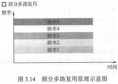

##### 3.5.1.2. 时分多路复用（TDM）

- **时分多路复用**是将一条物理信道按时间分成若干时间片，轮流地分配给多个信号使用。

每个时间片由复用的一个信号占用，而不像FDM那样，同一时间同时发送多路信号。这样，利用每个信号在时间上的交叉，就可以在一条物理信道上传输多个信号，如图3.15所示。

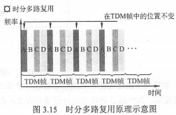

就某个时刻来看，时分多路复用信道上传送的仅是某一对设备之间的信号；就某段时间而言，传送的是按时间分割的多路复用信号。

但由于计算机数据的突发性，一个用户对已经分配到的子信道的利用率一般不高。**统计时分多路复用**(STDM，又称**异步时分多路复用**）是TDM的一种改进，它采用 STDM 帧，STDM 帧并不固定分配时隙，而按需动态地分配时隙，当终端有数据要传送时，才会分配到时间片，因此可以提高线路的利用率。

例如，线路传输速率为800b/s，4个用户的平均速率都为200b/s，当采用 TDM 方式时，每个秒的最高速率为200b/s，而在 STDM 方式下，每个用户的最高速率可达800b/s。

##### 3.5.1.3. 波分多路复用（WDM）

- **波分多路复用**即光的频分多路复用，它在一根光纤中传输多种不同波长（频率）的光信号，由于波长（频率）不同，各路光信号互不干扰，最后再用波长分解复用器将各路波长分解出来。

由于光波处于频谱的高频段，有很高的带宽，因而可以实现多路的波分复用，如图3.16所示。

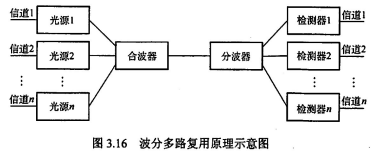

##### 3.5.1.4. 码分多路复用（CDM）

- **码分多路复用**是采用不同的编码来区分各路原始信号的一种复用方式。与 FDM 和 TDM 不同，它*既共享信道的频率，又共享时间*。

下面举一个直观的例子来理解码分复用：
假设A站要向C站运输黄豆，B站要向C站运输绿豆，A与C、B与C之间有一条公共的道路，可以类比为广播信道，如图3.17所示。在频分复用方式下，公共道路被划分为两个车道，分别提供给A到C的车和B到C的车行走，两类车可以同时行走，但只分到了公共车道的一半，因此频分复用（波分复用也一样）共享时间而不共享空间。在时分复用方式下，先让A到C的车走一趟，再让B到C的车走一趟，两类车交替地占用公共车道。公共车道没有划分，因此两车共享了空间，但不共享时间。码分复用与另外两种信道划分方式大为不同，在码分复用情况下，黄豆与绿豆放在同一辆车上运送，到达C后，由C站负责把车上的黄豆和绿豆分开。因此，黄豆和绿豆的运送，在码分复用的情况下，既共享了空间，也共享了时间。

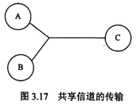

实际上，更常用的名词是**码分多址**(Code Division Multiple Access，CDMA)，其原理是每个比特时间再划分成m个短的时间槽，称为码片(Chip)，通常m的值是64或128，下例中为简单起见，设m为8。每个站点被指派一个唯一的m位码片序列。发送1时，站点发送它的码片序列;发送0时，站点发送该码片序列的反码。当两个或多个站点同时发送时，各路数据在信道中线性相加。为从信道中分离出各路信号，要求各个站点的码片序列相互正交。

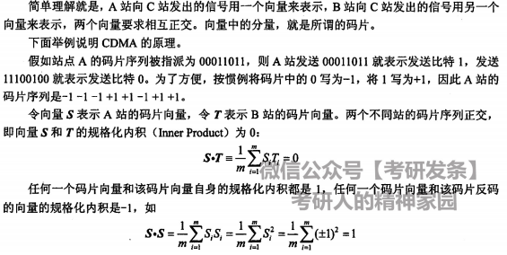

#### 3.5.2. 随机访问介质控制访问

在随机访问协议中，不采用集中控制方式解决发送信息的次序问题，所有用户能根据自己的意愿随机地发送信息，占用信道全部速率。在总线形网络中，当有两个或多个用户同时发送信息时，就会产生帧的冲突，导致所有冲突用户的发送均以失败告终。

- 为了解决随机接入发生的碰撞，每个用户需要按照一定的规则反复地重传它的帧，直到该帧无碰撞地通过。这些规则就是**随机访问介质访问控制协议**。

$$
常用的协议
\begin{cases}
ALOHA协议\\
CSMA协议\\
CSMA/CD协议\\
CSMA/CA协议\\
\cdots\\
\end{cases}
$$

它们的核心思想都是：胜利者通过争用获得信道，从而获得信息的发送权。
因此，随机访问介质访问控制协议又称**争用型协议**。

读者会发现，如果介质访问控制采用信道划分机制，那么结点之间的通信要么共享空间，要么共享时间，要么两者都共享；而如果采用随机访问控制机制，那么各结点之间的通信就可既不共享时间，也不共享空间。所以随机介质访问控制实质上是一种将广播信道转化为点到点信道的行为，如图3.18所示。

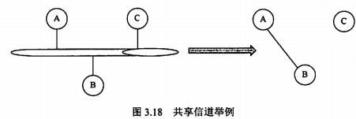

##### 3.5.2.1. ALOHA协议

夏威夷大学早期研制的随机接入系统称为ALOHA,它是Additive Link On-line HAwaii system的缩写。ALOHA协议分为**纯ALOHA协议**和**时隙ALOHA协议**两种

$$
ALOHA协议
\begin{cases}
纯ALOHA协议\\
时隙ALOHA协议\\
\end{cases}
$$

###### 3.5.2.1.1. 纯ALOHA协议

- 纯ALOHA 协议的基本思想是，当网络中的任何一个站点需要发送数据时，可以不进行任何检测就发送数据。如果在一段时间内未收到确认，那么该站点就认为传输过程中发生了冲突。发送站点需要等待一段时间后再发送数据，直至发送成功。

图3.19所示的模型不仅可代表总线形网络的情况，而且可以代表无线信道的情况。

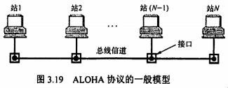

图3.20表示一个纯ALOHA 协议的工作原理。每个站均自由地发送数据帧。为简化问题，不考虑由信道不良而产生的误码，并假定所有站发送的帧都是定长的，帧的长度不用比特而用发送这个帧所需的时间来表示，在图3.20中用T表示这段时间。

在图3.20的例子中，当站1发送帧1时，其他站都未发送数据，所以站1的发送必定是成功的。
但随后站2和站N-1发送的帧2和帧3在时间上重叠了一些(即发生了碰撞)。
碰撞的结果是，碰撞双方（有时也可能是多方）所发送的数据出现了差错，因而都须进行重传。
但是发生碰撞的各站并不能马上进行重传，因为这样做必然会继续发生碰撞。纯ALOHA系统采用的重传策略是让各站等待一段随机的时间，然后再进行重传。
若再次发生碰撞，则需要再等待一段随机的时间，直到重传成功为止。
图中其余一些帧的发送情况是帧4发送成功，而帧5和帧6发生碰撞。

假设网络负载 ($T_0$时间内所有站点发送成功的和未成功而重传的帧数) 为G，则纯 ALOHA网络的吞吐量（$T_0$时间内成功发送的平均帧数）为$S=Ge^{-2G}$。当G=0.5时，$S=0.5e^{-1}\approx0.184$，这是吞吐量S可能达到的极大值。可见，**纯ALOHA网络的吞吐量很低**。为了克服这一缺点，人们在原始的纯ALOHA协议的基础上进行改进，产生了时隙ALOHA 协议。

###### 3.5.2.1.2. 时隙ALOHA协议

- 时隙ALOHA协议把所有各站在时间上同步起来，并将时间划分为一段段等长的时隙(Slot)，规定只能在每个时隙开始时才能发送一个帧。从而避免了用户发送数据的随意性，减少了数据产生冲突的可能性，提高了信道的利用率。

图3.21为两个站的时隙ALOHA协议的工作原理示意图，时隙的长度$T_0$使得每个帧正好在一个时隙内发送完毕。每个帧在到达后，一般都要在缓存中等待一段小于$T_0$的时间，然后才能发送出去。在一个时隙内有两个或两个以上的帧到达时，在下一个时隙将产生碰撞。碰撞后重传的策略与纯ALOHA 的情况是相似的。

时隙ALOHA网络的吞吐量S与网络负载G的关系是$S=Ge^{-G}$。当G=1时，$S=e^{-1}\approx0.368$。这是吞吐量S可能达到的极大值。可见，时隙ALOHA网络比纯ALOHA网络的吞吐量大了1倍。

##### 3.5.2.2. CSMA协议

时隙ALOHA系统的效率虽然是纯ALOHA系统的两倍，但每个站点都是随心所欲地发送数据的，即使其他站点正在发送也照发不误，因此发送碰撞的概率很大。

- 若每个站点在发送前都先侦听一下共用信道，发现信道空闲后再发送，则就会大大降低冲突的可能，从而提高信道的利用率，**载波侦听多路访问**(Carrier Sense Multiple Access，CSMA)**协议**依据的正是这一思想。

CSMA协议是在ALOHA 协议基础上提出的一种改进协议,它与ALOHA协议的主要区别是多了一个载波侦听装置。

根据侦听方式和侦听到信道忙后的处理方式不同，CSMA协议分为三种。

$$
CSMA协议
\begin{cases}
1-坚持CSMA协议\\
非坚持CSMA协议\\
p-坚持CSMA协议\\
\end{cases}
$$

###### 3.5.2.2.1. 1-坚持CSMA协议

- **1-坚持CSMA**（1-persistent CSMA）的基本思想是：一个结点要发送数据时，首先侦听信道；如果信道空闲，那么立即发送数据；如果信道忙，那么等待，同时继续侦听直至信道空闲；如果发生冲突，那么随机等待一段时间后，再重新开始侦听信道。

- **1-坚持的含义**是：侦听到信道忙后，继续坚持侦听信道；侦听到信道空闲后，发送帧的概率为1，即立刻发送数据。

**传播延迟对1-坚持 CSMA 协议的性能影响较大**。结点A开始发送数据时，结点B也正好有数据要发送，但这时结点A发出数据的信号还未到达结点B，结点B侦听到信道空闲，于是立即发送数据，结果必然导致冲突。
**不考虑延迟，1-坚持CSMA 协议也可能产生冲突**。例如，结点A正在发送数据时，结点B和C也准备发送数据，侦听到信道忙，于是坚持侦听，结果当结点A一发送完毕，结点B和C就会立即发送数据，同样导致冲突。

###### 3.5.2.2.2. 非坚持CSMA协议

- **非坚持CSMA**（Non-persistent CSMA）的基本思想是：一个结点要发送数据时，首先侦听信道；如果信道空闲，那么立即发送数据；如果信道忙，那么放弃侦听，等待一个随机的时间后再重复上述过程。

非坚持CSMA协议在侦听到信道忙后就放弃侦听，因此降低了多个结点等待信道空闲后同时发送数据导致冲突的概率，但也会增加数据在网络中的平均延迟。

可见，信道利用率的提高是以增加数据在网络中的延迟时间为代价的。

###### 3.5.2.2.3. p-坚持CSMA协议

- **p-坚持CSMA**（P-persistent CSMA）**用于时分信道**，其基本思想是：一个结点要发送数据时，首先侦听信道；如果信道忙，就持续侦听，直至信道空闲；如果信道空闲，那么以概率p发送数据，以概率1-p推迟到下一个时隙；如果在下一个时隙信道仍然空闲，那么仍以概率p发送数据，以概率1-p推迟到下一个时隙；这个过程一直持续到数据发送成功或因其他结点发送数据而检测到信道忙为止，若是后者，则等待下一个时隙再重新开始侦听。

p-坚持CSMA在检测到信道空闲后，以概率p发送数据，以概率1-p推迟到下一个时隙，其目的是降低1-坚持CSMA 协议中多个结点检测到信道空闲后同时发送数据的冲突概率；采用坚持*侦听*的目的是，试图克服非坚持CSMA协议中由于随机等待而造成的延迟时间较长的缺点。

因此，p-坚持CSMA 协议是非坚持CSMA 协议和1-坚持CSMA 协议的折中方案。

###### 3.5.2.2.4. 三种CSMA协议的比较

##### 3.5.2.3. CSMA/CD协议

- **载波侦听多路访问/碰撞检测**（Carrier Sense Multiple Access with Collision Detection, CSMA/CD)**协议**是CSMA协议的改进方案，适用于总线形网络或半双工网络环境。
- **载波侦听**就是发送前先侦听，即每个站在发送数据之前先要检测一下总线上是否有其他站点正在发送数据，若有则暂时不发送数据，等待信道变为空闲时再发送。
- **碰撞检测**就是边发送边侦听，即适配器边发送数据边检测信道上信号电压的变化情况，以便判断自己在发送数据时其他站点是否也在发送数据。

CSMA/CD的工作流程可简单概括为**先听后发，边听边发，冲突停发，随机重发**。

工作流程：

1. 适配器从网络层获得一个分组，封装成以太网帧，放入适配器的缓存，准备发送。
2. 如果适配器侦听到信道空闲，那么它开始发送该帧。如果适配器侦听到信道忙，那么它持续侦听直至信道上没有信号能量，然后开始发送该帧。
3. 在发送过程中，适配器持续检测信道。若一直未检测到碰撞，则顺利地把这个帧发送完毕。若检测到碰撞，则中止数据的发送，并发送一个拥塞信号，以让所有用户都知道。
4. 在中止发送后，适配器就执行指数退避算法，等待一段随机时间后返回到步骤2.

电磁波在总线上的传播速率总是有限的，因此，当某个时刻发送站检测到信道空闲时，此时信道并不一定是空闲的。

如图3.22所示，设$\tau$为单程传播时延。在$t=0$时，A发送数据。在 $t= \tau-\delta$ 时，A发送的数据还未到达B，由于B检测到信道空闲而发送数据。经过时间$\frac{\delta}{2}$后，即在$t= \tau-\frac{\delta}{2}$时，A发送的数据和B发送的数据发生碰撞，但这时A和B都不知道。在$t= \tau$时，B检测到碰撞，于是停止发送数据。在$t= 2\tau-\delta$时，A检测到碰撞，也停止发送数据。

显然，CSMA/CD中的站不可能同时进行发送和接收，因此采用CSMA/CD协议的以太网只能进行**半双工通信**。

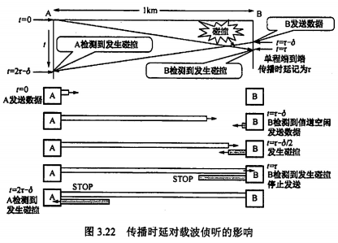

由图3.22可知，站A在发送帧后至多经过时间$2\tau$(端到端传播时延的2倍）就能知道所发送的帧有没有发生碰撞（当$\delta$→0时)。因此把以太网端到端往返时间$2\tau$称为争用期（又称冲突窗口或碰撞窗口）。每个站在自己发送数据之后的一小段时间内，存在发生碰撞的可能性，只有经过争用期这段时间还未检测到碰撞时，才能确定这次发送不会发生碰撞。

为了确保发送站在发送数据的同时能检测到可能存在的碰撞，需要在发送完帧之前就能收到自己发送出去的数据，即帧的传输时延至少要两倍于信号在总线中的传播时延，所以CSMA/CD总线网中的所有数据帧都必须要大于一个最小帧长。任何站点收到帧长小于最小帧长的帧时，就把它当作无效帧立即丢弃。

**最小帧长的计算公式**为
$$最小帧长=总线传播时延\times数据传输速率\times2$$

例如，以太网规定取$51.2\mu s$为争用期的长度。对于$10Mb/s$的以太网,在争用期内可发送$512bit$，即$64B$。在以太网发送数据时，如果前$64B$未发生冲突，那么后续数据也就不会发生冲突（表示已成功抢占信道）。
换句话说，如果发生冲突，那么就一定在前$64B$。由于一旦检测到冲突就立即停止发送，因此这时发送出去的数据一定小于$64B$。
因此，以太网规定最短帧长为$64B$，凡长度小于$64B$的帧都是由于冲突而异常中止的无效帧，收到这种无效帧时应立即丢弃。
如果只发送小于$64B$的帧，如$40B$的帧，那么需要在MAC子层中于数据字段的后面加入一个整数字节的填充字段，以保证以太网的$MAC$帧的长度不小于$64B$.

除检测冲突外，CSMA/CD还能从冲突中恢复。一旦发生了冲突，参与冲突的两个站点紧接着再次发送是没有意义的，如果它们这样做，那么将会导致无休止的冲突。CSMA/CD 采用**二进制指数退避算法**来解决碰撞问题。算法精髓如下:

1. 确定基本退避时间，一般取两倍的总线端到端传播时延2r(即争用期)。
2. 定义参数k，它等于重传次数，但k不超过10，即k= min[重传次数，10]。当重传次数不
超过10时，k等于重传次数；当重传次数大于10时，k就不再增大而一直等于10(这个条件往往容易忽略，请读者注意)。
3. 从离散的整数集合$[0，1,\cdots，2^k-1]$中随机取出一个数r，重传所需要退避的时间就是r倍的基本退避时间，即$2r\tau$.
4. 当重传达16次仍不能成功时，说明网络太拥挤，认为此帧永远无法正确发出，抛弃此帧
并向高层报告出错（这个条件也容易忽略，请读者注意）。

现在来看一个例子。假设一个适配器首次试图传输一帧，当传输时，它检测到碰撞。第1次重传时，k = 1，随机数r从整数{0，1}中选择，因此适配器可选的重传推迟时间是$0或2\tau$。若再次发送碰撞，则在第2次重传时，随机数r从整数{0,1,2,3}中选择，因此重传推迟时间是在$0,2\tau,4\tau,6\tau$这4个时间中随机地选取一个

使用截断二进制指数退避算法可使重传需要推迟的平均时间随重传次数的增大而增大(这也称动态退避)，因而能降低发生碰撞的概率，有利于整个系统的稳定。

##### 3.5.2.4. CSMA/CA协议

CSMA/CD协议已成功应用于使用有线连接的局域网，但在无线局域网环境下，却不能简单地搬用CSMA/CD协议，特别是碰撞检测部分这主要有两个原因:

1. 接收信号的强度往往会远小于发送信号的强度，且在无线介质上信号强度的动态变化范围很大，因此若要实现碰撞检测，则硬件上的花费就会过大。
2. 在无线通信中，并非所有的站点都能够听见对方，即存在*隐蔽站*问题。

为此，802.11标准定义了广泛应用于无线局域网的CSMA/CA协议，它对CSMA/CD协议进行了修改。把碰撞检测改为碰撞避免（Collision Avoidance，CA）。**碰撞避免并不是指协议可以完全避免碰撞，而是指协议的设计要尽量降低碰撞发生的概率。**
由于802.11无线局域网不使用碰撞检测，一旦站点开始发送一个帧，就会完全地发送该帧，但碰撞存在时仍然发送整个数据帧(尤其是长数据帧）会严重降低网络的效率，因此要采用碰撞避免技术降低碰撞的可能性。

由于无线信道的通信质量远不如有线信道，802.11使用链路层**确认/重传(ARQ)方案**，即站点每通过无线局域网发送完一帧，就要在收到对方的确认帧后才能继续发送下一帧。

- 为了尽量避免碰撞，802.11规定，所有的站完成发送后，必须再等待一段很短的时间（继续监听）才能发送下一―帧。这段时间称为**帧间间隔**（InterFrame Space，IFS）。

**帧间间隔的长短取决于该站要发送的帧的类型**。

- 802.11规定的3种IFS:

1. **SIFS（短IFS）**：最短的IFS，用来分隔属于一次对话的各帧，使用SIFS的帧类型有ACK帧、CTS帧、分片后的数据帧，以及所有回答AP探询的帧等。
2. **PIFS（点协调IFS）**：中等长度的IFS，在PCF操作中使用。
3. **DIFS（分布式协调IFS）**：最长的IFS，用于异步帧竞争访问的时延。

CSMA/CA的退避算法和CSMA/CD的稍有不同。信道从忙态变为空闲态时，任何一个站要发送数据帧，不仅都要等待一个时间间隔，而且要进入争用窗口，计算随机退避时间以便再次试图接入信道，因此降低了碰撞发生的概率。当且仅当检测到信道空闲且这个数据帧是要发送的第一个数据帧时，才不使用退避算法。

其他所有情况都必须使用退避算法，具体为

1. 在发送第一个帧前检测到信道忙
2. 每次重传
3. 每次成功发送后要发送下一帧。

- CSMA/CA算法的流程

1. 若站点最初有数据要发送（而不是发送不成功再进行重传），且检测到信道空闲，在等待时间DIFS后，就发送整个数据帧。
2. 否则，站点执行CSMA/CA退避算法，选取一个随机回退值。一旦检测到信道忙，退避计时器就保持不变。只要信道空闲，退避计时器就进行倒计时。
3. 当退避计时器减到0时（这时信道只可能是空闲的），站点就发送整个帧并等待确认。
4. 发送站若收到确认，就知道已发送的帧被目的站正确接收。这时如果要发送第二帧，就要从步骤2开始。
若发送站在规定时间内没有收到确认帧ACK（由重传计时器控制），就必须重传该帧，再次使用CSMA/CA协议争用该信道，直到收到确认，或经过若干次重传失败后放弃发送。

##### 3.5.2.5. RTS&CTS和CSMA/CD&CSMA/CA

- 站A和B都在AP的覆盖范围内，但A和B相距较远，彼此都听不见对方。当A和B检测到信道空闲时，都向AP发送数据，导致碰撞的发生，这就是**隐蔽站**问题（如图3.23）。

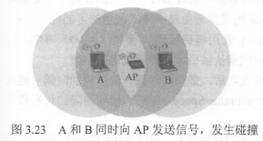

为了避免该问题，802.11允许发送站对信道进行预约。源站要发送数据帧乏前先广播一个很短的**请求发送**（Request To Send，RTS）控制帧，它包括**源地址**、**目的地址**和这次通信（含相应的确认帧）所**持续时间**，该帧能被其范围内包括AP在内的所有站点听到。若信道空闲，则AP广播一个**允许发送**（Clear To Send，CTS）控制帧，它包括这次通信所需的**持续时间**（从RTS帧复制），该帧也能被其范围内包括A和B在内的所有站点听到。B和其他站听到CTS后，在CTS帧中指明的时间内将抑制发送

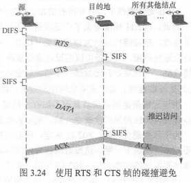

使用 RTS 和 CTS 帧会使网络的通信效率有所下降，但这两种帧都很短，与数据帧相比开销不算大。相反，若不使用这种控制帧，一旦发生碰撞而导致数据帧重发，则浪费的时间更多。
信道预约不是强制性规定，各站可以自己决定使用或不使用信道预约。只有当数据帧长度超过某一数值时，使用 RTS和 CTS帧才比较有利。

CSMA/CD与CSMA/CA主要有如下区别：

1. **CSMA/CD可以检测冲突，但无法避免**；**CSMA/CA 发送数据的同时不能检测信道上有无冲突**，本结点处没有冲突并不意味着在接收结点处就没有冲突，只能尽量避免。
2. **传输介质不同**。CSMA/CD用于总线形以太网，CSMA/CA用于无线局域网802.11a/b/g/n等。
3. **检测方式不同**。CSMA/CD通过电缆中的电压变化来检测；而CSMA/CA采用能量检测、载波检测和能量载波混合检测三种检测信道空闲的方式。

总结：**CSMA/CD协议的基本思想是发送前侦听**，边发送边侦听，一旦出现碰撞马上停止发送；**CSMA/CA 协议的基本思想是在发送数据前广播**告知其他结点，让其他结点在某段时间内不要发送数据，以免出现碰撞。

#### 3.5.3. 轮询访问:令牌传输协议

在轮询访问中，用户不能随机地发送信息，而要通过一个集中控制的监控站，以循环方式轮询每个结点，再决定信道的分配。当某结点使用信道时，其他结点都不能使用信道。

典型的轮询访问介质访问控制协议是**令牌传递协议**，它主要用在**令牌环局域网**中。

在令牌传递协议中，一个令牌（Token）沿着环形总线在各结点计算机间依次传递。令牌是一个特殊的MAC控制帧，它本身并不包含信息，仅控制信道的使用，确保同一时刻只有一个站点独占信道。当环上的一个站点希望传送帧时，必须等待令牌。一旦收到令牌，站点便可启动发送帧。帧中包括目的站点地址，以标识哪个站应该接受此帧。只有取得令牌后才能发送数据帧，因此令牌环网不会发生碰撞。站点在发送完一帧后，应释放令牌，以便让其他站使用。由于令牌在网环上是按顺序依次传递的，因此对所有入网计算机而言访问权是公平的。

- 令牌环网中令牌和数据的传递过程

1. 网络空闲时，环路中只有令牌帧在循环传递。
2. 令牌传递到有数据要发送的站点时，该站点就修改令牌中的一个标志位，并在令牌中附加自己需要传输的数据，将令牌变成一个数据帧，然后将这个数据帧发送出去。
3. 数据帧沿着环路传输，接收到的站点一边转发数据，一边查看帧的目的地址。如果目的地址和自己的地址相同，那么接收站就复制该数据帧以便进一步处理。
4. 数据帧沿着环路传输，直到到达该帧的源站点，源站点收到自己发出去的帧后便不再转发。同时，通过检验返回的帧来查看数据传输过程中是否出错，若有错则重传。
5. 源站点传送完数据后，重新产生一个令牌，并传递给下一站点，以交出信道控制权。

在令牌传递网络中，传输介质的物理拓扑不必是一个环，但是为了把对介质访问的许可从一个设备传递到另一个设备，令牌在设备间的传递通路逻辑上必须是一个环。

**轮询介质访问控制非常适合负载很高的广播信道**。所谓负载很高的信道，是指多个结点在同一时刻发送数据概率很大的信道。可以想象，如果这样的广播信道采用随机介质访问控制，那么发生冲突的概率将会很大，而采用轮询介质访问控制则可以很好地满足各结点间的通信需求。

轮询介质访问控制既不共享时间，也不共享空间，它实际上是在随机介质访问控制的基础上，限定了有权力发送数据的结点只能有一个。

即使是广播信道也可通过介质访问控制机制使广播信道逻辑上变为点对点的信道，所以说**数据链路层研究的是点到点之间的通信**。

---

### 3.6. 局域网

#### 3.6.1. 局域网基本概念和体系结构

- **局域网**（Local Area Network，LAN）是指在一个较小的地理范围（如一所学校）内，将各种计算机、外部设备和数据库系统等通过双绞线、同轴电缆等连接介质互相连接起来，组成资源和信息共享的计算机互联网络。

- **局域网的主要特点**

1. 为一个单位所拥有，且地理范围和站点数目均有限。
2. 所有站点共享较高的总带宽〔即较高的数据传输速率）。
3. 较低的时延和较低的误码率。
4. 各站为平等关系而非主从关系。
5. 能进行广播和组播。

$$
局域网特性的三要素
\begin{cases}
拓扑结构
\begin{cases}
星形结构\\
环形结构\\
总线形结构\\
星形和总线形结合的复合型结构\\
\end{cases}
\\
传输介质
\begin{cases}
双绞线\\
铜缆\\
光纤——主流传输介质\\
\end{cases}
\\
介质访问控制方式
\begin{cases}
CSMA/CD（总线形局域网）\\
令牌总线（总线形局域网）\\
令牌环（环形局域网）\\
\end{cases}
\\
\end{cases}
$$

- **局域网特性三要素中最重要的是介质访问控制方式**

介质访问控制方式决定着局域网的技术特性。

- **三种特殊的互联网拓扑**

1. **以太网**（目前使用范围最广的局域网）。逻辑拓扑是**总线形**结构，物理拓扑是**星形或拓展星形**结构。
2. **令牌环**（Token Ring，IEEE 802.5）。逻辑拓扑是**环形**结构，物理拓扑是**星形**结构。
3. **FDDI**（光纤分布数字接口，IEEE 802.8）。逻辑拓扑是**环形**结构，物理拓扑是**双环**结构。

IEEE 802标准定义的局域网参考模型只对应于OSI参考模型的数据链路层和物理层，并将数据链路层拆分为两个子层：**逻辑链路控制（LLC）子层**和**媒体接入控制（MAC）子层**。与接入传输媒体有关的内容都放在MAC子层，它向上层屏蔽对物理层访问的各种差异，提供对物理层的统一访问接口，主要功能包括：**组帧**和**拆卸帧**、**比特传输差错检测**、**透明传输**。LLC子层与传输媒体无关，它向网络层提供**无确认无连接**、**面向连接**、**带确认无连接**、**高速传送**4种不同的连接服务类型。

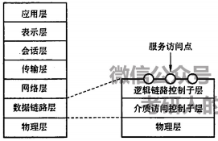

#### 3.6.2. 以太网与IEEE 802.3

IEEE 802.3标准是一种**基带总线形**的局域网标准，它描述物理层和数据链路层的MAC子层的实现方法。

- 以太网逻辑上采用总线形拓扑结构，以太网中的所有计算机共享同一条总线，信息以广播方式发送。为了保证数据通信的方便性和可靠性，以太网简化了通信流程并使用了CSMA/CD方式对总线进行访问控制。

以太网若严格划分应当是指符合DIX Ethernet V2标准的局域网，但 DIX Ethernet V2标准与IEEE 802.3标准只有很小的差别，因此通常将**802.3局域网简称为以太网**。

- 以太网采简化通信的两项措施：

1. 采用**无连接**的工作方式，不对发送的数据帧编号，也不要求接收方发送确认，即以太网尽最大努力交付数据，提供的是**不可靠服务**，对于差错的纠正则由高层完成；
2. 发送的数据都使用**曼彻斯特编码**的信号，每个码元的中间出现一次电压转换,接收端利用这种电压转换方便地把位同步信号提取出来。

##### 3.6.2.1. 以太网的传输介质和网卡

以太网常用的传输介质有4种：粗缆、细缆、双绞线和光纤。

## 4. 网络层
