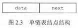

# 数据结构(C语言实现)

## 1. 绪论

$$
\begin{cases}
数据结构三要素\begin{cases}
逻辑结构
\begin{cases}
线性结构：线性表、栈、队列~\\
非线性结构：树、图、集合~\\
\end{cases}
~\\
储存结构（物理结构）~\\
数据的运算~\\
\end{cases}
~\\
算法
\begin{cases}
五个特征
\begin{cases}
有穷性~\\
确定性~\\
可行性~\\
输入~\\
输出~\\
\end{cases}
~\\
评价标准
\begin{cases}
时间复杂度~\\
空间复杂度~\\
\end{cases}
~\\
\end{cases}
~\\
\end{cases}
$$

---

## 2. 线性表

$$
\begin{cases}
顺序储存~\\
链式储存
\begin{cases}
单链表（指针实现）~\\
双链表（指针实现）~\\
循环列表（指针实现）~\\
静态列表（借助数组实现）
\end{cases}
~\\
\end{cases}
$$

### 2.1. 线性表的定义和基本操作

- 线性表是具有相同数据类型的$n\,(n \geq 0)$个数据元素的**有限序列**，其中n为表长，当n=0时线性表是一个空表，若用L命名线性表，则表中元素一般表示为

$L=(a_1,a_2,\cdots,a_i,a_{i+1},\cdots,a_n)$

如上式，$a_1$又称**表头元素**，$a_n$又称**表尾元素**。

除第一个元素外，每个元素有且仅有一个直接前驱。除最后一个元素外，每个元素有且仅有一个直接后继。

- 线性表的特点

1. 表中元素个数有限
2. 表中元素存在逻辑上的先后顺序
3. 表中元素是独立的数据元素
4. 表中元素的数据类型相同（即每个元素占用相同的储存空间）
5. 表中元素具有抽象性

>线性表是一种**逻辑结构**，表示元素之间一对一的相邻关系，顺序表和链表是指**储存结构**，两者属于不同层面的概念。

#### 2.1.1. 线性表的基本操作

- 线性表的主要操作有：

1. Initlist(L)：初始化线性表，构建一个空的线性表
2. Length(L)：求表长，返回线性表L的长度（即L中元素个数）
3. LocateElem(L,e)：按值查找，在表L中查找具有值e的元素，返回其位置，若不存在，则返回0
4. ListInsert(L,i,e)：按位置插入，在表L中第i个位置之前插入元素e，表L的长度加1
5. ListDelete(L,i,e)：按位置删除，在表L中第i个位置删除元素e，表L的长度减1，返回被删除元素的值
6. PrintList(L)：打印表L，打印表L的每个元素，每个元素之间用空格隔开
7. EmptyList(L)：判断表L是否为空，若为空，返回1，否则返回0
8. DestroyList(L)：销毁线性表，并释放L所占用的存储空间

### 2.2. 线性表的顺序表示

#### 2.2.1. 顺序表的定义

- 线性表的存储顺序称作顺序表。顺序表用一组**地址连续**的存储单元依次存储线性表中的数据元素，从而使逻辑上相邻的两个元素在物理位置上也相邻。

第 i 个元素$a_i$储存在线性表的第 i 个存储单元中，故 i 称作元素 $a_i$ 在线性表中的位序。

**顺序表中元素逻辑顺序与物理顺序相同**。

- 随机存取

假设线性表L存储空间的内存地址起始为LOC(A)，sizeof(ElemType)是每个数据元素所占用储存空间的大小，则线性表L所对应的顺序存储如下图所示


线性表的顺序存储结构是一种随机存取的存储方式，即可以通过线性表的首地址A和元素位序i来访问元素。

>通常用数组来描述线性表的顺序存储结构。

假定线性表的元素类型为ElemType，则线性表的顺序存储结构类型描述为：

- 创建线性表

```C++
静态分配

#defign MaxSize 100//线性表的最大长度
typedef struct {
    ElemType data[MaxSize];//线性表的数据元素
    int length;//线性表的当前长度
} SqList;//静态分配顺序表的类型定义
```

```C++
动态分配

typedef struct {
    ElemType *data;//动态分配数组的指针
    int length，MaxSize;//数组的最大容量和当前长度
} SqList;//动态分配顺序表的类型定义
```

一维数组可以静态分配，也可以动态分配，但是静态分配的数组大小必须是固定的，动态分配的数组大小可以根据线性表的长度变化。

C语言的初始动态分配语句

```C
L.data = (ElemType *)malloc(InitSize * sizeof(ElemType));//分配线性表的初始存储空间
if (!L.data) {
    exit(OVERFLOW);//线性表存储空间分配失败
}
```

C++语言的初始动态分配语句

```C++
L.data = new ElemType[InitSize];//分配线性表初始存储空间
if (!L.data) {
    exit(OVERFLOW);//线性表存储空间分配失败
}
```

>动态分配并不是链式存储，它同样属于顺序存储结构，物理结构没有变化，依然是随机存取方式，只是分配空间大小可以在运行时动态决定。

- 线性表顺序存储结构的特点

顺序表最主要的特点是随机访问，即可以通过线性表的首地址A和元素位序i在O(1)时间内访问指定的元素。

顺序表的存储密度高，每个节点只存储数据元素。

顺序表逻辑上相邻的元素物理上也相邻，因此在插入和删除时需要移动大量元素。

#### 2.2.2. 顺序表的基本操作

##### 2.2.2.1. 插入

在顺序表L的第$i(1 \leq i \leq L.length+1)$个位置插入新元素e。

- 代码实现

```C++
    bool InsertList(SqList &L, int i, ElemType e)
    {
        if (i < 1 || i > L.length + 1) {//插入位置不合法
            return false;//插入失败
        }
        if (L.length >= MaxSize) {//顺序表已满
            return false;//插入失败
        }
        for (int j = L.length; j >= i; j--) {//后移元素
            L.data[j] = L.data[j - 1];
        }
        L.data[i - 1] = e;//插入元素
        L.length++;//长度加1
        return true;//插入成功
    }
```

>注意区别顺序表的位序和数组下标的区别。

- 时间复杂度

最好情况：在表尾插入（$i=L.length+1$）元素后移无需执行，时间复杂度为O(1)。
最坏情况：在表头插入（$i=1$）元素后移时需要移动$L.length$个元素，时间复杂度为O(n)。
平均情况：在一般情况下，元素后移操作平均要执行$\frac{L.length}{2}$次，平均时间复杂度为O(n)。

##### 2.2.2.2. 删除

在顺序表L的第$i(1 \leq i \leq L.length)$个位置删除元素。

- 代码实现

```C++
    bool DeleteList(SqList &L, int i, ElemType &e)
    {
        if (i < 1 || i > L.length) {//删除位置不合法
            return false;//删除失败
        }
        e = L.data[i - 1];//获取待删除元素
        for (int j = i; j < L.length; j++) {//前移元素
            L.data[j - 1] = L.data[j];
        }
        L.length--;//长度减1
        return true;//删除成功
    }
```

- 时间复杂度

最好情况：删除表尾元素（$i=L.length$），无需移动元素，时间复杂度为$O(1)$。
最坏情况：删除表头元素（$i=1$），需要移动$L.length-1$个元素，时间复杂度为$O(n)$。
平均情况：在一般情况下，删除第$i$个元素，所需移动结点的平均次数为$\frac{n-1}{2}$，平均时间复杂度为$O(n)$。

- 示例

可见，顺序表中插入和删除操作的时间主要耗费在移动元素上，而移动元素的个数取决于插入和删除元素的位置。图2.2所示为一个顺序表在进行插入和删除操作前、后的状态，以及其数据元素在存储空间中的位置变化和表长的变化。在图2.2(a)中，将第4个至第7个元素从后往前依次后移一个位置，在图2.2(b)中，将第5个至第7个元素从前往后依次前移一个位置。


##### 2.2.2.3. 顺序查找(按值查找)

在顺序表L中查找第一个值为e的元素，并返回该元素的位序。

- 代码实现

```C++
    int LocateElem(SqList L, ElemType e)
    {
        int i;
        for (i = 1; i <= L.length; i++) {
            if (L.data[i - 1] == e) {
                return i;
            }
        }
        return 0;//查找失败
    }
```

- 时间复杂度

最好情况：查找的元素就在表头，时间复杂度为$O(1)$。
最坏情况：查找的元素在表尾（或者不存在），需要比较n次时间复杂度为$O(n)$。
平均情况：查找的元素在第$i$个位置，需要比较$\frac{n+1}{2}$次，时间复杂度为$O(n)$。

### 2.3. 线性表的链式表示

顺序存储线性表时，逻辑上连续的元素在内存地址（物理位置）上也连续，因此在插入和删除时需要移动大量元素。

而链式存储线性表时，不需要使用地址（物理位置）连续的存储单元，它通过指针建立起数据元素之间的逻辑关系，因此链表在插入和删除时不需要移动元素，但也会失去顺序表可随机存储的优点。

#### 2.3.1. 单链表的定义和结点

- 定义

线性表的链式存储称作单链表，它是指通过一组任意的存储单元来储存线性表中的数据元素

- 结点

为了建立数据元素之间的逻辑关系，每个单链表结点中除了包含存放数据元素的数据域（data）之外，还包含一个指针域（next），存放指向其后继元素的指针。



- 结点代码实现

```C++
    typedef struct LNode {//单链表结点类型
        ElemType data;//数据域
        struct LNode *next;//指针域
    } LNode, *LinkList;
```

- 单链表的优缺点

优点：

1. 相较于顺序表，单链表不需要大量连续的存储单元
2. 单链表的插入和删除操作比顺序表的操作要快

缺点：

1. 单链表附加指针域，某种程度上浪费了存储空间
2. 单链表是非随机存储，查找某个特定结点时需要遍历整个表

- 头结点和头指针

通常用头指针来标识一个单链表。
对于单链表L，头指针为NULL时表示一个空表。

通常，在单链表第一个结点之前附加一个结点，称为**头结点**。
头结点的数据域可以不填充任何信息，也可以记录表长等信息。
头结点的指针域指向线性表的第一个元素结点。


头结点和头指针的区分：不管带不带头结点，头指针始终指向链表的第一个结点，而头结点是带头结点的链表中的第一个结点，结点内通常不储存信息。

引入头结点有两个优点：

1. 由于第一个数据结点的位置被存放在头结点的指针域中，因此在链表的第一个位置上的操作和在表的其他位置上的操作一致，无须进行特殊处理。
2. 无论链表是否为空，其头指针都指向头结点的非空指针（空表中头结点的指针域为空），因此空表和非空表的处理也就得到了统一。

#### 2.3.2. 单链表上基本操作的实现

##### 2.3.2.1. 头插法建立单链表

该方法从一个空表开始，生成新结点，并将读取到的数据存放到新结点的数据域中，然后将新结点掺入到当前链表的表头（即头结点之后）。


- 算法实现

```C++
    LinkList List_HeadInsert(LinkList &L, ElemType e) {
        L=(LinkList)malloc(sizeof(LNode));//创建头结点
        L->next=NULL;//头结点的指针域为空
        s=(LinkList)malloc(sizeof(LNode));//创建新结点
        s->data=e;//新结点的数据域为e
        s->next=L->next;//新结点的指针域指向头结点的指针域
        L->next=s;//头结点的指针域指向新结点
        return L;
    }
```

采用头插法建立单链表时，读入数据的顺序与生成的链表中的元素的顺序是相反的。每个结点插入的时间为$O(1)$，设单链表长为n，则总时间复杂度为$O(n)$。

##### 2.3.2.2. 尾插法建立单链表

头插法建立单链表的算法虽然简单，但生成的链表中结点的次序和输入数据的顺序不一致。若希望两者次序一致，则可采用尾插法。该方法将新结点插入到当前链表的表尾，为此必须增加一个尾指针r，使其始终指向当前链表的尾结点，如图2.6所示。


- 算法实现

```C++
    LinkList List_TailInsert(LinkList &L, ElemType e) {
        L=(LinkList)malloc(sizeof(LNode));
        LNode *s=(LinkList)malloc(sizeof(LNode));
        L= *r
        s->data=e;
        r->next=s;
        r=s;
        r->next=NULL;
        return L;
    }
```

---

## 3. 栈 队列和数组

### 3.1. 栈

### 3.2. 队列

### 3.3. 栈和队列的应用

### 3.4. 数组和特殊矩阵

---

## 4. 串

### 4.1. 串的定义和实现

### 4.2. 串的匹配模式

---

## 5. 数与二叉树

### 5.1. 树的基本概念

### 5.2. 二叉树的概念

### 5.3. 二叉树的遍历和线索二叉树

### 5.4. 树和森林

### 5.5. 树和二叉树的应用

---

## 6. 图

### 6.1. 图的基本概念

### 6.2. 图的储存及基本操作

### 6.3. 图的遍历

### 6.4. 图的应用

---

## 7. 查找

### 7.1. 查找的概念

### 7.2. 顺序查找和折半查找

### 7.3. 树型查找

### 7.4. B树和B+树

### 7.5. 散列表

---

## 8. 排序

### 8.1. 排序的基本概念

### 8.2. 插入排序

### 8.3. 交换排序

### 8.4. 选择排序

### 8.5. 归并排序和基数排序

### 8.6. 内部排序算法

### 8.7. 外部排序
