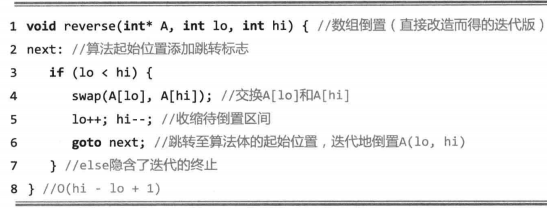
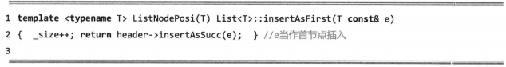
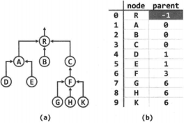
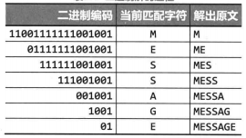

# 数据结构(C++ Language)

Reference：
数据结构(C++语言版)，邓俊辉，清华大学出版社

---

## 1. 绪论

### 1.1. 计算机与算法

#### 1.1.1. 起泡排序

排序(sorting)定义：按照某种约定的次序，将给定的一组元素顺序排列，比如将n个整数按通常的大小次序排成一个非降序列。这类操作统称排序(sorting) 。

##### 1.1.1.1. 局部有序与整体有序

在由一组整数组成的序列 A[e，n - 1] 中，满足 A[i - 1] ≤ A[i] 的相邻元素称作顺序的；否则是逆序的。不难看出，有序序列中每一对相邻元素都是顺序的，亦即,对任意 1 ≤ i < n 都有 A[i - 1] ≤ A[i]；反之，所有相邻元素均顺序的序列，也必然整体有序。

##### 1.1.1.2. 扫描交换

由有序序列的上述特征，我们可以通过不断改善局部的有序性实现整体的有序：从前向后依次检查每一对相邻元素，一旦发现逆序即交换二者的位置。对于长度为n的序列，共需做n - 1次比较和不超过n - 1次交换，这一过程称作一趟扫描交换。


*如上图所示，每一趟扫描交换可以确定一个未排序数列中的最大项*

```cpp
void bubbleSort(int A[], int n) {
    for (int i = 0; i < n; i++) {
        for (int j = 0; j < n - 1 - i; j++) {
            if (A[j] > A[j + 1]) {
                swap(A[j], A[j + 1]);
            }
        }
    }
}
```

### 1.2. 复杂度度量

#### 1.2.1. 时间复杂度

定义：随着输入规模的扩大，执行时间的变化趋势可以表示为输入规模的函数，这个函数称作该算法的时间复杂度（timecomplexity）。具体地，特定算法处理规模为n的问题所需的时间可记作T(n)。

#### 1.2.2. 渐进复杂度

在评价算法运行效率时，我们往往可以忽略其处理小规模问题时的能力差异，转而关注其在处理更大规模问题时的表现。其中的原因不难理解，小规模问题所需的处理时间本来就相对更少，故此时不同算法的实际效率差异并不明显;而在处理更大规模的问题时，效率的些许差异都将对实际执行效果产生巨大的影响。这种着眼长远、更为注重时间复杂度的总体变化趋势和增长速度的策略与方法，即所谓的渐进分析（asymptotic analysis）。

##### 1.2.2.1. 大O记号

具体地, 若存在正的常数c和函数 f(n), 使得对任何 $n\geq2$ 都有
$$T(n)\leq c\cdot f(n)$$

在n趋近于一个无穷大时
$$T(n)=  O(f(n))$$

由此,可得出大O符号的以下性质：

1. 对于任一常数 $c \geq 0$ ,有$\,O(f(n))=O(c \cdot f(n))$
2. 对于任意常数 $a \geq b \geq c$ ,有$\,O(n^a+n^b)=O(n^a)$

对于在之前提到的起泡排序[起泡排序](#111-起泡排序)

起泡算法由内、外两层循环组成。内循环从前向后，依次比较各对相邻元素，如有必要则将其交换。故在每一轮内循环中，需要扫描和比较n - 1对元素，至多需要交换n - 1对元素。元素的比较和交换，都属于基本操作，故每一轮内循环至多需要执行2(n - 1)次基本操作。另外，外循环至多执行n - 1轮。因此，总共需要执行的基本操作不会超过2(n - 1)2次。

若以此来度量该算法的时间复杂度，则有$\,T(n)=O(2{(n-1)}^2)=O(n^2)$

##### 1.2.2.2. 大$\Omega$记号

具体地, 若存在正的常数c和函数 f(n), 使得对任何 $n\geq2$ 都有
$$T(n)\geq c\cdot f(n)$$

在n趋近于一个无穷大时
$$T(n)=  \Omega (g(n))$$

由此,可得出大$\Omega$符号的以下性质：

##### 1.2.2.3. 大$\Theta$记号

$\Theta$ 是对算法的时间复杂度做出定量的界定, 在n足够大之后, h(n)给出了T(n)的一个确界
$$T(n)=\Theta(h(n))$$


#### 1.2.3. 空间复杂度

### 1.3. 复杂度分析

#### 1.3.1. 常数O(1)

运行时间可表示和度量为T(n) = *O*(1)的这一类算法，统称作**常数时间复杂度算法**(constant-time algorithm)。

一般地，仅含一次或常数次基本操作的算法均属此类。此类算法通常不含循环、分支、子程序调用等，但也不能仅凭语法结构的表面形式一概而论。

除了输入数组等参数之外，该算法仅需常数规模的辅助空间。
此类仅需*O*(1)辅助空间的算法，亦称作**就地算法**(in-place algorithm)。

#### 1.3.2. 对数O($\log$n)

对于任意非负整数，统计其二进制展开中数位1的总数


以$n = 441_{(10)} = 110111001_{(2)}$为例，采用以上算法, 变量 n 与计数器 ones 在计算过程中的演变过程如下表所示。


因此，countones()算法的执行时间主要由循环的次数决定，亦即:
$$
O(1+\lfloor\log_2{n}\rfloor) =O(\lfloor\log_2{n}\rfloor) = O(\log{n})
$$

更一般地，凡运行时间可以表示和度量为$T(n)= O(log^cn)$形式的这一类算法(其中常数$c\geq0$)，均统称作 **对数多项式时间复杂度的算法** (polylogarithmic-time algorithm). 上述O(logn)即c = 1的特例。此类算法的效率虽不如常数复杂度算法理想，但从多项式的角度看仍能无限接近于后者，故也是极为高效的一类算法。

#### 1.3.3. 线性O(n)

计算给定n个整数的总和, 可由下图代码中的算法sumI()解决。


首先，对s的初始化需要o(1)时间。算法的主体部分是一个循环，每一轮循环中只需进行一次累加运算，这属于基本操作，可在o(1)时间内完成。每经过一轮循环，都将一个元素累加至s,故总共需要做n轮循环，于是该算法的运行时间应为:
$$O(1)+O(1)\times n=O(n+1)=O(n)$$

凡运行时间可以表示和度量为T(n)= O(n)形式的这一类算法，均统称作 **线性时间复杂度算法** (linear-time algorithm)。

#### 1.3.4. 多项式O(n)

在算法复杂度理论中，多项式时间复杂度被视作一个具有特殊意义的复杂度级别。多项式级的运行时间成本，在实际应用中一般被认为是可接受的或可忍受的。某问题若存在一个复杂度在此范围以内的算法，则称该问题是可有效求解的或易解的(tractable)。

#### 1.3.5. 指数$O(2^n)$

在禁止超过1位的移位运算的前提下，对任意非负整数n，计算幂$2^n$。


一般地，凡运行时间可以表示和度量为T(n) = O($a^n$)形式的算法(a > 1)，均属于 **指数时间复杂度算法** (exponential-time algorithm) 。

#### 1.3.6. 复杂度层次


*复杂度的典型层次∶(1)~(7)依次为$O(\log n)、O(\sqrt[2]{n})、O(n)、O(n\log n)、O(n^2)、O(n^3)和O(2^{n})$*

### 1.4. 递归

**递归**则是函数和过程调用的一种特殊形式，即允许函数和过程进行自我调用.
自我调用通常是直接的, 即在函数体中包含一条或多条调用自身的语句; 递归也可能以间接的形式出现, 即某个方法首先调用其他方法,再辗转通过其他方法的相互调用,最终调用起始的方法自身.

#### 1.4.1. 线性递归


算法sum()可能朝着更深一层进行自我调用, 且每一递归实例对自身的调用至多一次。于是，每一层次上至多只有一个实例，且它们构成一个线性的次序关系。此类递归模式因而称作**线性递归**(linear recursion)，它也是递归的最基本形式。

#### 1.4.2. 递归分析

$$
\begin{cases}
递归跟踪~\\
递推方程~\\
\end{cases}
$$

##### 1.4.2.1. 递归跟踪

- 算法的每一递归实例都表示为一个方框，其中注明了该实例调用的参数
- 若实例M调用实例N,则在M与N对应的方框之间添加一条有向联线


具体地，就以上的sum()算法而言，每一递归实例中非递归部分所涉及的计算无非三类(判断n是否为0、累加sum(n - 1)与A[n - 1]、返回当前总和)，且至多各执行一次。鉴于它们均属于基本操作，每个递归实例实际所需的计算时间都应为常数O(3)。由上图还可以看出，**对于长度为n的输入数组，递归深度应为n + 1**，故整个sum()算法的运行时间为:
$$
(n+1)\times O(3)=O(n)
$$

sum()算法的空间复杂度线性正比于其递归的深度，亦即O(n)。

##### 1.4.2.2. 递推方程

仍以线性递归版sum()算法为例，将该算法处理长度为n的数组所需的时间成本记作T(n)。我们将该算法的思路重新表述如下:为解决问题sum(A, n), 需递归地解决问题sum(A, n - 1)，然后累加上A[n - 1]。按照这一新的理解，求解sum(A, n)所需的时间，应该等于求解sum(A, n - 1)所需的时间，另加一次整数加法运算所需的时间。

根据以上分析，可以得到关于T(n)的如下一般性的递推关系:
T(n)=T(n - 1) + O(1) = T(n - 1) +c，
其中c为常数

另一方面，当递归过程抵达递归基时，求解平凡问题sum(A，0)只需(用于直接返回e的)常数时间。

如此，即可获得如下边界条件:
T(0) = O(1) = $c_2$，其中cz为常数
联立以上两个方程，最终可以解得:
T(n) = $c_1n$ + $c_2$ = O(n)

#### 1.4.3. 递归模式

##### 1.4.3.1. 多递归基

考查数组倒置问题，也就是将数组中各元素的次序前后翻转

比如，若输入数组为:A[] = { 3，1，4，1，5，9，2，6 }
则输出数组为:A[] = { 2，6，9，5，1，4，1，3 }


通过上述思路，我们可以得到以下事实：
为了得到的整个数组的倒置，可以先对换其首末元素，然后递归地倒置除这两个元素以外的部分。

即是：


##### 1.4.3.2. 多项递归

对于[计算幂函数幂函数$2^n$](#135-指数o2n), 按照线性递归的构思, 我们可以得到
上述链接的代码可以表示如下


以上线性递归的算法与[计算幂函数幂函数$2^n$](#135-指数o2n)算法完全一样,总共需要做O(n)次递归调用。

以下则是更快的一例


基于这一递推式，即可如如下代码所示，实现幂函数的多向递归版本power2()


#### 1.4.4. 递归消除

##### 1.4.4.1. 空间成本

递归算法所消耗的空间量主要取决于递归深度，故较之同一算法的迭代版，递归版往往需耗费更多空间，并进而影响实际的运行速度。另外，就操作系统而言，为实现递归调用需要花费大量额外的时间以创建、维护和销毁各递归实例，这些也会令计算的负担雪上加霜。

有鉴于此，在对运行速度要求极高、存储空间需精打细算的场合，往往应将递归算法改写成等价的非递归版本。

##### 1.4.4.2. 尾递归及其消除

在线性递归算法中，若递归调用在递归实例中恰好以最后一步操作的形式出现，则称作尾递归(tail recursion)。

仍以[代码](#1431-多递归基)中算法为例。如代码1.9所示，首先在起始位置插入一个跳转标志next，然后将尾递归语句调用替换为一条指向next标志的跳转语句。


*由递归版改造而得的数组倒置算法(迭代版)*

新的迭代版与原递归版功能等效，但其中使用的goto语句有悖于结构化程序设计的原则。这一语句虽仍不得不被C++等高级语言保留，但最好还是尽力回避。为此可如以下代码所示，将next标志与if判断综合考查，并代之以一条逻辑条件等价的while语句。


#### 1.4.5. 二分递归

##### 1.4.5.1. 分而治之

既然每一递归实例都可能做多次递归，故称作“多路递归”(multi-way recursion)。通常都是将原问题一分为二，故称作“二分递归”(binary recursion)。需强调的是，无论是分解为两个还是更大常数个子问题，对算法总体的渐进复杂度并无实质影响。

##### 1.4.5.2. 数组求和

采用分而治之的策略,按照二分递归的模式再次解决数组求和问题。新算法的思路是：
以居中的元素为界将数组一分为二;递归地对子数组分别求和；最后，子数组之和相加即为原数组的总和。


*17.通过二分递归计算数组之和*


*18.对sum(A, 0，7)的递归跟踪分析*

算法启动后经连续m = $\log$n次递归调用，数组区间的长度从最初的n首次缩减至1，并到达第一个递归基。实际上，刚到达任一递归基时，已执行的递归调用总是比递归返回多m = $log_2n$次。更一般地，到达区间长度为$2^k$的任一递归实例之前，已执行的递归调用总是比递归返回多m-k次。因此，递归深度（即任一时刻的活跃递归实例的总数）不会超过m + 1。鉴于每个递归实例仅需常数空间，故除数组本身所占的空间，该算法只需要O(m + 1) = O(1ogn)的附加空间。我们还记得，[线性递归版sum()算法](#141-线性递归)共需O(n)的附加空间，就这一点而言，新的二分递归版sum()算法有很大改进。

##### 1.4.5.3. 效率

当然，并非所有问题都适宜于采用分治策略。实际上除了递归，此类算法的计算消耗主要来自两个方面。首先是**子问题划分**，即把原问题分解为形式相同、规模更小的多个子问题，比如将待求和数组分为前、后两段。其次是**子解答合并**，即由递归所得子问题的解，得到原问题的整体解，比如由子数组之和累加得到整个数组之和。

##### 1.4.5.4. Fibonacci数

###### 1.4.5.4.1. Fibonacci数:二分递归

考查Fibonacci数列第n项fib(n)的计算问题，该数列递归形式的定义如下


据此定义，可直接导出如代码1.12所示的二分递归版fib()算法

*20.通过二分递归计算Fibonacci数*

基于Fibonacci数列原始定义的这一实现，不仅正确性一目了然，而且简洁自然。然而不幸的是，在这种场合采用二分递归策略的效率极其低下。实际上，该算法需要运行$O(2^n)$时间才能计算出第n个Fibonacci数。这一指数复杂度的算法，在实际环境中毫无价值。

###### 1.4.5.4.2. Fibonacci数: 优化策略

为消除递归算法中重复的递归实例，一种自然而然的思路和技巧，可以概括为
**借助一定量的辅助空间，在各子问题求解之后，及时记录下其对应的解答**

###### 1.4.5.4.3. Fibonacci数: 线性递归

反观[代码ds20](#14541-fibonacci数二分递归)，原fib()算法之所以采用二分递归模式，完全是因为受到该问题原始定义的表面特征—— fib(n) 由 fib(n - 1) 和 fib(n - 2) 共同决定——的误导。然而不难看出，子问题fib(n - 1)和fib(n - 2)实际上并非彼此独立。比如，只要转而采用定义如下的递归函数，计算一对相邻的Fibonacci数:
(fib(k-1)，fib(k))


*通过线性递归计算Fibonacci数*

###### 1.4.5.4.4. Fibonacci数: 迭代

反观以上线性递归版fib()算法可见，其中所记录的每一个子问题的解答，只会用到一次。在该算法抵达递归基之后的逐层返回过程中,每向上返回一层，以下各层的解答均不必继续保留。

若将以上逐层返回的过程,等效地视作从递归基出发,按规模自小而大求解各子问题的过程，即可采用动态规划的策略，将以上算法进一步改写为如代码ds22所示的迭代版。


*基于动态规划策略计算Fibonacci数*

这里仅使用了两个中间变量f和g，记录当前的一对相邻Fibonacci数。整个算法仅需线性步的迭代，时间复杂度为O(n)。更重要的是，该版本仅需常数规模的附加空间，空间效率也有了极大提高。

### 1.5. 抽象数据类型

所谓**封装**，就是将数据项与相关的操作结合为一个整体，并将其从外部的可见性划分为若干级别，从而将数据结构的外部特性与其内部实现相分离，提供一致且标准的对外接口，隐藏内部的实现细节。于是，数据集合及其对应的操作可超脱于具体的程序设计语言、具体的实现方式，即构成所谓的抽象数据类型(abstract data type，ADT)。

---

## 2. 向量

**数据结构**是数据项的结构化集合，其结构性表现为数据项之间的相互联系及作用，也可以理解为定义于数据项之间的某种逻辑次序。根据这种逻辑次序的复杂程度，大致可以将各种数据结构划分为**线性结构**、**半线性结构**与**非线性结构**三大类。在线性结构中，各数据项按照一个线性次序构成一个整体。最为基本的线性结构统称为**序列**(sequence)，根据其中数据项的**逻辑次序**与其**物理存储地址**的对应关系不同，又可进一步地将序列区分为**向量**(vector)和**列表**(list)。在向量中，所有数据项的物理存放位置与其逻辑次序完全吻合，此时的逻辑次序也称作**秩**(rank);而在列表中，逻辑上相邻的数据项在物理上未必相邻，而是采用**间接定址**的方式通过封装后的位置（position）相互引用。

### 2.1. 数组与向量

#### 2.1.1. 数组介绍

若集合S由n个元素组成，且各元素之间具有一个线性次序，则可将它们存放于起始于地址A、物理位置连续的一段存储空间，并统称作数组(array)，通常以A作为该数组的标识。具体地，数组A[]中的每一元素都唯一对应于某一下标编号，在多数高级程序设计语言中，一般都是从0开始编号，依次是0号、1号、2号、....n-1号元素，记作;
$$
A={a_0,a_1,a_2,\cdots,a_n-1} or~\\
A[0,n)={a_0,a_1,a_2,\cdots,a_n-1}
$$

其中，对于任何0 $\leq$ i < j $\leq$ n，A[i] 都是 A[j] 的 **前驱**(predecessor)，A[j] 都是 A[i] 的 **后继**(successor)。特别地，对于任何i≥1，A[i- 1] 称作 A[i] 的 **直接前驱**(intermediatepredecessor) ;对于任何i sn - 2，A[i +1] 称作 A[i] 的 **直接后继** (intermediatesuccessor)。任一元素的所有前驱构成其 **前缀** (prefix)，所有后继构成其 **后缀** (suffix)。

若数组 A [ ] 存放空间的起始地址为A，且每个元素占用 s 个单位的空间，则元素 A[i] 对应的物理地址为:
$$
A+i \times s
$$

因其中元素的物理地址与其下标之间满足这种线性关系，故亦称作**线性数组** (linear array)

#### 2.1.2. 向量介绍

**向量** (vector) 是线性数组的一种抽象与泛化，它也是由具有线性次序的一组元素构成的集合V = { $v_0,\,v_1,\,\cdots,v_{n-1}$ }，其中的元素分别由**秩**相互区分。

各元素的秩 (rank) 互异，且均为 [0, n) 内的整数。具体地，若元素e的前驱元素共计r个，则其秩就是r。以此前介绍的线性递归为例，运行过程中所出现过的所有递归实例，按照相互调用的关系可构成一个线性序列。在此序列中,各递归实例的秩反映了它们各自被创建的时间先后，每一递归实例的秩等于早于它出现的实例总数。反过来，通过r亦可唯一确定e = v。这是向量特有的元素访问方式，称作“**循秩访问**”(call-by-rank)。
>经如此抽象之后，我们不再限定同一向量中的各元素都属于同一基本类型，它们本身可以是来自于更具一般性的某一类的对象。另外，各元素也不见得同时具有某一数值属性，故而并不保证它们之间能够相互比较大小。

### 2.2. 接口

#### 2.2.1. 抽象数据类型 (ADT) 接口

|   操作接口    |                       功能2                        | 适用对象 |
| :-----------: | :------------------------------------------------: | :------: |
|    size()     |           报告向量当前的规模（元素总数）           |   向量   |
|    get(r)     |                  获取秩为r的元素                   |   向量   |
|   put(r,e)    |               用e替换秩为r元素的数值               |   向量   |
| insert(r, e)  |       e作为秩为r元素插入，原后继元素依次后移       |   向量   |
|   remove(r)   |     删除秩为r的元素，返回该元素中原存放的对象      |   向量   |
| disordered()  |           判断所有元素是否已按非降序排列           |   向量   |
|    sort()     |         调整各元素的位置，使之按非降序排列         |   向量   |
|    find(e)    |              查找等于e且秩最大的元素               |   向量   |
|   search(e)   |      查找目标元素e，返回不大于e且秩最大的元素      | 有序向量 |
| deduplicate() |                    剔除重复元素                    |   向量   |
|  uniquify()   |                    剔除重复元素                    | 有序向量 |
|  traverse()   | 遍历向量并统一处理所有元素，处理方法由函数对象指定 |   向量   |

#### 2.2.2. 操作实例

按照表22定义的ADT接口，表23给出了一个整数向量从被创建开始，通过ADT接口依次实施一系列操作的过程。


#### 2.2.3. 向量模板类

按照表22确定的向量ADT接口，可定义Vector模板类如下所示


*24,25*

### 2.3. 构造与解析

向量中秩为r的元素，对应于内部数组中的_elem[r]，其物理地址为_elem +r

#### 2.3.1. 默认构造方法

与所有的对象一样,向量在使用之前也需首先被系统创建——借助构造函数(constructor)做初始化（initialization）。由代码5可见，这里为向量重载了多个构造函数。
其中默认的构造方法是，首先根据创建者指定的初始容量，向系统申请空间，以创建内部私有数组_elem[];若容量未明确指定，则使用默认值DEFAULT_CAPACITY。接下来，鉴于初生的向量尚不包含任何元素，故将指示规模的变量_size初始化为0。
整个过程顺序进行，没有任何迭代，故若忽略用于分配数组空间的时间，共需常数时间。

#### 2.3.2. 基于复制的构造方法


*26.基于复制的向量构造器*

copyFrom()首先根据待复制区间的边界，换算出新向量的初始规模；再以双倍的容量，为内部数组_elem[]申请空间。最后通过一趟迭代，完成区间A[1o，hi)内各元素的顺次复制。
若忽略开辟新空间所需的时间，运行时间应正比于区间宽度，即o(hi - lo) = o(_size)。

#### 2.3.3. 析构方法

不再需要的向量，应借助析构函数(destructor)及时清理(cleanup),以释放其占用的系统资源。与构造函数不同，**同一对象只能有一个析构函数**，不能重载。

向量对象的析构过程，如代码22中的方法~Vector()所示:只需释放用于存放元素的内部数组_elem[]，将其占用的空间交还操作系统。_capacity和_size之类的内部变量无需做任何处理，它们将作为向量对象自身的一部分被系统回收，此后既无需也无法被引用。
若不计系统用于空间回收的时间，整个析构过程只需O(1)时间。

同样地，向量中的元素可能不是程序语言直接支持的基本类型。比如，可能是指向动态分配对象的指针或引用，故在向量析构之前应该提前释放对应的空间。出于简化的考虑，这里约定并遵照“谁申请谁释放”的原则。究竟应释放掉向量各元素所指的对象，还是需要保留这些对象，以便通过其它指针继续引用它们，应由上层调用者负责确定。

### 2.4. 动态空间管理

#### 2.4.1. 动态空间管理

内部数组所占物理空间的容量,若在向量的生命期内不允许调整,则称作静态空间管理策略。很遗憾，该策略的空间效率难以保证。一方面，既然容量固定，总有可能在此后的某一时刻，无法加入更多的新元素——即导致所谓的**上溢**（overflow）。

例如，若使用向量来记录网络访问日志，则由于插入操作远多于删除操作，必然频繁溢出。注意，造成此类溢出的原因，并非系统不能提供更多的空间。另一方面反过来，即便愿意为降低这种风险而预留出部分空间，也很难在程序执行之前，明确界定一个合理的预留量。

以上述copyFrom()方法为例，即便将容量取作初始规模的两倍，也只能保证在此后足够长的一段时间内（而并非永远）不致溢出。

向量实际规模与其内部数组容量的比值（即_size/_capacity），亦称作装填因子(loadfactor)，它是衡量空间利用率的重要指标。从这一角度，上述难题可归纳为:
**如何才能保证向量的装填因子既不致于超过1，也不致于太接近于0?**——为此，需要改用动态空间管理策略。

#### 2.4.2. 可扩充向量

扩充向量(extendable vector)的原理，与之相仿。若内部数组仍有空余，则操作可照常执行。每经一次插入(删除)，可用空间都会减少(增加)一个单元(图27a)。一旦可用空间耗尽（图27b），就动态地扩大内部数组的容量。这里的难点及关键在于:
**如何实现扩容?新的容量取作多少才算适宜?**


*27.向量内部数组动态扩容算法expand()*

一种可行的方法,如图27(c~e)所示。我们需要另行申请一个容量更大的数组B[ ]（图(c)），并将原数组中的成员集体搬迁至新的空间（图(d)），此后方可顺利地插入新元素e而不致溢出(图(e))。当然，原数组所占的空间，需要及时释放并归还操作系统。

#### 2.4.3. 扩容

基于以上策略的扩容算法expand()，可实现如代码如下所示


*28.向量内部数组动态扩容算法expand()*

实际上，在调用insert()接口插入新元素之前，都要先调用该算法，检查内部数组的可用容量。一旦当前数据区已满(_size ==_capacity)，则将原数组替换为一个更大的数组。
请注意，新数组的地址由操作系统分配，与原数据区没有直接的关系。这种情况下，若直接引用数组，往往会导致共同指向原数组的其它指针失效，成为野指针(wild pointer);而经封装为向量之后，即可继续准确地引用各元素，从而有效地避免野指针的风险。
这里的关键在于，新数组的容量总是取作原数组的两倍——这正是上述后一问题的答案。

#### 2.4.4. 分摊分析

- 时间代价：与常规数组实现相比，可扩充向量更加灵活:只要系统尚有可用空间，其规模将不再受限于初始容量。不过，这并非没有代价——每次扩容，元素的搬迁都需要花费额外的时间。
- 分摊复杂度度：这里，不妨考查对可扩充向量的足够多次连续操作，并将其间所消耗的时间，分摊至所有的操作。如此分摊平均至单次操作的时间成本，称作**分摊运行时间**(amortized running time)。

>这里，不妨考查对可扩充向量的足够多次连续操作，并将其间所消耗的时间，分摊至所有的操作。如此分摊平均至单次操作的时间成本，称作分摊运行时间（ amortized running time）。
请注意,这一指标与平均运行时间(average running time)有着本质的区别。后者是按照某种假定的概率分布，对各种情况下所需执行时间的加权平均，故亦称作期望运行时间(expected running time)。而前者则要求，参与分摊的操作必须构成和来自一个真实可行的操作序列，而且该序列还必须足够地长。

- O(1)分摊时间：

>以可扩充向量为例，可以考查对该结构的连续n次（查询、插入或删除等）操作，将所有操作中用于内部数组扩容的时间累计起来，然后除以n。只要n足够大，这一平均时间就是用于扩容处理的分摊时间成本。以下我们将看到，即便排除查询和删除操作而仅考查插入操作，在可扩充向量单次操作中，用于扩容处理的分摊时间成本也不过O(1)。

假定数组的初始容量为某一常数N。既然是估计复杂度的上界，故不妨设向量的初始规模也为N——即将溢出。另外不难看出，除插入操作外，向量其余的接口操作既不会直接导致溢出，也不会增加此后溢出的可能性，因此不妨考查最坏的情况，假设在此后需要连续地进行n次insert()操作，n >> N。首先定义如下函数:

size(n)=连续插入n个元素后向量的规模
capacity(n) = 连续插入n个元素后数组的容量
T(n) = 为连续插入n个元素而花费于扩容的时间

其中，向量规模从N开始随着操作的进程逐步递增，故有:
size(n)= N + n

既然不致溢出，故装填因子绝不会超过100%。同时，这里的扩容采用了**懒惰策略**——只有在的确即将发生溢出时，才不得不将容量加倍——因此装填因子也始终不低于50%。

概括起来，始终应有:
$size(n)≤ capacity(n)< 2\cdot size(n)$
考虑到N为常数，故有:
$capacity(n)=\Theta (size(n)) =\Theta e(n)$

容量以2为比例按指数速度增长，在容量达到capacity(n)之前，共做过$\Theta(\log_2n)$次扩容，每次扩容所需时间线性正比于当时的容量（或规模)，且同样以2为比例按指数速度增长。因此，消耗于扩容的时间累计不过：
$T(n) = 2N + 4N + 8N + \cdots + capacity(n) < 2 \cdot capacity(n) = \Theta (n)$
将其分摊到其间的连续n次操作，单次操作所需的分摊运行时间应为o(1)。

#### 2.4.5. 缩容

- 向量的实际规模可能远远小于内部数组的容量。比如在连续的一系列操作过程中，若删除操作远多于插入操作，则装填因子极有可能远远小于100%，甚至非常接近于0。当装填因子低于某一阈值时，我们称数组发生了**下溢**（underflow）。

尽管下溢不属于必须解决的问题，但在格外关注空间利用率的场合，发生下溢时也有必要适当缩减内部数组容量。代码如下给出了一个动态缩容shrink()算法:


*29*

可见，每次删除操作之后，一旦空间利用率已降至某一阈值以下，该算法随即申请一个容量减半的新数组，将原数组中的元素逐一搬迁至其中，最后将原数组所占空间交还操作系统。这里以25%作为装填因子的下限，但在实际应用中，为避免出现频繁交替扩容和缩容的情况，可以选用更低的阈值，甚至取作0（相当于禁止缩容）。

与expand()操作类似，尽管单次shrink()操作需要线性量级的时间，但其分摊复杂度亦为O(1)。实际上shrink()过程等效于expand()的逆过程，这两个算法相互配合，在不致实质地增加接口操作复杂度的前提下，保证了向量内部空间的高效利用。当然，就单次扩容或缩容操作而言，所需时间的确会高达$\Omega$(n)，因此在对单次操作的执行速度极其敏感的应用场合以上策略并不适用，其中缩容操作甚至可以完全不予考虑。

### 2.5. 常规向量

#### 2.5.1. 直接引用元素

- 在经过封装之后，对向量元素的访问可以沿用数组的方式，通过元素下标进行访问，而不需要提供一个专用的访问接口。

解决的方法之一就是重载操作符“[ ]”


*30*

#### 2.5.2. 置乱器

- 置乱算法

经重载后操作符“[]”返回的是对数组元素的引用，这意味着其可以取代get()和set()方法。


*31.向量整体置乱算法permute()*

该算法从待置乱区间的末元素开始，逆序地向前逐一处理各元素。如(a)图所示，对每一个当前元素V[i - 1]，先通过调用 rand() 函数在[0，i)之间等概率地随机选取一个元素，再令二者互换位置。注意，这里的交换操作swap()，隐含了三次基于重载操作符 “[ ]” 的赋值。

于是如图(b)所示,每经过一步这样的迭代,置乱区间都会向前拓展一个单元。因此经过O(n)步迭代之后，即实现了整个向量的置乱。

*32.向量整体置乱算法permute()的迭代过程*

- 区间置乱接口


*33.向量区间置乱接口unsort()*

通过该接口，可以均匀地置乱任一向量区间[lo, hi)内的元素，故通用性有所提高。可见，只要将该区间等效地视作另一向量v，即可从形式上完整地套用以上permute()算法的流程。

尽管如此，还请特别留意代码32与代码33的细微差异：后者是通过下标，直接访问内部数组的元素；而前者则是借助重载的操作符“[ ]”，通过秩间接地访问向量的元素。

#### 2.5.3. 判等器与比较器


*34.重载比较器以便比较对象指针*

>在一些复杂的数据结构中，内部元素本身的类型可能就是指向其它对象的指针;而从外部更多关注的，则往往是其所指对象的大小。若不加处理而直接根据指针的数值（即被指对象的物理地址）进行比较，则所得结果将毫无意义。

#### 2.5.4. 无序查找

- 判等器

向量元素可通过相互比对判等
仅支持对比是否相等，但不支持比较相对大小向量，称作无序向量(unsorted vector)。

- 顺序查找

在无序向量中查找任意指定元素e时，在最坏情况下，只有在访遍所有元素之后，才能得出结论。


*35.无序向量的顺序查找*

因此不妨如图35所示，从末元素起自后向前，逐一取出各个元素并与目标元素e进行比对，直至发现与之相等者（查找成功），或者直至检查过所有元素之后仍未找到相等者（查找失败）。这种依次逐个比对的查找方式，称作**顺序查找**(sequential search) .

- 实现

针对向量的整体或区间，代码35分别定义了一个顺序查找操作的入口，其中前者作为特例，可直接通过调用后者而实现。因此，只需如代码36所示，实现针对向量区间的查找算法。


*36.无序向量元素查找接口find()*

- 复杂度

最坏情况下，查找终止于首元素_elem[lo]，运行时间为O(hi - lo) = O(n)。最好情况下，查找命中于末元素_elem[hi - 1]，仅需O(1)时间。

对于规模相同、内部组成不同的输入，渐进运行时间却有本质区别，故此类算法也称作**输入敏感**的（input sensitive）算法。

#### 2.5.5. 插入

按照ADT定义，插入操作insert(r,e)负责将任意给定的元素 e 插到任意指定的秩为 r 的单元。
整个操作的过程，可具体实现如代码37所示。

*37.向量元素插入接口insert()*

插入之前必须首先调用expand()算法，核对是否即将溢出

*38.向量元素插入操作insert(r,e)的过程*

为保证数组元素物理地址连续的特性，随后需要将后缀_elem[r，_size)（如果非空）整体后移一个单元。这些后继元素自后向前的搬迁次序不能颠倒，否则会因元素被覆盖而造成数据丢失。在单元_elem[r]腾出之后，方可将待插入对象e置入其中

- 复杂度

时间主要消耗于后继元素的后移，线性正比于后缀的长度，故总体为O(_size - r + 1)。可见，新插入元素越靠后（前）所需时间越短（长）。特别地，r取最大值_size时为最好情况，只需o(1)时间; r取最小值e时为最坏情况，需要o(_size)时间。一般地，若插入位置等概率分布，则平均运行时间为o(_size)= o(n)(习题[2-9])，线性正比于向量的实际规模。

#### 2.5.6. 删除

因数组中元素的地址必须连续，故每删除一个元素，所有后继元素都需向前移动一个单元。若后继元素共有m = _size - hi个，则对remove(r)的每次调用都需移动m次；对于整个区间，元素移动的次数累计将达到m$\times$(hi - lo)，为后缀长度和待删除区间宽度的乘积。

- 区间删除remove( lo, hi)


*39.向量元素删除接口remove(lo, hi)*

与插入算法同理,这里后继元素自前向后的移动次序也不能颠倒


*40.向量区间删除操作remove(lo，hi)的过程*

向量规模更新为_size - hi + lo后，还要调用shrink()，若有必要则做缩容处理

- 单元素删除remove(r)


*41.向量单元素删除操作remove(r)的过程*

- 复杂度

remove(lo，hi)的计算成本，主要消耗于后续元素的前移，线性正比于后缀的长度，总体不过O(m + 1) = O(_size - hi + 1)。

这与此前的预期完全吻合：区间删除操作所需的时间，应该仅取决于后继元素的数目，而与被删除区间本身的宽度无关。特别地，基于该接口实现的单元素删除接口remove(r)需耗时O(_size - r)。也就是说，被删除元素在向量中的位置越靠后（前）所需时间越短（长），最好为O(1)，最坏为O(n) = O(_size)。

- 错误及意外处理

请注意，上述操作接口对输入都有一定的限制和约定。其中指定的待删除区间，必须落在合法范围[0，_size)之内，为此输入参数必须满足0≤ lo ≤ hi ≤_size。

#### 2.5.7. 唯一化

- 实现

对无序向量的唯一化算法

*42.无序向量清除重复元素接口deduplicate()*

- 复杂度

每步迭代所需时间为$O(n)$，总体复杂度应为$O(n^2)。$

#### 2.5.8. 遍历

- 实现


*43.向量遍历接口traverse()*

increase()函数如下所示，以此基本操作做遍历即可使向量内所有元素的数值同步加一。


遍历操作本身只包含一层线性的循环迭代，故除了向量规模的因素之外，遍历所需时间应线性正比于所统一指定的基本操作所需的时间。比如在上例中，统一的基本操作 Increase< T > () 只需常数时间，故这一遍历的总体时间复杂度为O(n)。

### 2.6. 有序向量(unfinished)

- 若向量s[0，n)中的所有元素不仅按线性次序存放，而且其数值大小也按此次序单调分布,则称作有序向量(sorted vector)。

与通常的向量一样，有序向量依然不要求元素互异，故通常约定其中的元素自前(左)向后(右)构成一个非降序列，即对任意$0 \leq i < j <n$都有$S[i] \leq S[j]$。

## 3. 列表

### 3.1. 从向量到列表

- 列表（list）结构尽管也要求各元素在逻辑上具有线性次序，但对其物理地址却未作任何限制——此即所谓“动态存储”策略。此类结构将通过指针或引用等机制，来确定各元素的实际物理地址。

链表（linked list）就是一种典型的动态存储结构。其中的数据，分散为一系列称作节点（node）的单位，节点之间通过指针相互索引和访问。
为了引入新节点或删除原有节点,只需在局部，调整少量相关节点之间的指针。这就意味着，采用动态存储策略，至少可以大大降低动态操作的成本。

- 与向量一样，列表也是由具有线性逻辑次序的一组元素构成的集合:
$L= { a_0, a_1,\cdots, a_{n-1} }$

列表是链表结构的一般化推广，其中的元素称作节点(node)，分别由特定的位置或链接指代。与向量一样，在元素之间，也可定义前驱、直接前驱，以及后继、直接后继等关系；相对于任意元素，也有定义对应的前缀、后缀等子集。

### 3.2. 接口

#### 3.2.1. 列表节点

- ADT接口

作为一种抽象数据类型，列表节点对象应支持以下操作接口


*45.列表节点ADT支持的操作接口*

- ListNode模板类

这里并未对ListNode对象做封装处理。列表节点数据项的类型，通过模板参数T指定。


*46.列表节点模板类*

#### 3.2.2. 列表

- ADT接口


*47、48.列表ADT支持的操作接口*

- List模板类


*49、50.列表模板类*

### 3.3. 列表

#### 3.3.1. 头尾节点

List对象的内部组成及逻辑结构如图51所示，其中私有的头节点（header）和尾节点（trailer）始终存在，但对外并不可见。对外部可见的数据节点如果存在，则其中的第一个和最后一个节点分别称作首节点（first node）和末节点（last node）。


*51.首（末）节点是头（尾）节点的直接后继（前驱）*

#### 3.3.2. 默认构造方法

创建List对象时，默认构造方法将调用如代码3.3所示的统一初始化过程init()，在列表内部创建一对头、尾哨兵节点，并适当地设置其前驱、后继指针构成一个双向链表。


*52.列表类内部方法init()*


*53.刚创建的List对象*

#### 3.3.3. 从秩到位置的转换

#### 3.3.4. 查找

在代码49、50中，列表ADT针对整体和区间查找，重载了操作接口find(e)和find(e，p，n)。其中，前者作为特例，可以直接调用后者。因此，只需如代码54所示，实现后一接口。


*54.无序列表元素查找接口find()*

- 复杂度

以上算法时间复杂度也应是o(n)，线性正比于查找区间的宽度。

#### 3.3.5. 插入

- ADT接口



*55、56.列表节点插入接口*

- 前插入

将新元素e作为当前节点的前驱插至列表的过程


*57.ListNode::insertAsPred()算法*


*58.ListNode: :insertAsPred()算法*

>图58给出了整个操作的具体过程。插入新节点之前，列表局部的当前节点及其前驱如图(a)所示。该算法首先如图(b)所示创建新节点new，构造函数同时将其数据项置为e，并令其后继链接succ指向当前节点，令其前驱链接pred指向当前节点的前驱节点。随后如图(c)所示，使new成为当前节点前驱节点的后继，使new成为当前节点的前驱(次序不能颠倒)。最终如图(d)所示，经过如此调整，新节点即被顺利地插至列表的这一局部。

- 后插入

将新元素e作为当前节点的后继插至列表的过程


*59.ListNode: :insertAsSucc()算法*

后插入的操作过程以及最终效果与前插入完全对称

- 复杂度

上述两种插入操作过程,仅涉及局部的两个原有节点和一个新节点，且不含任何迭代或递归。若假设当前节点已经定位，不计入此前的查找所消耗的时间，则它们都可在**常数时间**内完成。

#### 3.3.6. 基于复制的构造

- copyNodes()

尽管这里提供了多种形式，以允许对原列表的整体或局部复制，但其实质过程均大同小异,都可概括和转化为如代码60所示的底层内部方法copyNodes()。在输入参数合法的前提下，copyNodes()首先调用init()方法，创建头、尾哨兵节点并做相应的初始化处理，然后自p所指节点起，从原列表中取出n个相邻的节点，并逐一作为末节点插至新列表中。


*60.列表类内部方法copyNodes()*

根据此前的分析,init()操作以及各步迭代中的插入操作均只需常数时间,故copyNodes()过程总体的运行时间应为o(n + 1)，线性正比于待复制列表区间的长度n。

- 基于复制的构造

如代码61所示，基于上述copyNodes()方法可以实现多种接口，通过复制已有列表的区间或整体，构造出新列表。其中，为了复制列表L中自秩r起的n个相邻节点，List(L, r, n)需借助重载后的下标操作符，找到待复制区间起始节点的位置，然后再以此节点作为参数调用copyNodes()。根据3.3.3节的分析结论，需要花费o(r + 1)的时间才能将r转换为起始节点的位置，故该复制接口的总体复杂度应为o(r + n + 1)，线性正比于被复制节点的最高秩。由此也可再次看出，在诸如列表之类采用动态存储策略的结构中，循秩访问远非有效的方式。


*61.基于复制的列表构造方法*

#### 3.3.7. 删除

- 实现


*62.列表节点删除接口remove()*

图62给出了整个操作的具体过程。删除节点之前，列表在位置p附近的局部如图(a)所示。为了删除位置p处的节点，首先如图(b)所示，令其前驱节点与后继节点相互链接。然后如图(c)所示，释放掉已经孤立出来的节点 p，同时相应地更新列表规模计数器_size。最终如图(d)所示，经过如此调整之后，原节点 p 即被顺利地从列表中摘除。


- 复杂度

列表的节点删除操作可在常数时间内完成。

#### 3.3.8. 析构

- 释放资源及清除节点


*64.列表析构方法*

可见，列表的析构需首先调用clear()接口删除并释放所有对外部有效的节点，然后释放内部的头、尾哨兵节点。而clear()过程则可描述和实现如代码65所示。


*65.列表清空方法clear()*

- 复杂度

这里的时间消耗主要来自clear()操作，该操作通过remove()接口反复删除列表的首节点因此，clear()方法以及整个析构方法的运行时间应为o(n)，线性正比于列表原先的规模。

#### 3.3.9. 唯一化

- 实现

旨在剔除无序列表中重复元素的接口deduplicate()，可实现如代码66所示


*66.无序列表剔除重复节点接口deduplicate()*

与算法Vector::deduplicate()类似，这里也是自前向后依次处理各节点p，一旦通过find()接口在p的前驱中查到雷同者，则随即调用remove()接口将其删除。

- 复杂度

该算法总共需做o(n)步迭代。由 3.3.4 节的分析结论，每一步迭代中find()操作所需的时间线性正比于查找区间宽度，即当前节点的秩；由 3.3.7 节的分析结论，列表节点每次remove()操作仅需常数时间。
因此，总体执行时间应为:

$$1 +2 +3 + \cdots +n= \frac{n\times (n + 1)}{2}= o(n^2)$$

相对于无序向量，尽管此处节点删除操作所需的时间减少，但总体渐进复杂度并无改进。

### 3.4. 有序列表

#### 3.4.1. 唯一化

若列表中所有节点的逻辑次序与其大小次序完全一致，则称作**有序列表**（sorted list）。为保证节点之间可以定义次序，依然假定元素类型 T 直接支持大小比较，或已重载相关操作符。与有序向量一致地，这里依然约定采用非降次序。


*67.有序列表剔除重复节点接口uniquify()*

整个过程的运行时间为o(_size) = o(n)，线性正比于列表原先的规模：

#### 3.4.2. 查找

- 实现

有序列表的节点查找算法，可实现如代码68所示


*68.有序列表查找接口search()*

- 顺序查找

与2.6.5节至2.6.8节有序向量的各种查找算法相比，该算法完全不同；反过来，除了循环终止条件的细微差异，多数部分反倒与3.3.4节无序列表的顺序查找算法几乎一样。
究其原因在于，尽管有序列表中的节点已在逻辑上按次序单调排列，但在动态存储策略中，节点的物理地址与逻辑次序毫无关系，故无法像有序向量那样自如地应用减治策略，从而不得不继续沿用无序列表的顺序查找策略。

- 复杂度

最好情况下的运行时间为o(1)，最坏情况下为o(n)。在等概率的前提下，平均运行时间也是o(n)，线性正比于查找区间的宽度。

### 3.5. 排序器

#### 3.5.1. 统一入口

与无序向量一样，针对无序列表任意合法区间的排序需求，如代码69所示，设置了一个统一的排序操作接口。


这里提供了**插入排序**、**选择排序**和**归并排序**三种算法，并依然以随机方式确定每次调用的具体算法，以便测试和对比。

以下，将依次地讲解这几种算法的原理、实现，并分析其复杂度。

#### 3.5.2. 插入排序

- 原理

插入排序（insertionsort）算法适用于包括向量与列表在内的任何序列结构。

算法的思路可简要描述为：始终将整个序列视作并切分为两部分:有序的前缀，无序的后缀；通过迭代，反复地将后缀的首元素转移至前缀中。

由此亦可看出插入排序算法的不变性:
**在任何时刻，相对于当前节点e=S[r]，前缀S[0,r)总是已有序**

算法开始时该前缀为空，不变性自然满足


*70.序列的插入排序*

假设如图70(a)所示，前缀S[0，r)已经有序。
接下来，借助有序序列的查找算法，可在该前缀中定位到不大于e的最大元素。
于是只需将e从无序后缀中取出，并紧邻于查找返回的位置之后插入，即可如图(b)所示，使得有序前缀的范围扩大至S[0，r]。

如此，该前缀的范围可不断拓展。当其最终覆盖整个序列时，亦即整体有序。

- 实例


*71.插入排序算法实例*

- 实现


*72.列表的插入排序*

以上插入排序算法属于稳定算法

- 复杂度

- 时间复杂度：o(n^2)
- 空间复杂度：o(1)
- 稳定性：稳定

#### 3.5.3. 选择排序

- 原理

与插入排序类似，该算法也将序列划分为无序前缀和有序后缀两部分；此外，还要求前缀不大于后后缀。如此，每次只需从前缀中选出最大者，并作为最小元素转移至后缀中，即可使有序部分的范围不断扩张。


上述描述也给出了选择排序算法过程所具有的不变性:
**在任何时刻，后缀S[r,n)已经有序,且不小于前缀S[0,r)**

- 实例


*74.选择排序算法实例*

- 实现

可针对列表实现选择排序算法

*75.列表的选择排序*

其中的selectMax()接口用于在无序列表中定位最大节点

*76.列表最大节点的定位*

- 复杂度

与插入排序算法不同，以上选择排序算法的时间复杂度为固定的O(n2)。也就是说，其最好和最坏情况下的渐进效率相同。

#### 3.5.4. 归并排序(unfinished)

- 实现


*77.有序列表的二路归并*

作为有序列表的内部接口，List::merge()可以将另一有序列表L中起始于节点q、长度为m的子列表，与当前有序列表中起始于节点p、长度为n的子列表做二路归并。

- 归并时间

- 特例

- 分治策略

- 排序时间

## 4. 栈与队列

相对于向量和列表，栈与队列的外部接口更为简化和紧凑，故亦可视作向量与列表的特例。

### 4.1. 栈

#### 4.1.1. ADT接口

- **栈**（stack）是存放数据对象的一种特殊容器，其中的数据元素按线性的逻辑次序排列，故也可定义首、末元素。不过，尽管栈结构也支持对象的插入和删除操作，但其操作的范围仅限于栈的某一特定端。也就是说，若约定新的元素只能从某一端插入其中，则反过来也只能从这一端删除已有的元素。禁止操作的另一端，称作盲端。

栈中可操作的一端更多地称作栈顶（stack top），而另一无法直接操作的盲端则更多地称作栈底（stack bottom）。


*78.ADT支持的操作接口*

最常用的插入与删除操作分别称作 **入栈**（push）和 **出栈**（pop）

- LIFO

由以上关于栈操作位置的约定和限制不难看出，栈中元素接受操作的次序必然始终遵循所谓**后进先出**（last-in-first-out，LIFO）的规律：从栈结构的整个生命期来看，更晚（早）出栈的元素，应为更早（晚）入栈者；反之，更晚（早）入栈者应更早（晚）出栈。

#### 4.1.2. 栈的操作接口


*79.栈操作实例*

既然栈可视作序列的特例，故只要将栈作为向量的派生类，即可利用C++的继承机制，基于2.2.3节定义的向量模板类实现栈结构。当然，这里需要按照栈的习惯，对各接口重新命名。


*80.Stack模板类*

既然栈操作都限制于向量的末端，参与操作的元素没有任何后继，故由2.5.5节和2.5.6节的分析结论可知，以上栈接口的时间复杂度均为常数。

### 4.2. 栈与递归

#### 4.2.1. 函数调用栈


*81.函数调用栈实例∶主函数main()调用funcA(), funcA()调用funcB()，funcB()再自我调用*

在windows等大部分操作系统中，每个运行中的二进制程序都配有一个**调用栈**（callstack）或**执行栈**（execution stack）。借助调用栈可以跟踪属于同一程序的所有函数，记录它们之间的相互调用关系，并保证在每一调用实例执行完毕之后，可以准确地返回。

- 函数调用

**调用栈的基本单位是帧**(frame)。每次函数调用时，都会相应地创建一帧，记录该函数实例在二进制程序中的**返回地址**（return address），以及**局部变量**、**传入参数**等，并将该帧压入调用栈。若在该函数返回之前又发生新的调用，则同样地要将与新函数对应的一帧压入栈中，成为新的栈顶。
函数一旦运行完毕，对应的帧随即弹出，运行控制权将被交还给该函数的上层调用函数，并按照该帧中记录的返回地址确定在二进制程序中继续执行的位置。

在任一时刻，调用栈中的各帧，依次对应于那些尚未返回的调用实例，亦即当时的活跃函数实例(active function instance)。特别地，位于栈底的那帧必然对应于入口主函数main()，若它从调用栈中弹出，则意味着整个程序的运行结束，此后控制权将交还给操作系统。
仿照递归跟踪法，程序执行过程出现过的函数实例及其调用关系，也可构成一棵树，称作该程序的运行树。任一时刻的所有活跃函数实例，在调用栈中自底到顶，对应于运行树中从根节点到最新活跃函数实例的一条调用路径。
此外，调用栈中各帧还需存放其它内容。比如，因各帧规模不一，它们还需记录前一帧的起始地址，以保证其出栈之后前一帧能正确地恢复。

- 递归

作为函数调用的特殊形式，递归也可借助上述调用栈得以实现。比如在图81中，对应于funcB()的自我调用，也会新压入一帧。可见，同一函数可能同时拥有多个实例，并在调用栈中各自占有一帧。这些帧的结构完全相同，但其中同名的参数或变量，都是独立的副本。比如在funcB()的两个实例中，入口参数m和内部变量i各有一个副本。

#### 4.2.2. 避免递归

---

### 4.3. 栈的典型应用

#### 4.3.1. 逆序输出

在栈所擅长解决的典型问题中，有一类具有以下共同特征：首先，虽有明确的算法，但其解答却以线性序列的形式给出；其次，无论是递归还是迭代实现，该序列都是依逆序计算输出的；最后，输入和输出规模不确定，难以事先确定盛放输出数据的容器大小。因其特有的*后进先出*特性及其在容量方面的自适应性，使用栈来解决此类问题可谓恰到好处。

- 进制转换


*82.进制转换算法流程*

- 递归实现


*83.进制转换算法（递归版）*

尽管新进制下的各数位须按由低到高次序逐位算出,但只要引入一个栈并将算得的数位依次入栈，则在计算结束后只需通过反复的出栈操作即可由高到低地将其顺序输出。

- 迭代实现


84.进制转换算法（迭代版）

#### 4.3.2. 递归嵌套

具有自相似性的问题多可嵌套地递归描述，但因分支位置和嵌套深度并不固定，其递归算法的复杂度不易控制。栈结构及其操作天然地具有递归嵌套性，故可用以高效地解决这类问题。以下先从混洗的角度介绍栈的递归嵌套性，然后再讲解其在具体问题中的应用。

- 栈清洗

考查三个栈A、B和S，其中A含有n个元素，自顶而下构成输入序列：
{${a_1,a_2,\cdots,a_n}$}

B和S初始为空。若只允许通过S.push(A.pop())弹出栈A的顶元素并压入栈S中，或通过B.push(S.pop())弹出s的顶元素并压入栈B中，则在经过一系列这样的操作后，当栈A和S均为空时，原A中的元素应均已转入栈B。此时，若将B中元素自底而上构成的序列记作:
{${a_k1,a_k2,\cdots,a_kn}$}

则该序列称作原输入序列的一个栈混洗（stack permutation）


*85.栈混洗实例:从{1，2，3，4}到{3，2，4，1}(上方左侧为栈A，右侧为栈B；下方为栈s)*

从图85也可看出，一般地对于长度为n的输入序列，每一栈混洗都对应于由栈s的n次push和n次pop构成的某一合法操作序列，比如{ 3，2，4，1 }即对应于操作序列：
{push，push，push，pop，pop，pop，pop}

n次push和n次pop构成的任何操作序列，只要满足**任一前缀中的push不少于pop**这一限制，则该序列也必然对应于某个栈混洗

- 括号匹配

对表达式括号匹配的检查则是语法检查中必需的一个环节。其任务是，对任一程序块，判断其中的括号是否在嵌套的意义下完全匹配（简称匹配）。比如在以下两个表达式中，前者匹配，而后者不匹配。

$$
a / ( b [ i - 1 ][ j+1 ]+ c [ i + 1 ] [ j- 1 ] )*2~\\
a / ( b [ i - 1 ][ j+ 1 ] ) + c [ i + 1 ] [ j - 1 ] )* 2
$$

其中$S_0$和$S_3$不含括号，且$S_1$中左、右括号数目相等，则S匹配当且仅当$S_1$和$S_2$均匹配。


*86.括号匹配算法（递归版）*

新算法的流程控制简单，而且便于推广至多类括号并存的场合。它自左向右逐个考查各字符，忽略所有非括号字符。凡遇到左括号，无论属于哪类均统一压入栈S中。若遇右括号，则弹出栈顶的左括号并与之比对。若二者属于同类，则继续检查下一字符；否则，即可断定表达式不匹配。当然，栈S提前变空或者表达式扫描过后栈S非空，也意味着不匹配。

图87给出了一次完整的计算过程。表达式扫描完毕时，栈S恰好为空，故知表达式匹配。

*87.迭代式括号匹配算法实例(上方为输入表达式；下方为辅助栈的演变过程；虚框表示在(右)括号与栈顶(左)括号匹配时对应的出栈操作)*

#### 4.3.3. 延迟缓冲

在一些应用问题中，输入可分解为多个单元并通过迭代依次扫描处理，但过程中的各步计算往往滞后于扫描的进度，需要待到必要的信息已完整到一定程度之后，才能作出判断并实施计算。在这类场合，栈结构则可以扮演数据缓冲区的角色。

- 表达式求值

在编译C++程序的预处理阶段，源程序中的所有常量表达式都需首先计算并替换为对应的具体数值。而在解释型语言中，算术表达式的求值也需随着脚本执行过程中反复进行。


*88.在UNIX She1l、Dos She11和Postscript交互窗口中分别输入, 返回值都是2011”*

不能简单地按照“先左后右”的次序执行表达式中的运算符。

- 优先级表


*89.运算符优先级关系的定义*

在常规的四则运算之外，这里还引入了乘方和阶乘运算。其中阶乘属于一元运算，且优先级最高。为统一算法的处理流程，将左、右括号以及标识表达式尾部的字符"\0'，也视作运算符。

- 求值算法


*90.表达式的求值及RPN转换*

该算法自左向右扫描表达式，并对其中字符逐一做相应的处理。那些已经扫描过但（因信息不足）尚不能处理的操作数与运算符，将分别缓冲至栈opnd和栈optr。一旦判定已缓存的子表达式优先级足够高，便弹出相关的操作数和运算符，随即执行运算，并将结果压入栈opnd。

请留意这里区分操作数和运算符的技巧。一旦当前字符由非数字转为数字，则意味着开始进入一个对应于操作数的子串范围。由于这里允许操作数含有多个数位，甚至可能是小数，故可调用readNumber()函数（习题[4-6]），根据当前字符及其后续的若干字符，利用另一个栈解析出当前的操作数。解析完毕，当前字符将再次聚焦于一个非数字字符。

- 不同优先级的处置

1. 若当前运算符的优先级更高，则optr中的栈顶运算符尚不能执行
2. 反之，一旦栈顶运算符的优先级更高，则可以立即弹出并执行对应的运算
3. 当前运算符与栈顶运算符的优先级相等

- 语法检查及鲁棒性

为简洁起见，以上算法假设输入表达式的语法完全正确;否则，有可能会导致荒诞的结果。读者可在此基础上，尝试扩充语法检查以及对各种非法情况的处理功能(习题[4-12])。

#### 4.3.4. 逆波兰表达式（RPN）(unfinished)

逆波兰表达式（reverse Polish notation，RPN）是数学表达式的一种，其语法规则可概括为：操作符紧邻于对应的（最后一个）操作数之后。比如“12+”即通常习惯的“1+2”。

按此规则，可递归地得到更复杂的表达式，比如RPN表达式
$1 2 +34 ^*$

### 4.4. 试探回溯法

### 4.5. 队列

#### 4.5.1. 概述

- **队列**(queue)也是存放数据对象的一种容器，其中的数据对象也按线性的逻辑次序排列。队列结构同样支持对象的插入和删除，但两种操作的范围分别被限制于队列的两端——若约定新对象只能从某一端插入其中，则只能从另一端删除已有的元素。允许取出元素的一端称作队头(front)，而允许插入元素的另一端称作队尾(rear) .

元素的插入与删除也是修改队列结构的两种主要方式，站在被操作对象的角度，分别称作入队(enqueue)和出队(dequeue)操作。

#### 4.5.2. ADT接口


*91.队列ADT支持的操作接口*

#### 4.5.3. 操作实例


*92.队列操作实例（元素均为整型）*

#### 4.5.4. 队列模板类


*93.Queue模板类*

由代码93可见,队列的enqueue()操作等效于将新元素作为列表的末元素插入, dequeue()操作则等效于删除列表的首元素，front()操作可直接返回对列表首元素的引用。而size()及empty()等接口,均可直接沿用基类的同名接口。

这里插入和删除操作的位置分别限制于列表的末端和首端，故由3.3.5节的分析结论可知，队列结构以上接口的时间复杂度均为常数。

### 4.6. 队列应用(unfinished)

## 5. 二叉树

在此前介绍的这些结构中，元素之间都存在一个自然的线性次序，故它们都属于所谓的线性结构（linear structure）。树则不然，其中的元素之间并不存在天然的直接后继或直接前驱关系。不过，正如我们马上就要看到的，只要附加某种约束（比如遍历），也可以在树中的元素之间确定某种线性次序，因此**树属于半线性结构**（semi-linear structure）。

### 5.1. 二叉树及其表示

#### 5.1.1. 树

从图论的角度看，**树等价于连通无环图**。因此与一般的图相同，树也由一组顶点（vertex）以及联接与其间的若干条边（edge）组成。在计算机科学中，往往还会在此基础上，再指定某一特定顶点，并称之为**根**（root）。在指定根节点之后，我们也称之为**有根树**（rooted tree）。此时，从程序实现的角度，我们也更多地将顶点称作**节点**（node）。

- 深度与层次


*94.有根树的逻辑结构*

由树的**连通性**，每一节点与根之间都有一条路径相联；而根据树的**无环性**，由根通往每个节点的路径必然唯一。因此如图94所示，沿每个节点v到根r的唯一通路所经过边的数目，称作v的**深度**(depth)，记作depth(v)。依据深度排序，可对所有节点做分层归类。特别地，约定根节点的深度depth(r) = 0，故属于第0层。

任一节点v在通往树根沿途所经过的每个节点都是其**祖先**（ancestor），v是它们的**后代**（descendant）。特别地，v的祖先/后代包括其本身，而v本身以外的祖先/后代称作**真祖先**(proper ancestor)/**真后代**(proper descendant) 。

节点v历代祖先的层次，自下而上以1为单位逐层递减；在每一层次上，v的祖先至多一个。特别地，若节点u是v的祖先且恰好比v高出一层，则称u是v的**父亲**（parent），v是u的**孩子**（child）。

v的孩子总数，称作其**度数**或**度**（degree），记作deg(v)。无孩子的节点称作叶**节点**（leaf），包括根在内的其余节点皆**为内部节点**（internal node）。

v所有的后代及其之间的联边称作**子树**(subtree)，记作subtree(v)。在不致歧义时，我们往往不再严格区分节点(v)及以之为根的子树(subtree(v)) 。

- 高度

树T中所有节点深度的最大值称作该树的**高度**(eight)，记作height(T)。

不难理解，树的高度总是由其中某一叶节点的深度确定的。特别地，本书约定，仅含单个节点的树高度为0，空树高度为-1。

推而广之，任一节点v所对应子树subtree(v)的高度，亦称作该节点的高度，记作height(v)。特别地，全树的高度亦即其根节点r的高度，height(T) = height(r)。

#### 5.1.2. 二叉树


*95.(a)逻辑结构；(b)实例*

如图95所示，二叉树(binary tree)中每个节点的度数均不超过2。
因此在二叉树中，同一父节点的孩子都可以左、右相互区分——此时，亦称作**有序二叉树**（ordered binary tree）。本书所提到的二叉树，默认地都是有序的。
特别地，不含一度节点的二叉树称作**真二叉树**（proper binary tree）

#### 5.1.3. 多叉树

一般地，树中各节点的孩子数目并不确定。每个节点的孩子均不超过k个的有根树，称作**k叉树**（k-ary tree）。本节将就此类树结构的表示与实现方法做一简要介绍。

- 父节点


96.多叉树的“父节点”表示法

由如图96(a)实例不难看出，在多叉树中，根节点以外的任一节点有且仅有一个父节点。
因此可如图96(b)所示，将各节点组织为向量或列表，其中每个元素除保存节点本身的信息（node）外，还需要保存父节点（parent）的秩或位置。可为树根指定一个虚构的父节点-1或NULL，以便统一判断。
如此，所有向量或列表所占的空间总量为o(n)，线性正比于节点总数n。时间方面，仅需常数时间，即可确定任一节点的父节点；但反过来，孩子节点的查找却不得不花费o(n)时间访遍所有节点。

- 孩子节点


*97.多叉树的“孩子节点”表示法*

若注重孩子节点的快速定位，可如图97所示，令各节点将其所有的孩子组织为一个向量或列表。如此，对于拥有r个孩子的节点，可在o(r + 1)时间内列举出其所有的孩子。

- 父节点+孩子节点


*98.多叉树的“父节点＋孩子节点”表示法*

以上父节点表示法和孩子节点表示法各有所长，但也各有所短。为综合二者的优势，消除缺点，可如图5.5所示令各节点既记录父节点，同时也维护一个序列以保存所有孩子。
尽管如此可以高效地兼顾对父节点和孩子的定位，但在节点插入与删除操作频繁的场合，为动态地维护和更新树的拓扑结构，不得不反复地遍历和调整一些节点所对应的孩子序列。然而，向量和列表等线性结构的此类操作都需耗费大量时间，势必影响到整体的效率。

- 有序多叉树 = 二叉树

解决上述难题的方法之一，就是采用支持高效动态调整的二叉树结构。为此，必须首先建立起从多叉树到二叉树的某种转换关系，并使得在此转换的意义下，任一多叉树都等价于某棵二叉树。当然，为了保证作为多叉树特例的二叉树有足够的能力表示任何一棵多叉树，我们只需给多叉树增加一项约束条件——同一节点的所有孩子之间必须具有某一线性次序。

仿照有序二叉树的定义，凡符合这一条件的多叉树也称作有序树（ordered tree）。幸运的是，这一附加条件在实际应用问题中往往自然满足。以互联网域名系统所对应的多叉树为例，其中同一域名下的分支通常即按照字典序排列。

由图99(a)的实例可见，有序多叉树中任一非叶节点都有唯一的“长子”，而且从该“长子”出发，可按照预先约定或指定的次序遍历所有孩子节点。因此可如图(b)所示，为每个节点设置两个指针，分别指向其“长子”和下一“兄弟”。


*99.多叉树的“长子＋兄弟”表示法（(b)中长子和兄弟指针，分别以垂直实线和水平虚线示意）*

现在，若将这两个指针分别与二叉树节点的左、右孩子指针统一对应起来，则可进一步地将原有序多叉树转换为如图(c)所示的常规二叉树。

在这里，一个饶有趣味的现象出现了：尽管二叉树只是多叉树的一个子集，但其对应用问题的描述与刻画能力绝不低于后者。实际上以下我们还将进一步发现，即便是就计算效率而言，二叉树也并不逊色于一般意义上的树。反过来，得益于其定义的简洁性以及结构的规范性，二叉树所支撑的算法往往可以更好地得到描述，更加简捷地得到实现。二叉树的身影几乎出现在所有的应用领域当中，这也是一个重要的原因。

### 5.2. 编码树

#### 5.2.1. 二进制编码

在加载到信道上之前，信息被转换为二进制形式的过程称作**编码**（encoding）﹔反之，经信道抵达目标后再由二进制编码恢复原始信息的过程称作**解码**（decoding）。


*100.完整的通讯过程由预处理、编码和解码阶段组成*

编码和解码的任务分别由发送方和接收方分别独立完成，故在开始通讯之前，双方应已经以某种形式，就编码规则达成过共同的约定或协议。

- 生成编码表


*101.二进制编码表举例*

- 二进制编码

现在，所谓编码就是对于任意给定的文本，通过查阅编码表逐一将其中的字符转译为二进制编码，这些编码依次串接起来即得到了全文的编码。比如若待编码文本为"MESSAGE"，则根据由表102确定的编码方案，对应的二进制编码串应为"$110^{01}111^{111}00^{10}01$"。

- 二进制解码


*102.二进制解码过程*

由编码器生成的二进制流经信道送达之后，接收方可以按照事先约定的编码表（表5.1）依次扫描各比特位，并经匹配逐一转译出各字符，从而最终恢复出原始的文本。

仍以二进制编码串应"$110^{01}111^{111}00^{10}01$"为例，其解码过程如图102所示

- 解码歧义


*103.可能有多种解码结果*

- 前缀无歧义编码(PFC)

解码过程之所以会出现上述歧义甚至错误，根源在于编码表制订不当。这里的解码算法采用的是，按顺序对信息比特流做子串匹配的策略，因此为消除匹配的歧义性，任何两个原始字符所对应的二进制编码串，相互都不得是前缀。比如在表5.3中，字符'M'的编码("11")即为字符"S"的编码("111")的前缀，于是编码串"111111"既可以解释为:
SS="$111^{111}$"
也可以解释为
MMM="$11^{11}11$"

反过来，只要各字符的编码串互不为前缀，则即便出现无法解码的错误，也绝对不致歧义。这类编码方案即所谓的**前缀无歧义编码**(prefix-free code)，简称PFC编码。此类编码算法，可以明确地将二进制编码串，分割为一系列与各原始字符对应的片段，从而实现无歧义的解码。得益于这一特点，此类算法在整个解码过程中，对信息比特流的扫描不必回溯。

#### 5.2.2. 二叉编码树

- 根通路与节点编码

任一编码方案都可描述为一棵二叉树：从根节点出发,每次向左（右）都对应于一个0(1)比特位。于是如图104所示，由从根节点到每个节点的唯一通路，可以为各节点v赋予一个互异的二进制串，称作根通路串(root path string)，记作rps(v).当然，|rps(v)| = depth(v)就是v的深度。


*104.二叉树中每个节点都由根通路串唯一确定*

若将$\sum$中的字符分别映射至二叉树的节点，则字符x的二进制编码串即可取作rps(v(x))。以下，在不致引起混淆的前提下，不再区分字符x和与之对应的节点v(×)。于是，rps(v(x))可简记作rps(x): depth(v(x))可简记作depth(x)。

- PFC编码树

仍以字符集$\sum$={'A','E','G','M','S'}为例
易见，rps(u)是rps(v)的前缀，当且仅当节点u是v的祖先，故表5.3中编码方案导致解码歧义的根源在于，其编码树中字符"M"是"S"的父亲。
反之，只要所有字符都对应于叶节点，歧义现象即自然消除这也是实现PFC编码的简明策略。比如，图105(a)即为一种可行的PFC编码方案。


105.两种编码方案对应的二叉编码树

- 基于PFC编码树的编码

反过来，依据PFC编码树可便捷地完成编码串的解码。依然以图105(a)中编码树为例，设对编码串"$110^{01}111^{111}00^{10}01$"解码。从前向后扫描该串，同时在树中相应移动。起始时从树根出发，视各比特位的取值相应地向左或右深入下一层，直到抵达叶节点。
比如，在扫描过前三位"110"后将抵达叶节点'N'。此时，可以输出其对应的字符'N'，然后重新回到树根，并继续扫描编码串的剩余部分。比如，再经过接下来的两位"01"后将抵达叶节点'E'，同样地输出字符'E'并回到树根。如此迭代，即可无歧义地解析出原文中的所有字符。

### 5.3. 二叉树的实现

作为图的特殊形式，二叉树的基本组成单元是节点与边；作为数据结构，其基本的组成实体是二叉树节点(binary tree node)，而边则对应于节点之间的相互引用。

#### 5.3.1. 二叉树的节点

- BinNode模板类

以二叉树BinNode模板类，可定义如代码106所示

*106.二叉树节点模板类BinNode*

为简化起见，这里也未做严格的封装。通过宏BinNodePosi来指代节点位置，可以简化后续代码描述；通过定义宏stature，则可以保证从节点返回的高度值，能够与“空树高度为-1”的约定相统一。

- 成员变量


*107.BinNode模板类的逻辑结构*

如图107所示，BinNode节点由多个成员变量组成，它们分别记录了当前节点的父亲和孩子的位置、节点内存放的数据以及节点的高度等指标，这些都是二叉树相关算法赖以实现的基础。

其中，data的类型由模板变量T指定，用于存放各节点所对应的数值对象。lChild、rChild和parent均为指针类型，分别指向左、右孩子以及父节点的位置。如此，既可将各节点联接起来，也可在它们之间漫游移动。比如稍后5.4节将要介绍的遍历算法，就必须借助此类位置变量。
当然，通过判断这些变量所指位置是否为NULL，也可确定当前节点的类型。比如，v.parent = NULL当且仅当v是根节点，而v.lchild = v.rChlid = NULL当且仅当v是叶节点。

后续章节将基于二叉树实现二叉搜索树和优先级队列等数据结构，而节点高度height在其中的具体语义也有所不同。比如，8.3节的红黑树将采用所谓的黑高度（black height），而10.3节的左式堆则采用所谓的**空节点通路长度**（null path length，npl）。尽管后者也可以直接沿用height变量，但出于可读性的考虑，这里还是专门设置了一个变量npl。

有些种类的二叉树还可能需要其它的变量来描述节点状态，比如针对其中节点的颜色，红黑树需要引入一个属于枚举类型RB_Color的变量color。

根据不同应用需求，还可以针对节点的深度增设成员变量depth，或者针对以当前节点为根的子树规模（该节点的后代数目）增设成员变量size。利用这些变量固然可以加速静态的查询或搜索，但为保持这些变量的时效性，在所属二叉树发生结构性调整（比如节点的插入或删除）之后，这些成员变量都要动态地更新。
因此，究竞是否值得引入此类成员变量，必须权衡利弊。比如，在二叉树结构改变频繁以至于动态操作远多于静态操作的场合，舍弃深度、子树规模等变量，转而在实际需要时再直接计算这些指标，应是更为明智的选择。

- 快捷方式


*108、109.以宏的形式对基于BinNode的操作做一归纳整理*

#### 5.3.2. 二叉树节点操作接口

由于BinNode模板类本身处于底层，故这里也将所有操作接口统一设置为开放权限，以简化描述。同样地，注重数据结构封装性的读者可在此基础之上自行修改扩充。

- 插入孩子节点


*110.二叉树节点左、右孩子的插入*

可见，为将新节点作为当前节点的左孩子插入树中，可如图111(a)所示，先创建新节点；再如图(b)所示，将当前节点作为新节点的父亲，并令新节点作为当前节点的左孩子。这里约定，在插入新节点之前，当前节点尚无左孩子。


*111.二叉树节点左孩子插入过程*

右孩子的插入过程完全对称，不再赘述。

- 定位直接后继

稍后在5.4.3节将会看到，通过中序遍历，可在二叉树各节点之间定义一个线性次序。相应地，各节点之间也可定义前驱与后继关系。这里的succ()接口，可以返回当前节点的直接后继（如果存在）。该

- 遍历

稍后的5.4节，将从递归和迭代两个角度，分别介绍各种遍历算法的不同实现。为便于测试与比较，不妨将这些算法的不同版本统一归入统一的接口中，并在调用时随机选择。


*112.二叉树中序遍历算法的统一入口*

#### 5.3.3. 二叉树

- BinTree模板类


*113、114.二叉树模板类BinTree*

其中，_root指向树根，_size动态记录树的规模，且_root = NULL当且仅当_size = 0。

- 高度更新

二叉树任一节点的高度，都等于其孩子节点的最大高度加一。于是，每当某一节点的孩子或后代有所增减，其高度都有必要及时更新。然而实际上，节点自身很难发现后代的变化，因此这里反过来采用另一处理策略：一旦有节点加入或离开二叉树，则更新其所有祖先的高度。

在每一节点v处，只需读出其左、右孩子的高度并取二者之间的大者，再计入当前节点本身,就得到了v的新高度。通常，接下来还需要从v出发沿parent指针逆行向上，依次更新各代祖先的高度记录。这一过程可具体实现如代码115所示。


*115.二叉树节点的高度更新*

更新每一节点本身的高度，只需执行两次getHeight()操作、两次加法以及两次取最大操作，不过常数时间，故updateHeight()算法总体运行时间也是O(depth(v) + 1)，其中depth(v)为节点v的深度。当然，这一算法还可进一步优化。
在某些种类的二叉树（例如8.3节将要介绍的红黑树）中，高度的定义有所不同，因此这里将updateHeight()定义为保护级的虚方法，以便派生类在必要时重写（override）。

- 节点插入


*116.二叉树根、左、右节点的插入*

insertAsRoot()接口用于将节点插入空树中，当然，该节点随即也应成为树根。
为此，只需创建一个新节点并存入指定的数据项，再令其作为根节点，同时更新全树的规模。

如图117(a)所示，若二叉树T中某个节点x的右孩子为空，则可通过T.insertAsRC()接口为其添加一个右孩子。为此可如图(b)所示调用x$\rightarrow$insertAsRC()接口，将二者按照父子关系相互联接，同时通过updateHeightAbove()接口更新x所有祖先的高度，并更新全树规模。请注意这里的两个同名insertAsRC()接口，它们各自所属的对象类型不同。


*117.右节点插入过程:(a)插入前；(b)插入后*

左侧节点的插入过程与此相仿，可对称地调用insertAsLC()完成。

- 子树接入

如代码5.8所示，任一二叉树均可作为另一二叉树中指定节点的左子树或右子树，植入其中。


*118.二叉树子树的接入*

如图119(a)，若二叉树T中节点x的右孩子为空，则attachAsRC()接口首先将待植入的二叉树S的根节点作为x的右孩子，同时令×作为该根节点的父亲；然后，更新全树规模以及节点x所有祖先的高度；最后，将树s中除已接入的各节点之外的其余部分归还系统。
左子树接入过程与此类似，可对称地调用attachAsLC()完成。


*119.右子树接入过程:(a)接入前;(b)接入后*

- 子树删除

子树删除的过程与如图119所示的子树接入过程恰好相反，不同之处在于，需要将被摘降子树中的节点逐一释放并归还系统。具体实现如代码120所示。


120.二叉树子树的删除

- 子树分离

子树分离的过程与以上的子树删除过程基本一致，不同之处在于，需要对分离出来的子树重新封装，并返回给上层调用者。具体实现如代码121所示。


*121.二叉树子树的分离*

- 复杂度

就二叉树拓扑结构的变化范围而言，以上算法均只涉及局部的常数个节点。因此，除了更新祖先高度和释放节点等操作，只需常数时间。

### 5.4. 遍历

对二叉树的访问多可抽象为如下形式：按照事先约定的某种规则或次序，对节点各访问一次而且仅一次。与向量和列表等线性结构一样，二叉树的这类访问也统称为遍历(traversal)。

同样地，遍历操作之于二叉树的意义，在于为许多相关算法的实现提供了通用框架和基本接口。从算法策略的角度看，这一过程也等效于将半线性的树形结构转换为线性结构。
不过，因为二叉树已经不再属于线性结构，故相对于向量和列表等序列结构，二叉树的遍历略显复杂。

为此，以下首先从递归的角度，给出若干种典型的二叉树遍历次序的定义，并给出相应的递归式实现；然后，为了提高遍历算法的实际效率，再分别介绍各种遍历接口的迭代式实现。

#### 5.4.1. 递归式遍历1


*122.二叉树遍历的全局次序由局部次序规则确定*

二叉树本身并不具有天然的全局次序，故为实现遍历，需通过在各节点与其孩子之间约定某种局部次序，间接地定义某种全局次序。
按惯例左兄弟优先于右兄弟，故若将节点及其孩子分别记作V、L和R，则如图5.14所示，局部访问的次序可有VLR、LVR和LRV三种选择。根据节点v在其中的访问次序，三种策略也相应地分别称作先序遍历、中序遍历和后序遍历，分述如下。

- 先序遍历


*123.二叉树先序遍历算法〔递归版）*

为遍历（子）树x，首先核对x是否为空。若x为空，则直接退出——其效果相当于递归基。反之，若x非空，则按照先序遍历关于局部次序的定义，优先访问其根节点x：然后，依次深入左子树和右子树，递归地进行遍历。实际上，这一实现模式也同样可以应用于中序和后序遍历。

经过遍历之后,即可相应地在节点之间定义出某种线性次序,称作遍历（生成）序列。图124以一棵具体的二叉树为例，给出了完整的先序遍历过程以及生成的遍历序列。


*124.二叉树先序遍历序列*

- 后续遍历


*125.二叉树后序遍历算法（递归版）*


*126.二叉树的后序遍历序列*

按照后序遍历规则，为遍历非空的（子）树x，将在依次递归遍历其左子树和右子树之后,才访问节点x。对于以上二叉树实例，其完整的后序遍历过程以及生成的遍历序列如图126所示。与图124做一对比可见，先序遍历序列与后序遍历序列并非简单的逆序关系。

- 中序遍历


*127.二叉树中序遍历算法（递归版）*

按照中序遍历规则，为遍历非空的（子）树x，将依次递归遍历其左子树、访问节点x、递归遍历其右子树。以上二叉树实例的中序遍历过程以及生成的遍历序列，如图5.17所示。


*128.二叉树的中序遍历序列*

与以上的先序和后序遍历序列做一对比不难发现，各节点在中序遍历序列中的局部次序，与按照有序树定义所确定的全局左、右次序完全吻合。这一现象并非巧合，在第7章和第8章中，这正是搜索树及其等价变换的原理和依据所在。

#### 5.4.2. 迭代版先序遍历

#### 5.4.3. 迭代版中序遍历

#### 5.4.4. 迭代版后序遍历

#### 5.4.5. 层次遍历

在所谓**广度优先遍历或层次遍历**（level-order traversal）中，确定节点访问次序的原则可概括为"先上后下、先左后右"——先访问树根，再依次是左孩子、右孩子、左孩子的左孩子、左孩子的右孩子、右孩子的左孩子、右孩子的右孩子、...，依此类推。

当然，有根性和有序性是层次遍历序列得以明确定义的基础。正因为确定了树根，各节点方可拥有深度这一指标，并进而依此排序：有序性则保证孩子有左、右之别，并依此确定同深度节点之间的次序。

该树完整的层次遍历过程以及生成的遍历序列，如图5.24所示。


*129.二叉树的层次遍历序列*

- 算法实现


*130.二叉树层次遍历算法*


*131.层次遍历实例（出队节点以深色示意）*

初始化时先令树根入队，随后进入循环。每一步迭代中，首先取出并访问队首节点，然后其左、右孩子（若存在）将顺序入队。一旦在试图进入下一迭代前发现队列为空，遍历即宣告完成。

图131以左侧二叉树为例，给出了层次遍历辅助队列从初始化到再次变空的演变过程。

- 完全二叉树

在层次遍历算法的每一次迭代中，必有一个节点出队（而且不再入队），故累计恰好迭代n次。然而，每次迭代中入队节点的数目并不确定。若在对某棵二叉树的层次遍历过程中，前$\lfloor$n/2$\rfloor$次迭代中都有左孩子入队，且前$\lceil$n/2$\rceil$- 1次迭代中都有右孩子入队，则称之为完全二叉树（complete binary tree）。

图132给出了完全二叉树的实例，及其一般性的宏观拓扑结构特征：叶节点只能出现在最底部的两层，且最底层叶节点均处于次底层叶节点的左侧。由此不难验证，高度为h的完全二叉树，规模应该介于 $2^h$ 至 $2^{h+1}-1$ 之间；反之，规模为n的完全二叉树，高度$h =\lfloor \log_2n \rfloor=O(logn)$。另外，叶节点虽不致少于内部节点，但至多多出一个。以图5.26左侧的完全二叉树为例，高度h = 4；共有n = 20个节点，其中内部节点和叶节点各10个。


*132.完全二叉树实例及其宏观结构*

得益于以上特性，完全二叉树可以借助向量结构，实现紧凑存储和高效访问。

- 满二叉树

完全二叉树的一种特例是，所有叶节点同处于最底层（非底层节点均为内部节点）。于是根据数学归纳法，每一层的节点数都应达到饱和，故将称其为满二叉树（full binary tree）。


*133.满二叉树实例及其宏观结构*

### 5.5. 哈夫曼编码(unfinished)

#### 5.5.1. PFC编码及解码

以下基于二叉树结构，按照图134的总体框架，介绍PFC编码和解码算法的具体实现。


*134.为实现PFC编码和解码过程所需的数据结构和算法*


*135.子集的PFC编码树合并后,即是全集的一棵PFC编码树*

如图135所示，若字符集$\sum_1$和$\sum_2$之间没有公共字符，且PFC编码方案分别对应于二叉树$T_1$和$T_2$，则通过引入一个根节点合并$T_1$和$T_2$之后所得到的二叉树，就是对应于$\sum_1 \cup \sum_2$的一种PFC编码方案。请注意，无论$T_1$和$T_2$的高度与规模是否相等，这一性质总是成立。

利用上述性质，可自底而上地构造PFC编码树。首先，由每一字符分别构造一棵单节点二叉树，并将它们视作一个森林。此后，反复从森林中取出两棵树并将其合二为一。如此，经$|\sum|-1$步迭代之后，初始森林中的$|\sum|$棵树将合并成为一棵完整的PFC编码树。接下来，再将PFC编码树转译为编码表，以便能够根据待编码字符快捷确定与之对应的编码串。至此，对于任何待编码文本，通过反复查阅编码表，即可高效地将其转化为二进制编码串。

与编码过程相对应地，接收方也可以借助同一棵编码树来记录双方约定的编码方案。于是，每当接收到经信道传送过来的编码串后，（只要传送过程无误）接收方都可通过在编码树中反复从根节点出发做相应的漫游，依次完成对信息文本中各字符的解码。

- 总体框架


*136.基于二叉树的PFC编码*

- 数据结构的选取与设计

## 6. 图

### 6.1. 概述

- 图

图结构是描述和解决实际应用问题的一种基本而有力的工具。所谓的图(graph)，可定义为G = (V，E)。其中，集合v中的元素称作顶点（vertex）﹔集合E中的元素分别对应于V中的某一对顶点(u, v)，表示它们之间存在某种关系，故亦称作边(edge)。

一种直观显示图结构的方法是，用小圆圈或小方块代表顶点，用联接于其间的直线段或曲线弧表示对应的边。

从计算的需求出发，我们约定v和E均为有限集，通常将其规模分别记n = |v|和e = |E|。

- 无向图、有向图及混合图

若边(u，v)所对应顶点u和v的次序无所谓，则称作**无向边**（undirected edge），例如表示同学关系的边。反之若u和v不对等，则称（u，v）为**有向边**（directed edge），例如描述企业与银行之间的借贷关系，或者程序之间的相互调用关系的边。

如此，无向边(u,v)也可记作(v，u)，而有向的(u,v)和(v，u)则不可混淆。这里约定，有向边(u, v)从u指向v，其中u称作该边的起点(origin)或尾顶点(tail)，而v称作该边的终点(destination)或头顶点(head) 。
若E中各边均无方向，则G称作**无向图**(undirected graph，简称undigraph)。例如在描述影视演员相互合作关系的图G中，若演员u和v若曾经共同出演过至少一部影片，则在他(她)们之间引入一条边(u, v)。
反之，若E中只含有向边，则G称作**有向图**(directed graph，简称digraph)。例如在C++类的派生关系图中，从顶点u指向顶点v的有向边，意味着类u派生自类v。特别地，若E同时包含无向边和有向边，则G称作混合图(mixed graph)。例如在北京市内交通图中，有些道路是双行的，另一些是单行的，对应地可分别描述为无向边和有向边。


*137.(a)无向图、(b)混合图和(c)有向图*

相对而言,有向图的通用性更强，因为无向图和混合图都可转化为有向图。

- 度

对于任何边e = (u,v)，称顶点u和v彼此邻接(adjacent)，互为邻居；而它们都与边e彼此关联(incident)。在无向图中，与顶点v关联的边数，称作v的**度数**(degree)，记作deg(v)。以图137(a)为例，顶点{ A，B，c，D}的度数为{ 2，3，2，1 }。
对于有向边e = (u, v)，e称作u的出边（outgoing edge）、v的入边(incoming edge)。v的出边总数称作其出度(out-degree)，记作outdeg(v)：入边总数称作其入度(in-degree)，记作indeg(v)。在图6.1(c)中，各顶点的出度为{ 1，3，1，1 }，入度为{ 2，1，2，1 }。

- 简单图

联接于同一顶点之间的边，称作**自环**(self-loop)。**不含任何自环的图称作简单图**(simple graph)，也是本书主要讨论的对象。

- 通路与环路

所谓路径或通路（path），就是由m+1个顶点与m条边交替而成的一个序列：
$\pi$ $=$ {$v_0,e_1,v_1,e_2,v_2,\cdots,e_m,v_m$}

且对任何$0 < i \leq m$都有$e_i = (v_{i-1}， v_i)$。也就是说，这些边依次地首尾相联。其中沿途边的总数m，亦称作通路的长度，记作$|\pi|= m$。
为简化描述，也可依次给出通路沿途的各个顶点，而省略联接于其间的边，即表示为：
$\pi ={ v_0, v_1, v_2, ..., v_m }$

图138(a)中的{ C，A，B，A, D }，即是从顶点C到D的一条通路，其长度为4。可见，尽管通路上的边必须互异，但顶点却可能重复。沿途顶点互异的通路，称作简单通路(simple path)。在图138(b)中，{ C，A, D，B }即是从顶点C到B的一条简单通路，其长度为3。


*138.通路与简单通路*

特别地，对于长度$m \geq 1$的通路元，若起止顶点相同(即$v_0= v_m$)，则称作**环路**(cycle)，其长度也取作沿途边的总数。图139(a)中，{  C，A，B，A，D，B，C }即是一条环路，其长度为6。反之，不含任何环路的有向图，称作**有向无环图**(directed acyclic graph，DAG)。


*139.环路与简单环路*

同样，尽管环路上的各边必须互异，但项点却也可能重复。反之若沿途除$v_0=v_m$外所有项点均互异，则称作**简单环路**(simple cycle)。
例如，图139(b)中的{ C，A，B，C}即是一条简单环路，其长度为3。特别地，经过图中名边一次且恰好一次的环路，称作**欧拉环路**(Eulerian tour)——当然，其长度也恰好等于图中边的总数e。

图6.4(a)中的{ C，A，B，A，D，C，D，B，C }即是一条欧拉环路，其长度为8。对偶地，经过图中各顶点一次且恰好一次的环路，称作**哈密尔顿环路**(Hamiltonian tour)，其长度亦等于构成环路的边数。图6.4(b)中，{ c，A，D，B，C }即是一条长度为4的哈密尔顿环路。

- 带权网络

图不仅需要表示顶点之间是否存在某种关系，有时还需要表示这一关系的具体细节。

为适应这类应用要求，需通过一个权值函数，为每一边e指定一个权重(weight)，比如wt(e)即为边e的权重。各边均带有权重的图，称作**带权图**(weighted graph)或带权网络(weighted network)，有时也简称网络(network)，记作G(V，E, wt())。

- 复杂度

对于无向图，每一对顶点至多贡献一条边，故总共不超过n(n - 1)/2条边，且这个上界由完全图达到。对于有向图，每一对顶点都可能贡献（互逆的）两条边，因此至多可有n(n - 1)条边。总而言之，必有$O = O(n^2)$。

### 6.2. 抽象数据类型

#### 6.2.1. 操作接口


*140.（左）图ADT支持的边操作接口（右）图ADT支持的顶点操作接口*

#### 6.2.2. Graph模板类


*141、142.图ADT操作接口*

### 6.3. 邻接矩阵

#### 6.3.1. 原理

**邻接矩阵**（adjacency matrix）是图ADT最基本的实现方式，使用方阵A[n][n]表示由n个顶点构成的图，其中每个单元，各自负责描述一对顶点之间可能存在的邻接关系，故此得名。


*143.邻接矩阵（空白单元对应的边不存在，其统一取值标注于矩阵最左上角）*

对于无权图，存在从顶点u到v的边，当且仅当A[u][v]= 1。图143(a)和(b)即为无向图和有向图的邻接矩阵实例。
这一表示方式，不难推广至带权网络。此时如图(c)所示，矩阵各单元可从布尔型改为整型或浮点型，记录所对应边的权重。对于不存在的边，通常统一取值为$\infin$或0。

#### 6.3.2. 实现


*144、145、146.基于邻接矩阵实现的图结构*

可见，这里利用第2章实现并封装的Vector结构，在内部将所有顶点组织为一个向量V[ ]；同时通过嵌套定义，将所有（潜在的）边组织为一个二维向量E[ ][ ]——亦即邻接矩阵。
每个顶点统一表示为Vertex对象，每条边统一表示为Edge对象。
边对象的属性weight统一简化为整型，既可用于表示无权图，亦可表示带权网络。

#### 6.3.3. 时间性能

按照如上的实现方式，各顶点的编号可直接转换为其在邻接矩阵中对应的秩，从而使得图ADT中所有的静态操作接口，均只需O(1)时间——这主要是得益于向量"循秩访问"的特长与优势。另外，边的静态和动态操作也仅需O(1)时间——其代价是邻接矩阵的空间冗余。
然而，这种方法并非完美无缺。其不足主要体现在，顶点的动态操作接口均十分耗时。为了插入新的顶点，顶点集向量v[]需要添加一个元素；边集向量E[][]也需要增加一行，且每行都需要添加一个元素。顶点删除操作，亦与此类似。不难看出，这些恰恰也是向量结构固有的不足。
好在通常的算法中，顶点的动态操作远少于其它操作。而且，即便计入向量扩容的代价，就分摊意义而言，单次操作的耗时亦不过o(n)。

#### 6.3.4. 空间性能

上述实现方式所用空间，主要消耗于邻接矩阵，亦即其中的二维边集向量E[][]。每个Edge对象虽需记录多项信息，但总体不过常数。根据2.4.4节的分析结论，Vector结构的装填因子始终不低于50%，故空间总量渐进地不超过$O(n \times n) = o(n^2)$。
当然，对于无向图而言，仍有改进的余地。如图143(a)所示，无向图的邻接矩阵必为对称阵，其中除自环以外的每条边，都被重复地存放了两次。也就是说，近一半的单元都是冗余的。为消除这一缺点，可采用压缩存储等技巧，进一步提高空间利用率。

### 6.4. 邻接表

#### 6.4.1. 原理