# 数据结构(C++ Language)

Reference：
数据结构(C++语言版)，邓俊辉，清华大学出版社

---

## 绪论

### 计算机与算法

#### 起泡排序

排序(sorting)定义：按照某种约定的次序，将给定的一组元素顺序排列，比如将n个整数按通常的大小次序排成一个非降序列。这类操作统称排序(sorting) 。

##### 局部有序与整体有序

在由一组整数组成的序列 A[e，n - 1] 中，满足 A[i - 1] ≤ A[i] 的相邻元素称作顺序的；否则是逆序的。不难看出，有序序列中每一对相邻元素都是顺序的，亦即,对任意 1 ≤ i < n 都有 A[i - 1] ≤ A[i]；反之，所有相邻元素均顺序的序列，也必然整体有序。

##### 扫描交换

由有序序列的上述特征，我们可以通过不断改善局部的有序性实现整体的有序：从前向后依次检查每一对相邻元素，一旦发现逆序即交换二者的位置。对于长度为n的序列，共需做n - 1次比较和不超过n - 1次交换，这一过程称作一趟扫描交换。

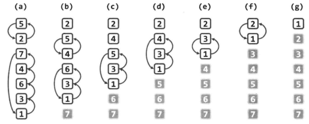
*如上图所示，每一趟扫描交换可以确定一个未排序数列中的最大项*

```cpp
void bubbleSort(int A[], int n) {
    for (int i = 0; i < n; i++) {
        for (int j = 0; j < n - 1 - i; j++) {
            if (A[j] > A[j + 1]) {
                swap(A[j], A[j + 1]);
            }
        }
    }
}
```

### 复杂度度量

#### 时间复杂度

定义：随着输入规模的扩大，执行时间的变化趋势可以表示为输入规模的函数，这个函数称作该算法的时间复杂度（timecomplexity）。具体地，特定算法处理规模为n的问题所需的时间可记作T(n)。

#### 渐进复杂度

在评价算法运行效率时，我们往往可以忽略其处理小规模问题时的能力差异，转而关注其在处理更大规模问题时的表现。其中的原因不难理解，小规模问题所需的处理时间本来就相对更少，故此时不同算法的实际效率差异并不明显;而在处理更大规模的问题时，效率的些许差异都将对实际执行效果产生巨大的影响。这种着眼长远、更为注重时间复杂度的总体变化趋势和增长速度的策略与方法，即所谓的渐进分析（asymptotic analysis）。

##### 大O记号

具体地, 若存在正的常数c和函数 f(n), 使得对任何 $n\geq2$ 都有
$$T(n)\leq c\cdot f(n)$$

在n趋近于一个无穷大时
$$T(n)=  O(f(n))$$

由此,可得出大O符号的以下性质：

1. 对于任一常数 $c \geq 0$ ,有$\,O(f(n))=O(c \cdot f(n))$
2. 对于任意常数 $a \geq b \geq c$ ,有$\,O(n^a+n^b)=O(n^a)$

对于在之前提到的起泡排序[起泡排序](#起泡排序)

起泡算法由内、外两层循环组成。内循环从前向后，依次比较各对相邻元素，如有必要则将其交换。故在每一轮内循环中，需要扫描和比较n - 1对元素，至多需要交换n - 1对元素。元素的比较和交换，都属于基本操作，故每一轮内循环至多需要执行2(n - 1)次基本操作。另外，外循环至多执行n - 1轮。因此，总共需要执行的基本操作不会超过2(n - 1)2次。

若以此来度量该算法的时间复杂度，则有$\,T(n)=O(2{(n-1)}^2)=O(n^2)$

##### 大$\Omega$记号

具体地, 若存在正的常数c和函数 f(n), 使得对任何 $n\geq2$ 都有
$$T(n)\geq c\cdot f(n)$$

在n趋近于一个无穷大时
$$T(n)=  \Omega (g(n))$$

由此,可得出大$\Omega$符号的以下性质：

##### 大$\Theta$记号

$\Theta$ 是对算法的时间复杂度做出定量的界定, 在n足够大之后, h(n)给出了T(n)的一个确界
$$T(n)=\Theta(h(n))$$

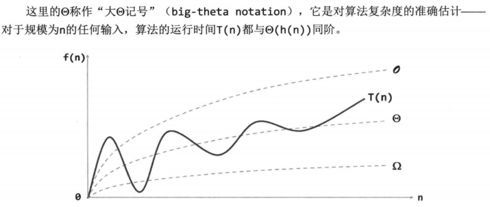

#### 空间复杂度

### 复杂度分析

#### 常数O(1)

运行时间可表示和度量为T(n) = *O*(1)的这一类算法，统称作**常数时间复杂度算法**(constant-time algorithm)。

一般地，仅含一次或常数次基本操作的算法均属此类。此类算法通常不含循环、分支、子程序调用等，但也不能仅凭语法结构的表面形式一概而论。

除了输入数组等参数之外，该算法仅需常数规模的辅助空间。
此类仅需*O*(1)辅助空间的算法，亦称作**就地算法**(in-place algorithm)。

#### 对数O($\log$n)

对于任意非负整数，统计其二进制展开中数位1的总数

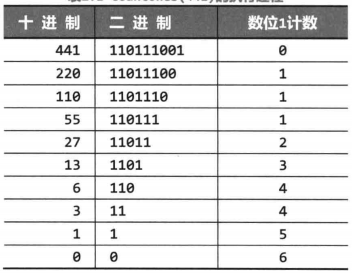

以$n = 441_{(10)} = 110111001_{(2)}$为例，采用以上算法, 变量 n 与计数器 ones 在计算过程中的演变过程如下表所示。


因此，countones()算法的执行时间主要由循环的次数决定，亦即:
$$
O(1+\lfloor\log_2{n}\rfloor) =O(\lfloor\log_2{n}\rfloor) = O(\log{n})
$$

更一般地，凡运行时间可以表示和度量为$T(n)= O(log^cn)$形式的这一类算法(其中常数$c\geq0$)，均统称作 **对数多项式时间复杂度的算法** (polylogarithmic-time algorithm). 上述O(logn)即c = 1的特例。此类算法的效率虽不如常数复杂度算法理想，但从多项式的角度看仍能无限接近于后者，故也是极为高效的一类算法。

#### 线性O(n)

计算给定n个整数的总和, 可由下图代码中的算法sumI()解决。

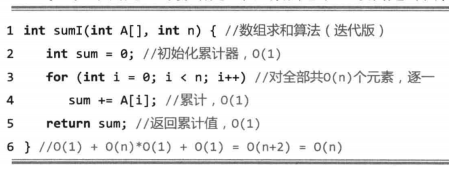

首先，对s的初始化需要o(1)时间。算法的主体部分是一个循环，每一轮循环中只需进行一次累加运算，这属于基本操作，可在o(1)时间内完成。每经过一轮循环，都将一个元素累加至s,故总共需要做n轮循环，于是该算法的运行时间应为:
$$O(1)+O(1)\times n=O(n+1)=O(n)$$

凡运行时间可以表示和度量为T(n)= O(n)形式的这一类算法，均统称作 **线性时间复杂度算法** (linear-time algorithm)。

#### 多项式O(n)

在算法复杂度理论中，多项式时间复杂度被视作一个具有特殊意义的复杂度级别。多项式级的运行时间成本，在实际应用中一般被认为是可接受的或可忍受的。某问题若存在一个复杂度在此范围以内的算法，则称该问题是可有效求解的或易解的(tractable)。

#### 指数$O(2^n)$

在禁止超过1位的移位运算的前提下，对任意非负整数n，计算幂$2^n$。

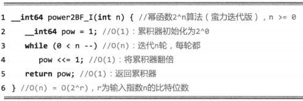

一般地，凡运行时间可以表示和度量为T(n) = O($a^n$)形式的算法(a > 1)，均属于 **指数时间复杂度算法** (exponential-time algorithm) 。

#### 复杂度层次

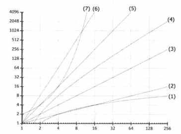
*复杂度的典型层次∶(1)~(7)依次为$O(\log n)、O(\sqrt[2]{n})、O(n)、O(n\log n)、O(n^2)、O(n^3)和O(2^{n})$*

### 递归

**递归**则是函数和过程调用的一种特殊形式，即允许函数和过程进行自我调用.
自我调用通常是直接的, 即在函数体中包含一条或多条调用自身的语句; 递归也可能以间接的形式出现, 即某个方法首先调用其他方法,再辗转通过其他方法的相互调用,最终调用起始的方法自身.

#### 线性递归

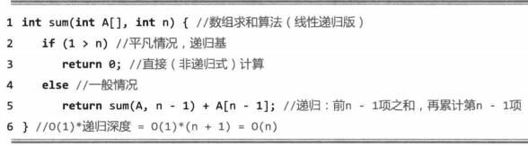

算法sum()可能朝着更深一层进行自我调用, 且每一递归实例对自身的调用至多一次。于是，每一层次上至多只有一个实例，且它们构成一个线性的次序关系。此类递归模式因而称作**线性递归**(linear recursion)，它也是递归的最基本形式。

#### 递归分析

$$
\begin{cases}
递归跟踪~\\
递推方程~\\
\end{cases}
$$

##### 递归跟踪

- 算法的每一递归实例都表示为一个方框，其中注明了该实例调用的参数
- 若实例M调用实例N,则在M与N对应的方框之间添加一条有向联线

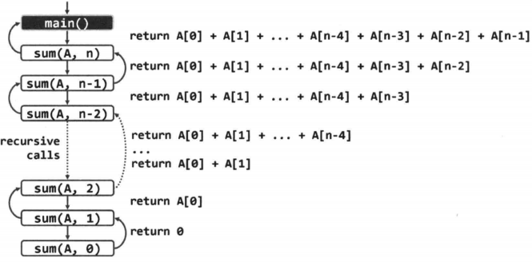

具体地，就以上的sum()算法而言，每一递归实例中非递归部分所涉及的计算无非三类(判断n是否为0、累加sum(n - 1)与A[n - 1]、返回当前总和)，且至多各执行一次。鉴于它们均属于基本操作，每个递归实例实际所需的计算时间都应为常数O(3)。由上图还可以看出，**对于长度为n的输入数组，递归深度应为n + 1**，故整个sum()算法的运行时间为:
$$
(n+1)\times O(3)=O(n)
$$

sum()算法的空间复杂度线性正比于其递归的深度，亦即O(n)。

##### 递推方程

仍以线性递归版sum()算法为例，将该算法处理长度为n的数组所需的时间成本记作T(n)。我们将该算法的思路重新表述如下:为解决问题sum(A, n), 需递归地解决问题sum(A, n - 1)，然后累加上A[n - 1]。按照这一新的理解，求解sum(A, n)所需的时间，应该等于求解sum(A, n - 1)所需的时间，另加一次整数加法运算所需的时间。

根据以上分析，可以得到关于T(n)的如下一般性的递推关系:
T(n)=T(n - 1) + O(1) = T(n - 1) +c，
其中c为常数

另一方面，当递归过程抵达递归基时，求解平凡问题sum(A，0)只需(用于直接返回e的)常数时间。

如此，即可获得如下边界条件:
T(0) = O(1) = $c_2$，其中cz为常数
联立以上两个方程，最终可以解得:
T(n) = $c_1n$ + $c_2$ = O(n)

#### 递归模式

##### 多递归基

考查数组倒置问题，也就是将数组中各元素的次序前后翻转

比如，若输入数组为:A[] = { 3，1，4，1，5，9，2，6 }
则输出数组为:A[] = { 2，6，9，5，1，4，1，3 }


通过上述思路，我们可以得到以下事实：
为了得到的整个数组的倒置，可以先对换其首末元素，然后递归地倒置除这两个元素以外的部分。

即是：


##### 多项递归

对于[计算幂函数幂函数$2^n$](#指数o2n), 按照线性递归的构思, 我们可以得到
上述链接的代码可以表示如下


以上线性递归的算法与[计算幂函数幂函数$2^n$](#指数o2n)算法完全一样,总共需要做O(n)次递归调用。

以下则是更快的一例

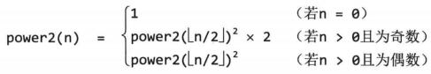


#### 递归消除

##### 空间成本

递归算法所消耗的空间量主要取决于递归深度，故较之同一算法的迭代版，递归版往往需耗费更多空间，并进而影响实际的运行速度。另外，就操作系统而言，为实现递归调用需要花费大量额外的时间以创建、维护和销毁各递归实例，这些也会令计算的负担雪上加霜。

有鉴于此，在对运行速度要求极高、存储空间需精打细算的场合，往往应将递归算法改写成等价的非递归版本。

##### 尾递归及其消除

在线性递归算法中，若递归调用在递归实例中恰好以最后一步操作的形式出现，则称作尾递归(tail recursion)。

仍以[代码](#多递归基)中算法为例。如代码1.9所示，首先在起始位置插入一个跳转标志next，然后将尾递归语句调用替换为一条指向next标志的跳转语句。


*由递归版改造而得的数组倒置算法(迭代版)*

新的迭代版与原递归版功能等效，但其中使用的goto语句有悖于结构化程序设计的原则。这一语句虽仍不得不被C++等高级语言保留，但最好还是尽力回避。为此可如以下代码所示，将next标志与if判断综合考查，并代之以一条逻辑条件等价的while语句。

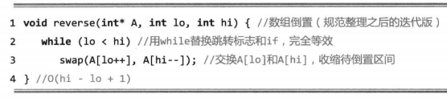

#### 二分递归

##### 分而治之

既然每一递归实例都可能做多次递归，故称作“多路递归”(multi-way recursion)。通常都是将原问题一分为二，故称作“二分递归”(binary recursion)。需强调的是，无论是分解为两个还是更大常数个子问题，对算法总体的渐进复杂度并无实质影响。

##### 数组求和

采用分而治之的策略,按照二分递归的模式再次解决数组求和问题。新算法的思路是：
以居中的元素为界将数组一分为二;递归地对子数组分别求和；最后，子数组之和相加即为原数组的总和。

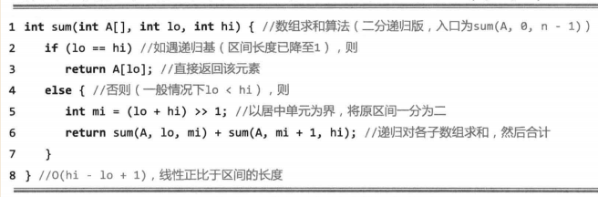
*通过二分递归计算数组之和*


*对sum(A, 0，7)的递归跟踪分析*

算法启动后经连续m = $\log$n次递归调用，数组区间的长度从最初的n首次缩减至1，并到达第一个递归基。实际上，刚到达任一递归基时，已执行的递归调用总是比递归返回多m = $log_2n$次。更一般地，到达区间长度为$2^k$的任一递归实例之前，已执行的递归调用总是比递归返回多m-k次。因此，递归深度（即任一时刻的活跃递归实例的总数）不会超过m + 1。鉴于每个递归实例仅需常数空间，故除数组本身所占的空间，该算法只需要O(m + 1) = O(1ogn)的附加空间。我们还记得，[线性递归版sum()算法](#线性递归)共需O(n)的附加空间，就这一点而言，新的二分递归版sum()算法有很大改进。

##### 效率

当然，并非所有问题都适宜于采用分治策略。实际上除了递归，此类算法的计算消耗主要来自两个方面。首先是**子问题划分**，即把原问题分解为形式相同、规模更小的多个子问题，比如将待求和数组分为前、后两段。其次是**子解答合并**，即由递归所得子问题的解，得到原问题的整体解，比如由子数组之和累加得到整个数组之和。

##### Fibonacci数

###### Fibonacci数:二分递归

考查Fibonacci数列第n项fib(n)的计算问题，该数列递归形式的定义如下


据此定义，可直接导出如代码1.12所示的二分递归版fib()算法
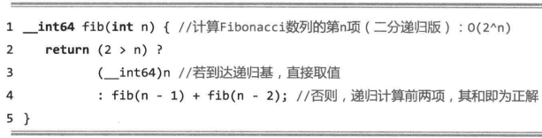
*通过二分递归计算Fibonacci数*

基于Fibonacci数列原始定义的这一实现，不仅正确性一目了然，而且简洁自然。然而不幸的是，在这种场合采用二分递归策略的效率极其低下。实际上，该算法需要运行$O(2^n)$时间才能计算出第n个Fibonacci数。这一指数复杂度的算法，在实际环境中毫无价值。

###### Fibonacci数: 优化策略

为消除递归算法中重复的递归实例，一种自然而然的思路和技巧，可以概括为
**借助一定量的辅助空间，在各子问题求解之后，及时记录下其对应的解答**

###### Fibonacci数: 线性递归

反观[代码ds20](#fibonacci数二分递归)，原fib()算法之所以采用二分递归模式，完全是因为受到该问题原始定义的表面特征—— fib(n) 由 fib(n - 1) 和 fib(n - 2) 共同决定——的误导。然而不难看出，子问题fib(n - 1)和fib(n - 2)实际上并非彼此独立。比如，只要转而采用定义如下的递归函数，计算一对相邻的Fibonacci数:
(fib(k-1)，fib(k))


*通过线性递归计算Fibonacci数*

###### Fibonacci数: 迭代

反观以上线性递归版fib()算法可见，其中所记录的每一个子问题的解答，只会用到一次。在该算法抵达递归基之后的逐层返回过程中,每向上返回一层，以下各层的解答均不必继续保留。

若将以上逐层返回的过程,等效地视作从递归基出发,按规模自小而大求解各子问题的过程，即可采用动态规划的策略，将以上算法进一步改写为如代码ds22所示的迭代版。


*基于动态规划策略计算Fibonacci数*

这里仅使用了两个中间变量f和g，记录当前的一对相邻Fibonacci数。整个算法仅需线性步的迭代，时间复杂度为O(n)。更重要的是，该版本仅需常数规模的附加空间，空间效率也有了极大提高。

### 抽象数据类型

所谓**封装**，就是将数据项与相关的操作结合为一个整体，并将其从外部的可见性划分为若干级别，从而将数据结构的外部特性与其内部实现相分离，提供一致且标准的对外接口，隐藏内部的实现细节。于是，数据集合及其对应的操作可超脱于具体的程序设计语言、具体的实现方式，即构成所谓的抽象数据类型(abstract data type，ADT)。

## 向量

**数据结构**是数据项的结构化集合，其结构性表现为数据项之间的相互联系及作用，也可以理解为定义于数据项之间的某种逻辑次序。根据这种逻辑次序的复杂程度，大致可以将各种数据结构划分为**线性结构**、**半线性结构**与**非线性结构**三大类。在线性结构中，各数据项按照一个线性次序构成一个整体。最为基本的线性结构统称为**序列**(sequence)，根据其中数据项的**逻辑次序**与其**物理存储地址**的对应关系不同，又可进一步地将序列区分为**向量**(vector)和**列表**(list)。在向量中，所有数据项的物理存放位置与其逻辑次序完全吻合，此时的逻辑次序也称作**秩**(rank);而在列表中，逻辑上相邻的数据项在物理上未必相邻，而是采用**间接定址**的方式通过封装后的位置（position）相互引用。

### 数组与向量

#### 数组介绍

若集合S由n个元素组成，且各元素之间具有一个线性次序，则可将它们存放于起始于地址A、物理位置连续的一段存储空间，并统称作数组(array)，通常以A作为该数组的标识。具体地，数组A[]中的每一元素都唯一对应于某一下标编号，在多数高级程序设计语言中，一般都是从0开始编号，依次是0号、1号、2号、....n-1号元素，记作;
$$
A={a_0,a_1,a_2,\cdots,a_n-1} or~\\
A[0,n)={a_0,a_1,a_2,\cdots,a_n-1}
$$

其中，对于任何0 $\leq$ i < j $\leq$ n，A[i] 都是 A[j] 的 **前驱**(predecessor)，A[j] 都是 A[i] 的 **后继**(successor)。特别地，对于任何i≥1，A[i- 1] 称作 A[i] 的 **直接前驱**(intermediatepredecessor) ;对于任何i sn - 2，A[i +1] 称作 A[i] 的 **直接后继** (intermediatesuccessor)。任一元素的所有前驱构成其 **前缀** (prefix)，所有后继构成其 **后缀** (suffix)。

若数组 A [ ] 存放空间的起始地址为A，且每个元素占用 s 个单位的空间，则元素 A[i] 对应的物理地址为:
$$
A+i \times s
$$

因其中元素的物理地址与其下标之间满足这种线性关系，故亦称作**线性数组** (linear array)

#### 向量介绍

**向量** (vector) 是线性数组的一种抽象与泛化，它也是由具有线性次序的一组元素构成的集合V = { $v_0,\,v_1,\,\cdots,v_{n-1}$ }，其中的元素分别由**秩**相互区分。

各元素的秩 (rank) 互异，且均为 [0, n) 内的整数。具体地，若元素e的前驱元素共计r个，则其秩就是r。以此前介绍的线性递归为例，运行过程中所出现过的所有递归实例，按照相互调用的关系可构成一个线性序列。在此序列中,各递归实例的秩反映了它们各自被创建的时间先后，每一递归实例的秩等于早于它出现的实例总数。反过来，通过r亦可唯一确定e = v。这是向量特有的元素访问方式，称作“**循秩访问**”(call-by-rank)。
>经如此抽象之后，我们不再限定同一向量中的各元素都属于同一基本类型，它们本身可以是来自于更具一般性的某一类的对象。另外，各元素也不见得同时具有某一数值属性，故而并不保证它们之间能够相互比较大小。

### 接口

#### 抽象数据类型 (ADT) 接口

|   操作接口    |                       功能2                        | 适用对象 |
| :-----------: | :------------------------------------------------: | :------: |
|    size()     |           报告向量当前的规模（元素总数）           |   向量   |
|    get(r)     |                  获取秩为r的元素                   |   向量   |
|   put(r,e)    |               用e替换秩为r元素的数值               |   向量   |
| insert(r, e)  |       e作为秩为r元素插入，原后继元素依次后移       |   向量   |
|   remove(r)   |     删除秩为r的元素，返回该元素中原存放的对象      |   向量   |
| disordered()  |           判断所有元素是否已按非降序排列           |   向量   |
|    sort()     |         调整各元素的位置，使之按非降序排列         |   向量   |
|    find(e)    |              查找等于e且秩最大的元素               |   向量   |
|   search(e)   |      查找目标元素e，返回不大于e且秩最大的元素      | 有序向量 |
| deduplicate() |                    剔除重复元素                    |   向量   |
|  uniquify()   |                    剔除重复元素                    | 有序向量 |
|  traverse()   | 遍历向量并统一处理所有元素，处理方法由函数对象指定 |   向量   |

#### 操作实例

按照表22定义的ADT接口，表23给出了一个整数向量从被创建开始，通过ADT接口依次实施一系列操作的过程。

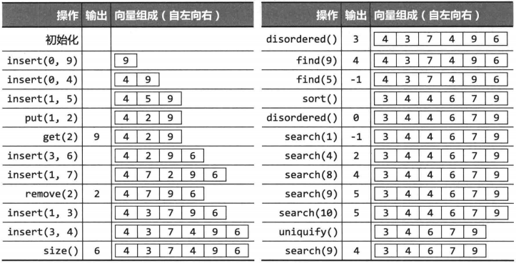

#### 向量模板类

按照表22确定的向量ADT接口，可定义Vector模板类如下所示

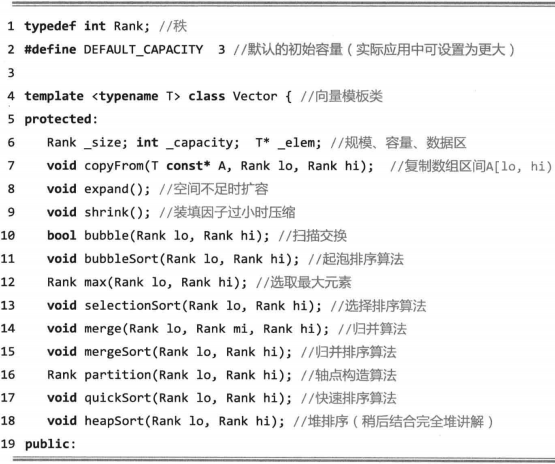


