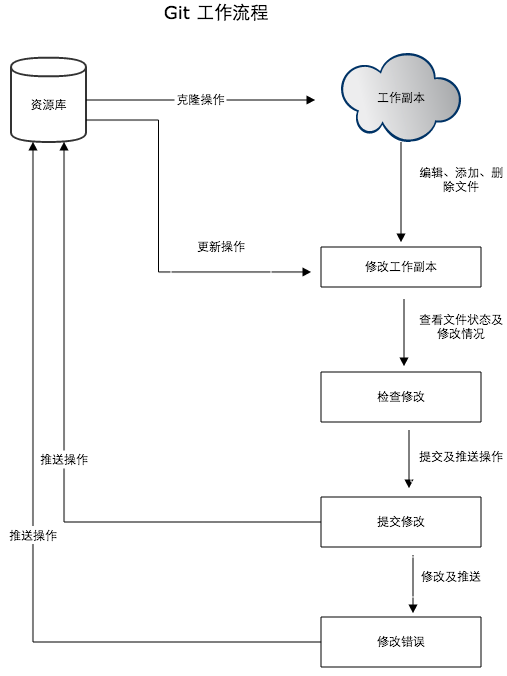

# Git

Git 是一个开源的分布式版本控制系统，用于敏捷高效地处理任何或小或大的项目。
Git 是 Linus Torvalds 为了帮助管理 Linux 内核开发而开发的一个开放源码的版本控制软件。
Git 与常用的版本控制工具 CVS, Subversion 等不同，它采用了分布式版本库的方式，不必服务器端软件支持。

## 安装与初始配置

### Git不同平台上安装

Git 的工作需要调用 curl，zlib，openssl，expat，libiconv 等库的代码，所以需要先安装这些依赖工具。

在有 yum 的系统上（比如 Fedora）或者有 apt-get 的系统上（比如 Debian 体系），可以用下面的命令安装：

各 Linux 系统可以使用其安装包管理工具（apt-get、yum 等）进行安装：

#### Linux

##### Debian/Ubuntu

Debian/Ubuntu Git 安装命令为：

```shell
apt-get install libcurl4-gnutls-dev libexpat1-dev gettext \
libz-dev libssl-dev
apt-get install git
git --version
git version 1.8.1.2
```

##### Centos/RedHat

如果你使用的系统是 Centos/RedHat 安装命令为：

```shell
yum install curl-devel expat-devel gettext-devel \
  openssl-devel zlib-devel
yum -y install git-core
git --version
git version 1.7.1
```

##### 源码安装

我们也可以在官网下载源码包来安装，最新源码包下载地址：<https://git-scm.com/download>

安装指定系统的依赖包：

########## Centos/RedHat ##########

```shell
yum install curl-devel expat-devel gettext-devel \
openssl-devel zlib-devel
```

########## Debian/Ubuntu ##########

```shell
apt-get install libcurl4-gnutls-dev libexpat1-dev gettext \
libz-dev libssl-dev
```

解压安装下载的源码包：

```shell
tar -zxf git-1.7.2.2.tar.gz
cd git-1.7.2.2
make prefix=/usr/local all
sudo make prefix=/usr/local install
```

#### Windows平台上安装

在 Windows 平台上安装 Git 同样轻松，有个叫做 msysGit 的项目提供了安装包，可以到 GitHub 的页面上下载 exe 安装文件并运行：

安装包下载地址：<https://gitforwindows.org/>

#### Mac 平台上安装

在 Mac 平台上安装 Git 最容易的当属使用图形化的 Git 安装工具，下载地址为：
<http://sourceforge.net/projects/git-osx-installer/>

### 初始配置

#### 配置个人信息

```shell
git config --global user.name "runoob"
git config --global user.email test@runoob.com
```

如果用了 --global 选项，那么更改的配置文件就是位于你用户主目录下的那个，以后你所有的项目都会默认使用这里配置的用户信息。

如果要在某个特定的项目中使用其他名字或者电邮，只要去掉 --global 选项重新配置即可，新的设定保存在当前项目的 .git/config 文件里

#### 查看配置信息

要检查已有的配置信息，可以使用 git config --list 命令：

```shell
git config --list
http.postbuffer=2M
user.name=runoob
user.email=test@runoob.com
```

有时候会看到重复的变量名，那就说明它们来自不同的配置文件（比如 /etc/gitconfig 和 ~/.gitconfig），不过最终 Git 实际采用的是最后一个。

这些配置我们也可以在 ~/.gitconfig 或 /etc/gitconfig 看到，如下所示：

```shell
vim ~/.gitconfig
```

显示内容如下所示：

```shell
[http]
postBuffer = 2M
[user]
name = runoob
email = test@runoob.com
```

也可以直接查阅某个环境变量的设定，只要把特定的名字跟在后面即可，像这样：

```shell
git config user.name
runoob
```

## Git工作流程

一般工作流程如下：

1. 克隆 Git 资源作为工作目录。
2. 在克隆的资源上添加或修改文件。
3. 如果其他人修改了，你可以更新资源。
4. 在提交前查看修改。
5. 提交修改。
6. 在修改完成后，如果发现错误，可以撤回提交并再次修改并提交.



## 创建仓库

### 初始化本地仓库

Git 使用 git init 命令来初始化一个 Git 仓库，Git 的很多命令都需要在 Git 的仓库中运行，所以 git init 是使用 Git 的第一个命令。

在执行完成 git init 命令后，Git 仓库会生成一个 .git 目录，该目录包含了资源的所有元数据，其他的项目目录保持不变。

使用当前目录作为 Git 仓库，我们只需使它初始化。

```shell
git init
```

该命令执行完后会在当前目录生成一个 .git 目录。

使用指定目录作为Git仓库。

```shell
git init newrepo
```

初始化后，会在 newrepo 目录下会出现一个名为 .git 的目录，所有 Git 需要的数据和资源都存放在这个目录中。

如果当前目录下有几个文件想要纳入版本控制，需要先用 git add 命令告诉 Git 开始对这些文件进行跟踪，然后提交：

```shell
git add *.c
git add README.txt
git commit -m '初始化项目版本'
```

以上命令将目录下以 .c 结尾及 README 文件提交到仓库中。

>注： 在 Linux 系统中，commit 信息使用单引号 '，Windows 系统，commit 信息使用双引号 "。所以在 git bash 中 git commit -m '提交说明' 这样是可以的，在 Windows 命令行中就要使用双引号 git commit -m "提交说明"。

```shell
git commit -m "Comments" Filename.txt
```

以上为将某个具体文件提交到本地仓库

### 克隆远程仓库到本地

我们使用 git clone 从现有 Git 仓库中拷贝项目（类似 svn checkout）。

克隆仓库的命令格式为：

```shell
git clone <repo>
```

如果我们需要克隆到指定的目录，可以使用以下命令格式：

```shell
git clone <repo> <directory>
```

参数说明：

- repo:远程仓库。
- directory:本地目录。

比如，要克隆 Ruby 语言的 Git 代码仓库 Grit，可以用下面的命令：

```shell
git clone git://github.com/schacon/grit.git
```

执行该命令后，会在当前目录下创建一个名为grit的目录，其中包含一个 .git 的目录，用于保存下载下来的所有版本记录。

如果要自己定义要新建的项目目录名称，可以在上面的命令末尾指定新的名字：

```shell
git clone git://github.com/schacon/grit.git mygrit
```

### 仓库配置

git 的设置使用 git config 命令。
显示当前的 git 配置信息：

```shell
git config --list
credential.helper=osxkeychain
core.repositoryformatversion=0
core.filemode=true
core.bare=false
core.logallrefupdates=true
core.ignorecase=true
core.precomposeunicode=true
```

编辑 git 配置文件:

```shell
git config -e    # 针对当前仓库
```

或者：

```shell
git config -e --global   # 针对系统上所有仓库
```

设置提交代码时的用户信息：

```shell
git config --global user.name "runoob"
git config --global user.email test@runoob.com
```

如果去掉 --global 参数只对当前仓库有效。

## 常见命令

git diff + filename
查看目的文件在工作区与本地仓库的差异

git diff
查看工作区与本地仓库的差异

