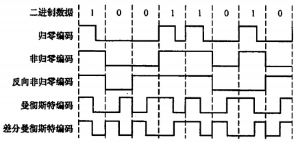
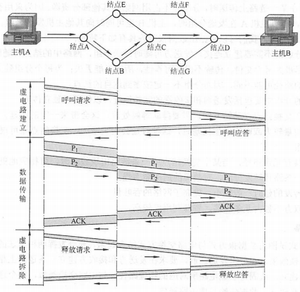
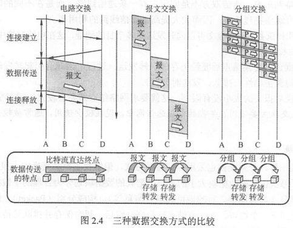

# 计网笔记

<!--本文文内公式不能另起一行，标题中不能有中文符号、-->

<table><tr><td bgcolor=white>【概要】本文仅为对2023王道计算机网络学习指导的整理笔记，不属于王道计算机网络学习指导的内容。本笔记仅供参考，不构成任何商业上的依据。本笔记所有权归个人所有，任何媒体、网站和其他方式的使用均不被许可。如有任何疑问，请联系QQ：1625369372。</td></tr></table>

## 计算机网络体系结构

## 物理层

### 通信基础

#### 基本概念

##### 数据 信号 码元

**通信**的目的是传送信息,如文字、图像和视频等。

**数据**是指传送信息的实体。

**信号**则是数据的电气或电磁表现，是数据在传输过程中的存在形式。

$$
\begin{cases}
连续变化的数据称为模拟数据\\
离散变化的数据称为数字数据\\
\end{cases}
$$

$$
数据传输方式
\begin{cases}
串行传输\\
并行传输\\
\end{cases}
$$

**串行传输**: 1比特1比特地按照时间顺序传输
(远距离通信通常采用串行传输)  
**并行传输**: 若干比特通过多条通信信道同时传输。

**码元**是指用一个固定时长的信号波形（数字脉冲）表示一位k进制数字，代表不同离散数值的基本波形，是数字通信中数字信号的计量单位，这个时长内的信号称为k进制码元,而该时长称为码元宽度。

##### 信源 信进 信宿

**数据通信**是指数字计算机或其他数字终端之间的通信。

一个数据通信系统主要划分为**信源**、**信道**和**信宿**三部分。  

**信源**是产生和发送数据的源头。  
**信宿**是接收数据的终点，它们通常都是计算机或其他数字终端装置。
>发送端信源发出的信息需要通过变换器转换成适合于在信道上传输的信号，而通过信道传输到接收端的信号先由反变换器转换成原始信息，再发送给信宿。

**信道**是信号的传输媒介,与电路并不等同。
>一个信道可视为一条线路的逻辑部件，一般用来表示向某个方向传送信息的介质，因此一条通信线路往往包含一条发送信道和一条接收信道。

信道的**极限容量**是指信道的最高码元传输速率或信道的极限信息传输速率。

**噪声源**是信道上的噪声（即对信号的干扰）及分散在通信系统其他各处的噪声的集中表示。

$$
信道分类
\begin{cases}
按传输信号形式分类
\begin{cases}
模拟信道（传输宽频信号）\\
数字信道（传输基带信号）\\
\end{cases}\\
按传输介质分类
\begin{cases}
无线信道\\
有线信道\\
\end{cases}\\
\end{cases}
$$

$$
信号分类
\begin{cases}
基带信号\\
宽带信号\\
\end{cases}
$$

**基带信号**:将数字信号1和0直接用两种不同的电压表示，然后送到数字信道上传输（称为基带传输）。
**宽带信号**:宽带信号将基带信号进行调制后形成频分复用模拟信号，然后送到模拟信道上传输（称为宽带传输）。

$$
通信双方信息交互方式
\begin{cases}
单向通信\\
半加工通信\\
全加工通信\\
\end{cases}
$$

**单向通信**：只有一个方向的通信而没有反方向的交互，仅需要一条信道。  
**半加工通信**：通信的双方都可以发送或接收信息，但任何一方都不能同时发送和接收信息，需要两条信道。
**全加工通信**：通信双方可以同时发送和接收信息,也需要两条信道。

##### 速率 波特 带宽

**速率**：也称数据率，指的是数据传输速率，表示单位时间内传输的数据量。

$$
速率表示方式的分类
\begin{cases}
码元传输速率\\
信息传输速率\\
\end{cases}
$$

**码元传输速率**：又称波特率，它表示单位时间内数字通信系统所传输的码元个数（也可称为脉冲个数或信号变化的次数），单位是波特（Baud）。1波特表示数字通信系统每秒传输一个码元。码元可以是多进制的，也可以是二进制的，码元速率与进制数无关。
**信息传输速率**：又称信息速率、比特率等，它表示单位时间内数字通信系统传输的二进制码元个数（即比特数），单位是比特/秒（b/s）。

码元传输速率（波特率）和信息传输速率（比特率）的关系
>若一个码元携带n比特的信息量
则M波特率的码元传输速率所对应的信息传输速率为Mn比特/秒
反之，则Mn比特/秒的码元传输速率所对应的信息传输速率为M
$\Longrightarrow$ 码元传输速率（波特率） $\times$ 单个码元平均携带信息量 = 信息传输速率（比特率）

---

#### 奈奎斯特定理与香农定理

**码间串扰**：具体的信道所能通过的频率范围总是有限的。信号中的许多高频分量往往不能通过信道，否则在传输中会衰减，导致接收端收到的信号波形失去码元之间的清晰界限。

##### 奈奎斯特定理

**奈奎斯特定理**：又称作奈氏准则，规定在理想低通（没有噪声、带宽有限）的信道中，为了避免码间串扰，极限码元传输速率为 2W 波特，其中 W 是理想低通信道的带宽。
>信道带宽是信道能通过的最高频率和最低频率之差，在这里单位是Hz。

W：理想低通信道的带宽
V：每个**码元离散电平**的数目
>码元的离散电平数目是指有多少种不同的码元，比如有16种不同的码元，则需要4个二进制位，因此数据传输速率是码元传输速率的4倍

$$
理想低通信道下的极限数据传输率 = 2W\ast\log_2(V)（单位为b/s）
$$

对于奈氏准则，可以得出以下结论：

1. 在任何信道中，码元传输速率是有上限的。若传输速率超过此上限，就会出现严重的码间串扰问题,使得接收端不可能完全正确识别码元。
2. 信道的频带越宽（即通过的信号高频分量越多），就可用更高的速率进行码元的有效传输。
3. 奈氏准则给出了码元传输速率的限制，但并未对信息传输速率给出限。即未对一个码元可以对应多少个二进制位给出限制。
4. 由于码元传输速率受奈氏准则的制约，所以要提高数据传输速率，就必须设法使每个码元携带更多比特的信息量，此时就需要采用多元制的调制方法。

##### 香农定理

香农（Shannon）定理给出了带宽受限且有高斯白噪声干扰的信道的极限数据传输速率，当用此速率进行传输时，可以做到不产生误差。

W：信道的带宽
S: 信道所传输信号的平均功率
N：信道内部高斯噪声功率
S/N：信噪比，即信号的平均功率与噪声的平均功率之比，信噪比 = $10\log_2(S/N)$，单位为dB
> 例如，信道带宽为10MHz，信号的平均功率为10W，噪声的平均功率为1W，则信噪比为10dB。

**香农定理**定义为：

$$
信道的极限数据传输速率 = W\ast\log_2(V)（单位为b/s）
$$

对于香农定理，可以得出以下结论：

1. 信道的带宽或信道中的信噪比越大，信息的极限传输速率越高。
2. 对一定的传输带宽和一定的信噪比，信息传输速率的上限是确定的。
3. 只要信息传输速率低于信道的极限传输速率凤就能找到某种方法来实现无差错的传输。
4. 香农定理得出的是极限信息传输速率，实际信道能达到的传输速率要比它低不少。

##### 奈氏准则 VS 香农定理

---

#### 编码与调制

> 数据 $\longrightarrow$ 数字信号 称作编码
数据 $\longrightarrow$ 模拟信号 称作调制

##### 数字数据编码为数字信号

1. **归零编码**：在归零编码（RZ）中用高电平代表1、低电平代表0（或者相反），每个时钟周期的中间均跳变到低电平（归零），接收方根据该跳变调整本方的时钟基准，这就为传输双方提供了自同步机制。由于归零需要占用一部分带宽，因此传输效率受到了一定的影响。
2. **非归零编码**：非归零编码（NRZ）与RZ编码的区别是不用归零，一个周期可以全部用来传输数据。但NRZ编码无法传递时钟信号，双方难以同步，因此若想传输高速同步数据,则需要都带有时钟线。
3. **反向非归零编码**：反向非归零编码（NRZI）与NRZ编码的区别是用信号的翻转代表0、信号保持不变代表1。翻转的信号本身可以作为一种通知机制。这种编码方式集成了前两种编码的优点，既能传输时钟信号，又能尽量不损失系统带宽。USB2.0通信的编码方式就是NRZI编码。
4. **曼彻斯特编码**：曼彻斯特编码。曼彻斯特编码（Manchester Encoding）将一个码元分成两个相等的间隔，前一个间隔为高电平而后一个间隔为低电平表示码元1;码元0的表示方法则正好相反。当然，也可采用相反的规定。该编码的特点是，在每个码元的中间出现电乎跳变，位中间的跳变既作为时钟信号（可用于同步）。又作为数据信号但它所占的频带宽度是原始基带宽度的两倍。
*是以太网使用的编码方式*
5. **差分曼彻斯特编码**：差分曼彻斯特编码。差分曼彻斯特编码常用于局域网传输，其规则是:若码元为1，则前半个码元的电平与上一码元的后半个码元的电平相同;若码元为0，则情形相反。该编码的特点是，在每个码元的中间都有一次电平的跳转，可以实现自同步，且抗干扰性较好。
6. 4B/5B编码：4B/5B编码。将欲发送数据流的每4位作为一组，然后按照4B/5B编码规则将其转换成相应的5位码。5位码共32种组合，但只采用其中的16种对应16种不同的4位码，其他16种作为控制码（帧的开始和结束、线路的状态信息等）或保留。

##### 数字数据调制为模拟信号

数字数据调制技术在发送端将数字信号转换为模拟信号，而在接收端将模拟信号还原为数字信号，分别对应于调制解调器的调制和解调过程。

基本的数字调制方法有如下几种:

1. 幅移键控（ASK）。通过改变载波信号的振幅来表示数字信号1和0，而载波的频率和相位都不改变。比较容易实现，但抗干扰能力差。
2. 频移键控（FSK）。通过改变载波信号的频率来表示数字信号1和0，而载波的振幅和相位都不改变。容易实现，抗干扰能力强，目前应用较为广泛。
3. 相移键控（PSK）。通过改变载波信号的相位来表示数字信号1和0，而载波的振幅和频率都不改变。它又分为绝对调相和相对调相。
4. 正交振幅调制（QAM）。在频率相同的前提下，将ASK与PSK结合起来，形成叠加信号。设波特率为B，采用m个相位，每个相位有n种振幅，则该QAM技术的数据传输速率R为
$$
R = B\ast\log_2(mn)\quad单位为b/s
$$

> 图 2.3 所示是二进制幅移键控、频移键控和相移键控的例子。2ASK中用载波有幅度和无幅度分别表示数字数据的1和0；2FSK中用两种不同的频率分别表示数字数据1和0；2PSK中用相位О和相位$\pi$分别表示数字数据的1和0，是一种绝对调相方式。

##### 模拟数据编码为数字信号

这种编码方式最典型的例子是常用于对音频信号进行编码的脉码调制（PCM）。它主要包括三个步骤，即采样、量化和编码。

1. **采样**：采样是指对模拟信号进行周期性扫描，把时间上连续的信号变成时间上离散的信号。根据采样定理，当采样的频率大于等于模拟数据的频带带宽（最高变化频率）的两倍时，所得的离散信号可以无失真地代表被采样的模拟数据。
2. **量化**：量化是把采样取得的电平幅值按照一定的分级标度转化为对应的数字值并取整数，这样就把连续的电平幅值转换为了离散的数字量。采样和量化的实质就是分割和转换。
3. **编码**：编码是把量化的结果转换为与之对应的二进制编码。

##### 模拟数据训制为模拟信号

为了实现传输的有效性，可能需要较高的频率。这种调制方式还可以使用频分复用（FDM）技术，充分利用带宽资源。电话机和本地局交换机采用模拟信号传输模拟数据的编码方式，模拟的声音数据是加载到模拟的载波信号中传输的。

---

#### 数据交换

##### 电路交换

在进行数据传输前，两个结点之间必须先建立一条专用（双方独占）的物理通信路径（由通信双方之间的交换设备和链路逐段连接而成），该路径可能经过许多中间结点。这一路径在整个数据传输期间一直被独占，直到通信结束后才被释放。

$$
电路交换技术分为三个阶段\begin{cases}
\text{1.} \text{连接建立} \\
\text{2.} \text{数据传输} \\
\text{3.} \text{连接释放} \\
\end{cases}
$$

从通信资源的分配角度来看，"交换"就是按照某种方式动态地分配传输线路的资源。电路交换的**关键点**是，在数据传输的过程中，用户始终占用端到端的固定传输带宽。

**电路交换技术优点**：

1. **通信时延小**。由于通信线路为通信双方用户专用，数据直达，因此传输数据的时延非常小。当传输的数据量较大时，这一优点非常明显。
2. **有序传输**。双方通信时按发送顺序传送数据,不存在失序问题。
3. **没有冲突**。不同的通信双方拥有不同的信道，不会出现争用物理信道的问题。
4. **适用范围广**。电路交换既适用于传输模拟信号，又适用于传输数字信号。
5. **实时性强**。通信双方之间的物理通路一旦建立,双方就可以随时通信。
6. **控制简单**。电路交换的交换设备（交换机等）及控制均较简单。

**电路交换技术缺点**：

1. **建立连接时间长**。电路交换的平均连接建立时间对计算机通信来说太长。
2. **线路独占**，使用效率低。电路交换连接建立后，物理通路被通信双方独占，即使通信线路空闲，也不能供其他用户使用，因而信道利用率低。
3. **灵活性差**。只要在通信双方建立的通路中的任何一点出了故障，就必须重新拨号建立新的连接,这对十分紧急和重要的通信是很不利的。
4. **难以规格化**。电路交换时，数据直达，不同类型、不同规格、不同速率的终端很难相互进行通信，也难以在通信过程中进行差错控制。

>注意，电路建立后，除源结点和目的结点外，电路上的任何结点都采取“直通方式”接收数据和发送数据，即不会存在存储转发所耗费的时间。

##### 报文交换

数据交换的单位是**报文**，报文携带有目标地址、源地址等信息。报文交换在交换结点采用的是**存储转发**的传输方式。

**报文交换技术优点**：

1. **无须建立连接**。报文交换不需要为通信双方预先建立一条专用的通信线路，不存在建立连接时延，用户可以随时发送报文。
2. **动态分配线路**。当发送方把报文交给交换设备时，交换设备先存储整个报文，然后选择一条合适的空闲线路，将报文发送出去。
3. **提高线路可靠性**。如果某条传输路径发生故障，那么可重新选择另一条路径传输数据，因此提高了传输的可靠性。
4. **提高线路利用率**。通信双方不是固定占有一条通信线路，而是在不同的时间一段一段髭部分占有这条物理通道，因而大大提高了通信线路的利用率。
5. **提供多目标服务**。一个报文可以同时发送给多个目的地址，这在电路交换中是很难实现的。

**报文交换技术的缺点**如下:

1. 由于数据进入交换结点后要经历存储、转发这一过程，因此会引起转发时延（包括接收报文、检验正确性、排队、发送时间等）。
2. 报文交换对报文的大小没有限制，这就要求网络结点需要有较大的缓存空间。

##### 分组交换

同报文交换一样，分组交换也采用**存储转发**方式，但解决了报文交换中大报文传输的问题。分组交换限制了每次传送的数据块大小的上限，把大的数据块划分为合理的小数据块，再加上一些必要的控制信息（如源地址、目的地址和编号信息等），构成分组（Packet）。网络结点根据控制信息把分组送到下一个结点，下一个结点接收到分组后，暂时保存并排队等待传输，然后根据分组控制信息选择它的下一个结点，直到到达目的结点。

分组交换的优点如下：

1. **无建立时延**。不需要为通信双方预先建立一条专用的通信线路，不存在连接建立时延，用户可随时发送分组。
2. **线路利用率高**。通信双方不是固定占有一条通信线路，而是在不同的时间一段一段地部分占有这条物理通路，因而大大提高了通信线路的利用率。
3. **简化了存储管理**（相对于报文交换）。因为分组的长度固定，相应的缓冲区的大小也固定，在交换结点中存储器的管理通常被简化为对缓冲区的管理，相对比较容易。
4. **加速传输**。分组是逐个传输的，可以使后一个分组的存储操作与前一个分组的转发操作并行，这种流水线方式减少了报文的传输时间。此外，传输一个分组所需的缓冲区比传输一次报文所需的缓冲区小得多，这样因缓冲区不足而等待发送的概率及时间也必然少得多。
5. **减少了出错概率和重发数据量**。因为分组较短其出错概率必然减小,所以每次重发的数据量也就大大减少，这样不仅提高了可靠性，也减少了传输时延。

分组交换的缺点如下：

1. **存在传输时延**。尽管分组交换比报文交换的传输时延少，但相对于电路交换仍存在存储转发时延，而且其结点交换机必须具有更强的处理能力。
2. **需要传输额外的信息量**。每个小数据块都要加上源地址、目的地址和分组编号等信息，从而构成分组，因此使得传送的信息量增大了5%~10%，一定程度上降低了通信效率，增加了处理的时间，使控制复杂，时延增加。
3. 当分组交换采用数据报服务时，可能会出现失序、丢失或重复分组，分组到达目的结点时，要对分组按编号进行排序等工作，因此很麻烦。若采用虚电路服务，虽无失序问题，但有呼叫建立、数据传输和虚电路释放三个过程。

分组交换根据其通信子网向端点系统提供的服务，还可进一步分为**面向连接**的虚电路方式和**无连接**的数据报方式。这两种服务方式都由**网络层**提供。

$$
分组交换方式\begin{cases}
数据报\\
虚电路\\
\end{cases}
$$

###### **数据报**

作为通信子网用户的端系统发送一个报文时，在端系统中实现的高层协议先把报文拆成若干带有序号的数据单元，并在网络层加上地址等控制信息后形成数据报分组（即网络层的PDU）。中间结点存储分组很短一段时间，找到最佳的路由后，尽快转发每个分组。不同的分组可以走不同的路径，也可以按不同的顺序到达目的结点。

假定主机A要向主机B发送分组，以下是**数据报的传送过程**。

1. 主机A先将分组逐个发往与它直接相连的交换结点A，交换结点A缓存收到的分组。
2. 然后查找自己的转发表。由于不同时刻的网绍状态不同，因此转发表的内容可能不完全相同，所以有的分组转发给交换结点C，有的分组转发给交换结点D。
3. 网络中的其他结点收到分组后，类似地转发分组，直到分组最终到达主机B.

>当分组正在某一链路上传送时，分组并不占用网络的其他部分资源。因为采用存储转发技术，资源是共享的，所以主机A在发送分组时，主机B也可同时向其他主机发送分组。

**数据报服务的特点**：

1. 发送分组前不需要建立连接。发送方可随时发送分组，网络中的结点可随时接收分组。
2. 网络尽最大努力交付，传输不保证可靠性，所以可能丢失；为每个分组独立地选择路由，转发的路径可能不同，因而分组不一定按序到达目的结点。
3. 发送的分组中要包括发送端和接收端的完整地址，以便可以独立传输。
4. 分组在交换结点存储转发时，需要排队等候处理，这会带来一定的时延。通过交换结点的通信量较大或网络发生拥塞时，这种时延会大大增加，交换结点还可根据情况丢弃部分分组。
5. 网络具有冗余路径，当某个交换结点或一条链路出现故障时，可相应地更新转发表，寻找另一条路径转发分组，对故障的适应能力强。
6. 存储转发的延时一般较小，提高了网络的吞吐量。
7. 收发双方不独占某条链路，资源利用率较高。

###### **虚电路**

虚电路方式试图将数据报方式与电路交换方式结合起来，充分发挥两种方法的优点，以达到最佳的数据交换效果。在分组发送之前，要求在发送方和接收方建立一条逻辑上相连的虚电路,并且连接一旦建立，就固定了虚电路所对应的物理路径。与电路交换类似，整个通信过程分为三个阶段：虚电路建立、数据传输与虚电路释放。

>在虚电路方式中，端系统每次建立虚电路时，选择一个未用过的虚电路号分配给该虚电路，以区别于本系统中的其他虚电路。在传送数据时，每个数据分组不仅要有分组号、校验和等控制信息，还要有它要通过的虚电路号，以区别于其他虚电路上的分组。在虚电路网络中的每个结点上都维持一张虚电路表，表中的每项记录了一个打开的虚电路的信息，包括在接收链路和发送链路上的虚电路号、虚电路的源结点和目的结点。数据的传输是双向进行的，上述信息是在虚电路的建立过程中确定的。

>上图的数据传输过程是**有确认的传输**（由高层实现），主机B收到分组后要发回相应分组的确认。网络中的传输是否有确认与网络层提供的两种服务没有任何关系。

**虚电路的连接过程**：

1. 为进行数据传输，主机A与主机B之间先建立一条逻辑通路，主机A发出一个特殊的“呼叫请求”分组，该分组通过中间结点送往主机B，若主机B同意连接，则发送“呼叫应答”分组予以确认。
2. 虚电路建立后，主机A就可向主机B发送数据分组。当然，主机B也可在该虚电路上向主机A发送数据。
3. 传送结束后主机A通过发送“释放请求”分组来拆除虚电路，逐段断开整个连接。

通过上面的例子，可以总结出**虚电路服务具有如下特点**:

1. 虚电路通信链路的建立和拆除需要时间开销，对交互式应用和小量的短分组情况显得很浪费，但对长时间、频繁的数据交换效率较高。
2. 虚电路的路由选择体现在连接建立阶段，连接建立后，就确定了传输路径。
3. 虚电路提供了可靠的通信功能，能保证每个分组正确且有序到达。此外，还可以对两个数据端点的流量进行控制，当接收方来不及接收数据时，可以通知发送方暂缓发送。
4. 虚电路有一个致命的弱点，即当网络中的某个结点或某条链路出现故障而彻底失效时，所有经过该结点或该链路的虚电路将遭到破坏。
5. 分组首部不包含目的地址，包含的是虚电路标识符，相对于数据报方式，其开销小。

>虚电路乙所以是“虚”的，是因为这条电路不是专用的，每个结点到其他结点之间的链路可能同时有若干虚电路通过，也可能同时与多个结点之间建立虚电路。（每条虚电路支持特定的两个端系统之间的数据传输，两个端系统之间也可以有多条虚电路为不同的进程服务，这些虚电路的实际路由可能相同也可能不同。

##### 三种交换方式的比较

要传送的数据量很大且其传送时间远大于呼叫时间时，采用[电路交换](#电路交换)较为合适。端到端的通路由多段链路组成时，采用[分组交换](#分组交换)传送数据较为合适。从提高整个网络的信道利用率上看，[报文交换](#报文交换)和分组交换优于电路交换，其中分组交换比报文交换的时延小，尤其适合于计算机之间的**突发式数据通信**。

---

### 传输介质

传输介质也称传输媒体，它是数据传输系统中发送设备和接收设备之间的物理通路。

传输介质 $\begin{cases}导向传输介质\\非导向传输介质\\\end{cases}$
在**导向传输介质**中，电磁波被导向沿着固体媒介（铜线或光纤）传播，而**非导向传输介质**可以是空气、真空或海水等。

#### 导向传输介质

##### 双绞线

**双绞线**是最常用的古老传输介质，它由两根采用一定规则并排绞合的、相互绝缘的铜导线组成。绞合可以减少对相邻导线的电磁干扰。

双绞线 $\begin{cases}屏蔽双绞线\\非屏蔽双绞线\\\end{cases}$
为了进一步提高抗电磁干扰的能力，可在双绞线的外面再加上一层，即用金属丝编织成的**屏蔽层**，这就是**屏蔽双绞线**（STP）。无屏蔽层的双绞线称为**非屏蔽双绞线**（UTP）。

>双绞线的价格便宜，是最常用的传输介质之一，在局域网和传统电话网中普遍使用。双绞线的带宽取决于铜线的粗细和传输的距离。模拟传输和数字传输都可使用双绞线，其通信距离一般为几千米到数十千米。距离太远时，对于模拟传输，要用放大器放大衰减的信号；对于数字传输，要用中继器将失真的信号整形。

##### 同轴电缆

**同轴电缆**由内导体、绝缘层、网状编织屏蔽层和塑料外层构成，如下图所示。按特性阻抗数值的不同，通常将同轴电缆分为两类：50$\Omega$同轴电缆和75$\Omega$同轴电缆。其中，50$\Omega$同轴电缆主要用于传送基带数字信号，又称基带同轴电缆，它在局域网中应用广泛；75$\Omega$同轴电缆主要用于传送宽带信号，又称宽带同轴电缆，主要用于有线电视系统。

同轴电缆 $\begin{cases}基带同轴电缆\\宽带同轴电缆线\\\end{cases}$

[同轴电缆](#同轴电缆) VS [双绞线](#双绞线)
由于外导体屏蔽层的作用，同轴电缆具有良好的抗干扰特性，被广泛用于传输较高速率的数据，其传输距离更远，但价格较双绞线贵。

##### 光纤

**光纤通信**就是利用光导纤维（简称光纤）传递光脉冲来进行通信。
>有光脉冲表示1，无光脉冲表示0。可见光的频率约为10$^8$MHz，因此光纤通信系统的带宽范围极大。

光纤主要由纤芯和包层构成，纤芯很细，其直径只有8至100um，光波通过纤芯进行传导，包层较纤芯有较低的折射率。当光线从高升射踯的余质射向低折射率的介质时，其折射角将大于入射角。因此，只要入射角大于某个临界角度,就会出现全反射，即光线碰到包层时就会折射回纤芯，这个过程不断重复，光也就沿光纤传输下去。

光纤 $\begin{cases}多模光纤（适合近距离）\\单模光纤（适合远距离）\\\end{cases}$

**多模光纤**：利用光的全反射特性，可以将从不同角度入射的多条光线在一根光纤中传输，这种光纤称为多模光纤，多模光纤的光源为发光二极管。光脉冲在多模光纤中传输时会逐渐展宽，造成失真，因此多模光纤只适合于近距离传输。

**单模光纤**：光纤的直径减小到只有一个光的波长时，光纤就像一根波导那样，可使光线一直向前传播，而不会产生多次反射，这样的光纤就是单模光纤。单模光纤的纤芯很细，直径只有几微米，制造成本较高。同时，单模光纤的光源为定向性很好的半导体激光器，因此单模光纤的衰减较小，可传输数公里甚至数十千米而不必采用中继器，适合远距离传输。

光纤不仅具有通信容量非常大的**优点**，还具有如下**特点**:

1. 传输损耗小，中继距离长，对远距离传输特别经济。
2. 抗雷电和电磁干扰性能好。这在有大电流脉冲干扰的环境下尤为重要。
3. 无串音干扰，保密性好，也不易被窃听或截取数据。
4. 体积小，重量轻。这在现有电缆管道已拥塞不堪的情况下特别有利。

---

#### 非导向传输介质

也称作无线传输介质。无线通信已广泛应用于移动电话领域，构成蜂窝式无线电话网。随着便携式计算机的出现，以及在军事、野外等特殊场合下移动通信联网的需要，促进了数字化移动通信的发展，现在无线局域网产品的应用已非常普遍。

##### 无线电波

无线电波具有较强的穿透能力，可以传输很长的距离，所以它被广泛应用于通信领域，如无线手机通信、计算机网络中的无线局域网（WLAN）等。因为无线电波使信号向所有方向散播，因此有效距离范围内的接收设备无须对准某个方向，就可与无线电波发射者进行通信连接，大大简化了通信连接。这也是无线电传输的最重要优点之一。

##### 视线介质

视线介质 $\begin{cases}微波\\红外线\\激光\\\end{cases}$

目前高带宽的无线通信主要使用三种技术:微波、红外线和激光。它们都需要发送方和接收方之间存在一条视线（Line-of-sight）通路，有很强的方向性，都沿直线传播，有时统称这三者为视线介质。不同的是，红外通信和激光通信把要传输的信号分别转换为各自的信号格式，即红外光信号和激光信号，再直接在空间中传播。
微波通信的频率较高，频段范围也很宽，载波频率通常为2~40GHz，因而通信信道的容量大。例如，一个带宽为2MHz的频段可容纳500条语音线路，若用来传输数字信号，数据率可达数兆比特/秒。与通常的无线电波不同，微波通信的信号是沿直线传播的，因此在地面的传播距离有限，超过一定距离后就要用中继站来接力。
卫星通信利用地球同步卫星作为中继来转发徼波信号，可以克服地面徼波通信距离的限制。三颗相隔120°的同步卫星几乎能覆盖整个地球表面，因而基本能实现全球通信。卫星通信的优点是通信容量大、距离远、覆盖广，缺点是保密性差、端到端传播时延长。·

---

#### 物理层接口的特性

物理层考虑的是如何在连接到各种计算机的传输媒体上传输数据比特流，而不指具体的传输媒体。网络中的硬件设备和传输介质的种类繁多，通信方式也各不相同。物理层应尽可能屏蔽这些差异，让数据链路层感觉不到这些差异，使数据链路层只需考虑如何完成本层的协议和服务。

物理层的主要任务可以描述为确定与传输媒体的接口有关的一些特性:

1. **机械特性**。指明接口所用接线器的形状和尺寸、引脚数目和排列、固定和锁定装置等。
2. **电气特性**。指明在接口电缆的各条线上出现的电压的范围。
3. **功能特性**。指明某条线上出现的某一电平的电压表示何种意义。
4. **过程特性**。或称规程特性。指明对于不同功能的各种可能事件的出现顾序。常用的物理层接口标准有 EIA RS-232-C、ADSL 和 SONET/SDH 等。

---

### 物理层设备

#### 中继器

中继器的**主要功能**是将信号整形并放大再转发出去，以消除信号经过一长段电缆后而产生的失真和衰减，使信号的波形和强度达到所需要的要求，进而扩大网络传输的距离。其原理是信号再生（而非简单地将衰减的信号放大）。中继器有两个端口，数据从一个端口输入，再从另一个端口发出。端口仅作用于信号的电气部分，而不管是否有错误数据或不适于网段的数据。
中继器是用来扩大网络规模的最简单廉价的互联设备。中继器两端的网络部分是网段，而不是子网，使用中继器连接的几个网段仍然是一个局域网。中继器若出现故障，对相邻两个网段的工作都将产生影响。由于**中继器工作在物理层**，因此它不能连接两个具有不同速率的局域网。

>注意:如果某个网络设备具有存储转发的功能，那么可以认为它能连接两个不同的协议;如果该网络设备没有存储转发功能，那么认为它不能连接两个不同的协议。中继器没有存储转发功能，因此它不能连接两个速率不同的网段，中继器两端的网段一定要使用同一个协议。

从理论上讲，中继器的使用数目是无限的，网络因而也可以无限延长。但事实上这不可能,因为网络标准中对信号的延迟范围做了具体的规定，中继器只能在此规定范围内进行有效的工作，否则会引起网络故障。例如，在采用粗同轴电缆的 10BASE5 以太网规范中，互相串联的中继器的个数不能超过4个，而且用4个中继器串联的5段通信介质中只有3段可以挂接计算机;其余两段只能用作扩展通信范围的链路段，不能挂接计算机。这就是所谓的“5-4-3规则”。
>注意:放大器和中继器都起放大作用，只不过放大器放大的是模拟信号，原理是将衰减的信号放大，而中继器放大的是数字信号，原理是将衰减的信号整形再生.

#### 集线器

集线器（Hub）实质上是一个多端口的中继器。当Hub工作时，一个端口接收到数据信号后，由于信号在从端口到Hub的传输过程中已有衰减，所以 Hub 便将该信号进行整形放大，使之再生（恢复）到发送时的状态，紧接着转发到其他所有（除输入端口外）处于工作状态的端口。如果同时有两个或多个端口输入，那么输出时会发生冲突，致使这些数据都无效。从 Hub 的工作方式可以看出，它在网络中只起信号放大和转发作用，目的是扩大网络的传输范围，而不具备信号的定向传送能力，即信号传输的方向是固定的，是一个标准的共享式设备。
Hub主要使用双绞线组建共享网络，是从服务器连接到桌面的最经济方案。在交换式网络中，Hub直接与交换机相连，将交换机端口的数据送到桌面上。使用Hub组网灵活，它把所有结点的通信集中在以其为中心的结点上，对结点相连的工作站进行集中管理，不让出问题的工作站影响整个网络的正常运行，并且用户的加入和退出也很自由。由 Hub 组成的网络是共享式网络，但逻辑上仍是一个总线网。Hub 的每个端口连接的网络部分是同一个网络的不同网段，同时 Hub 也只能在半双工状态下工作，网络的吞吐率因而受到限制。
>注意：多台计算机必然会发生同时通信的情形，因此集线器不能分割冲突域，所有集线器的端口都属于同一个冲突域。集线器在一个时钟周期中只能传输一组信息，如果一台集线器连接的机器数目较多，且多台机器经常需要同时通信，那么将导致信息碰撞，使得集线器的工作效率很差。比如，一个带宽为10Mb/s的集线器上连接了8台计算机，当这8台计算机同时工作时，每台计算机真正所拥有的带宽为10/8Mb/s = 1.25Mb/s.

---

## 数据链路层

### 数据链路层的功能

#### 为网络层提供服务

数据链路层在物理层提供服务的基础上**向网络层提供服务**，其最基本的服务是将源自网络层来的数据*可靠*地传输至相邻节点的目标机网络层。其主要作用是**加强物理层传输原始比特流的功能**，将物理层提供的可能出错的物理连去改造成为*逻辑上无差错的数据链路*，使之对网络层表现为一条无差错的链路。

对网络层而言，数据链路层的**基本任务**是将源机器中来自网络层的数据传输到目标机器的网络层。数据链路层通常可为网络层提供如下服务:

1. **无确认的无连接服务**。源机器发送数据帧时不需先建立链路连接，目的机器收到数据帧时不需发回确认。对丢失的帧，数据链路层不负责重发而交给上层处理。适用于实时通信或误码率较低的通信信道，如以太网。
2. **有确认的无连接服务**。源机器发送数据帧时不需先建立链路连接，但目的机器收到数据帧时必须发回确认。源机器在所规定的时间内未收到确定信号时，就重传丢失的帧，以提高传输的可靠性。该服务适用于误码率较高的通信信道，如无线通信。
3. **有确认的面向连接服务**。帧传输过程分为三个阶段：建立数据链路、传输帧、释放数据链路。目的机器对收到的每一帧都要给出确认，源机器收到确认后才能发送下一帧，因而该服务的可靠性最高。该服务适用于通信要求（可靠性、实时性）较高的场合。

>注意：有连接就一定要有确认，即不存在无确认的面向连接的服务。

#### 链路管理

数据链路层连接的**建立**、**维持**和**释放**过程称为链路管理，它主要用于**面向连接**的服务。链路两端的结点要进行通信，必须首先确认对方已处于就绪状态，并交换一些必要的信息以对帧序号初始化，然后才能建立连接，在传输过程中则要能维持连接，而在传输完毕后要释放该连接。在多个站点共享同一物理信道的情况下（如在局域网中）如何在要求通信的站点间分配和管理信道也属于数据链路层管理的范畴。

#### 封装成帧

两台主机之间传输信息时，必须将网络层的分组**封装成帧**，以帧的格式进行传送。将一段数据的前后分别添加首部和尾部，就构成了**帧**。因此，**帧长**等于数据部分的长度加上首部和尾部的长度。首部和尾部中含有很多控制信息，它们的一个重要作用是确定帧的界限，即**帧定界**。而**帧同步**指的是接收方应能从接收到的二进制比特流中区分出帧的起始与终止。如在HDIC协议中，用标识位F（O1111110）来标识帧的开始和结束。通信过程中，检测到帧标识位F即认为是帧的开始，然后一旦检测到帧标识位F即表示帧的结束。HDLC标准帧格式如图所示。为了提高帧的传输效率，应当使帧的数据部分的长度尽可能地大于首部和尾部的长度，但每种数据链路层协议都规定了帧的数据部分的长度上限——**最大传送单元（MTU）**.

如果在数据中恰好出现与帧定界符相同的比特组合（会误认为“传输结束”而丢弃后面的数据），那么就要采取有效的措施解决这个问题，即透明传输。更确切地说，**透明传输**就是不管所传数据是什么样的比特组合，都应当能在链路上传送。

#### 流量控制

由于收发双方各自的工作速率和缓存空间的差异，可能出现发送方的发送能力大于接收方的接收能力的现象，如若此时不适当限制发送方的发送速率（即链路上的信息流盘），前面来不及接收的帧将会被后面不断发送来的帧“淹没”，造成帧的丢失而出错。因此，**流量控制**实际上就是限制发送方的数据流量，使其发送速率不超过接收方的接收能力。
这个过程需要通过某种反馈机制使发送方能够知道接收方是否能跟上自己，即需要有一些规则使得发送方知道在什么情况下可以接着发送下一帧，而在什么情况下必须暂停发送，以等待收到某种反馈信息后继续发送。
流量控制（见图3.2）并不是数据链路层特有的功能，许多高层协议中也提供此功能，只不过控制的对象不同而已。对于数据链路层来说，控制的是相邻两结点之间数据链路上的流量，而对于运输层来说，控制的则是从源端到目的端之间的流量。

注意:在OSI体系结构中，数据链路层具有流量控制的功能。而在TCP/P体系结构中，流量控制功能被移到了传输层。因此，有部分教材将流量控制放在传输层进行讲解。

#### 差错控制

由于信道噪声等各种原因，帧在传输过程中可能会出现错误。用以使发送方确定接收方是否正确收到由其发送的数据的方法称为差错控制。通常，这些错误可分为位错和帧错。
**位错**指帧中某些位出现了差错。通常采用循环冗余校验（CRC）方式发现位错，通过自动重传请求（Automatic Repeat reQuest，ARQ）方式来重传出错的帧。具体做法是：让发送方将要发送的数据帧附加一定的CRC冗余检错码一并发送，接收方则根据检错码对数据帧进行错误检测,若发现错误则丢弃，发送方超时重传该数据帧。这种差错控制方法称为ARQ法。ARQ法只需返回很少的控制信息就可有效地确认所发数据帧是否被正确接收。
**帧错**指帧的丢失、重复或失序等错误。在数据链路层引入定时器和编号机制，能保证每一帧最终都能有且仅有一次正确地交付给目的结点。

[差错控制方法](#差错控制方法)

### 组帧

数据链路层之所以要把比特组合成帧为单位传输，是为了在出错时只重发出错的帧，而不必重发全部数据，从而提高效率。为了使接收方能正确地接收并检查所传输的帧，发送方必须依据一定的规则把网络层递交的分组[封装成帧](#封装成帧)（**又称为组帧**）。组帧主要解决**帧定界**、**帧同步**、**透明传输**等问题。

由于字节计数法中计数字段的脆弱性和字符填充法实现上的复杂性与不兼容性，目前较常用的组帧方法是比特填充法和违规编码法。

#### 字符计数法

如图所示，**字符计数法**是指在帧头部使用一个计数字段来标明帧内字符数。目的结点的数据链路层收到字节计数值时，就知道后面跟随的字节数，从而可以确定帧结束的位置（计数字段提供的字节数包含自身所占用的一个字节）。
这种方法最大的问题在于如果计数字段出错，即失去了帧边界划分的依据，那么接收方就无法判断所传输帧的结束位和下一帧的开始位，收发双方将失去同步，从而造成灾难性后果。

#### 字符填充的首尾定界符法

**字符填充法**使用特定字符来定界一帧的开始与结束，在图3.4的例子中，控制字符SOH放在帧的最前面，表示帧的首部开始，控制字符EOT 表示帧的结束。为了使信息位中出现的特殊字符不被误判为帧的首尾定界符，可在特殊字符前面填充一个**转义字符**（ESC）来加以区分（注意，转义字符是ASCII码中的控制字符，是一个字符，而非“E”“S”“C”三个字符的组合），以实现数据的透明传输。接收方收到转义字符后，就知道其后面紧跟的是数据信息，而不是控制信息。
如图3.4所示的字符帧，帧的数据段中出现EOT或SOH字符，发送方在每个EOT或SOH字符前再插入一个ESC字符，接收方收到数据后会自己删除这个插入的ESC字符，结果仍得到原来的数据。这也正是字符填充法名称的由来。如果转义字符ESC也出现在数据中，那么解决方法仍是在转义字符前插入一个转义字符。

#### 零比特填充的首尾标志法

如图所示，**零比特填充法**允许数据帧包含任意个数的比特，也允许每个字符的编码包含任意个数的比特。它使用一个特定的比特模式，即01111110来标志一帧的开始和结束。为了不使信息位中出现的比特流01111110被误判为帧的首尾标志，发送方的数据链路层在信息位中遇到5个连续的“1”时，将自动在其后插入一个“0"；而接收方做该过程的逆操作，即每收到5个连续的“1”时，自动删除后面紧跟的“0”，以恢复原信息。

零比特填充法很容易由硬件来实现，性能优于字符填充法。

#### 违规编码法

在物理层进行比特编码时，通常采用违规编码法。例如，曼彻斯特编码方法将数据比特“1”编码成“高-低”电平对，将数据比特“O”编码成“低-高”电平对，而“高-高”电平对和“低-低”电平对在数据比特中是违规的（即没有采用）。可以借用这些违规编码序列来定界帧的起始和终止。局域网IEEE 802标准就采用了这种方法。
违规编码法不需要采用任何填充技术，便能实现数据传输的透明性，但它只适用于采用冗余编码的特殊编码环境。

### 差错控制方法

[差错控制](#差错控制)

实际通信链路都不是理想的，比特在传输过程中可能会产生差错，1可能会变成0，0也可能会变成1，这就是比特差错。比特差错是传输差错中的一种，本节仅讨论比特差错。

通常利用编码技术进行差错控制，主要有两类：**自动重传请求**ARQ和**前向纠错**FEC。在ARQ方式中，接收端检测到差错时，就设法通知发送端重发，直到接收到正确的码字为止。在FEC方式中，接收端不但能发现差错，而且能确定比特串的错误位置，从而加以纠正。因此，差错控制又可分为[检错编码](#检错编码)和[纠错编码](#纠错编码)。

#### 检错编码

检错编码都采用冗余编码技术，其核心思想是在有效数据（信息位）被发送前，先按某种关系附加一定的冗余位，构成一个符合某一规则的码字后再发送。当要发送的有效数据变化时，相应的冗余位也随之变化，使得码字遵从不变的规则。接收端根据收到的码字是否仍符合原规则来判断是否出错。常见的检错编码有[奇偶校验码](#奇偶效验码)和[循环冗余码](#循环冗余码)。

##### 奇偶效验码

奇偶校验码是奇校验码和偶校验码的统称，是一种最基本的检错码。它由n-1位信息元和1位校验元组成，如果是奇校验码，那么在附加一个校验元后，码长为n的码字中“1”的个数为奇数；如果是偶校验码，那么在附加一个校验元以后，码长为n的码字中“1”的个数为偶数。它只能检测奇数位的出错情况，但并不知道哪些位错了，也不能发现偶数位的出错情况。

##### 循环冗余码

通过循环冗余码（CRC）的检错技术，数据链路层做到了对帧的**无差错接收**。也就是说，凡是接收端数据链路层接收的帧，我们都认为这些帧在传输过程中没有产生差错；而接收端丢弃的帧虽然也收到了，但最终因为有差错而被丢弃，即未被接受。

注意：循环冗余码（CRC）是具有纠错功能的，只是数据链路层仅使用了它的检错功能，检测到帧出错则直接丢弃，是为了方便协议的实现，因此本节将CRC放在检错编码中介绍。

#### 纠错编码

在数据通信的过程中，解决差错问题的一种方法是在每个要发送的数据块上附加足够的冗余信息，使接收方能够推导出发送方实际送出的应该是什么样的比特串。最常见的纠错编码是海明码，其实现原理是在有效信息位中加入几个校验位形成海明码，并把海明码的每个二进制位分配到几个奇偶校验组中。当某一位出错后，就会引起有关的几个校验位的值发生变化，这不但可以发现错位,而且能指出错位的位置，为自动纠错提供依据。

两个合法编码（码字）的对应比特取值不同的比特数称为这两个码字的海明距离（码距），一个有效编码集中，任意两个合法编码（码字）的海明距离的最小值称为该编码集的海明距离（码距）。

现以数据码1010为例讲述海明码的编码原理和过程。

