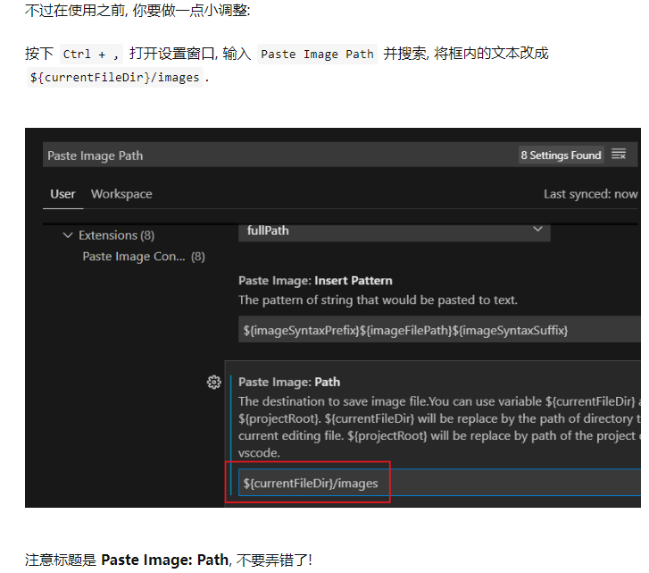

# Markdown For Visual Studio Code

## 换行

这是正文
换了一行？  
换了一行？ ^79d324

又换了一行？ ^748c4b

## 字符

**强调**——加粗——Ctrl + B  
*退退退*——斜体——Ctrl + I  
Alter + Shift + F——格式化  
<u>下划线</u>  
H<sub>2</sub>O  
X<sup>2</sup>  
==文字高亮==

---
<!-- 分割线之前需要空行 -->

## 列表

1. 自动有序编号
2. 有序列表叠加
   1. 子列表1
   2. 子列表2
3. 有序

* 无序列表也可以用——
* 如下
  * 如上

## 注脚

资料[^作者]  

URL: <https://github.com/1625369372>

## 待办

* [ ] sleep  

## 注释

>这是一段注释
<!-- 这是隐藏的注释 -->  
<!-- 多行注释
就像这样 -->

## 颜色

<font face="黑体">黑体</font>  
<font face="微软雅黑">微软雅黑</font>  
<font face="STCAIYUN">华文彩云</font>  
<font color=red>红色</font>  
<font color=#008000>绿色</font>  
<font color=Blue>蓝色</font>  
<font size=5>尺寸</font>  
<font face="黑体" color=green size=5>我是黑体，绿色，尺寸为5</font>  

<table><tr><td bgcolor=purple>背景色：purple</td></tr></table> 

<table><tr><td bgcolor=red><font face="宋体" color=white size=5>宋体白色红底,尺寸为5</font></td></tr></table>

## 链接  

(<https://github.com/1625369372>)  
[Github](https://github.com/1625369372 "我的GitHub主页")  
用 1 作为网址变量 [Google][1]  
用 2 作为网址变量 [RUNOOB][2]

### 链接到当前笔记
  
[公式](#公式)

## 代码

行内代码`char a = 'a'`

```java
char a = 'a';
```

## 图片

^32a4da

### 添加图片文件

添加图片ctrl+alter+v  

*上面是图片*

### 添加图片链接

  


## 公式

$$
x^2+y^2=1
$$  
$$
\begin{cases}
x=\rho\cos\theta \\
y=\rho\sin\theta \\
\end{cases}
$$

在一段文字中插入公式(在之后空一格以提高兼容性)——$\frac{sin(t)}{x}$。  
如上

## 表格

| 字段1 | 字段2 | 字段3 |
| :---- | :---: | ----: |
| 1     |   2   |     3 |

[1]: https://www.google.com/ "Google"  
[2]: http://static.runoob.com/images/runoob-logo.png "RUNOOB"  
[^作者]: 作者。
