# 高数零基础笔记

## 第1章 函数与极限

## 第2章 导数与微分

### 高阶导数

$y^{(n)} = \frac{d^ny}{dx^n}$

莱布尼茨公式（Leibniz）:  
$$
\sum_{k=0}^{n}C^k_nu^{(n-k)}v^{(k)}
$$

定义（高阶导数）：

$$
y^{(n)} = [f^{(n-1)}(x)]'
$$

$$
f^{(n)}(x_0) = \lim_{\Delta x \to 0} \frac{f^{(n-1)}(x_0+\Delta x) - f^{(n-1)}(x_0)}{\Delta x} = \lim_{ x \to x_0} \frac{f^{(n-1)}(x) - f^{(n-1)}(x_0)}{x-x_0}
$$

### 隐函数与参数方程

#### 隐函数

$$
F(x,y) = 0\ \Rightarrow y = f(x)
$$

$$
F(x,f(x)) \equiv 0
$$

例1：求由方程 $y^5 + 2y - x = 0$ 确定的隐函数 $y = f(x)$ 的导数  
Solution：
$$
5y^4y' + 2y -1 = 0
~\\
\Rightarrow y' = \frac{1}{5y^4+2}
$$

例2：设 $y = f(x)$ 由 $y = 1 + xe^{y}$ 所确定, 求 $y = f''(x).$
Solution：
$$
y' = e^y + xy'e^y~\\
\because x = 1\ y=0~\\
\therefore y'(0) = e~\\
y'' = y'e^y + y'e^y + xy''e^y + x(y')^2e^y~\\
\because y''(0) = 2y'(0)e^y~\\
\Rightarrow y''(0) = 2e^2
$$

例3：设 $y= (1 + x^2)^{\sin x}$ ，求 $y'$
Solution：
$$
对数求导法~\\
\ln y = \sin x \ln(1+x^2)~\\
\frac{y'}{y} = \cos x \ln(1+x^2) + \frac{2x\sin x}{1+x^2}~\\
\Rightarrow y' = [(1 + x^2)^{\sin x}][\cos x \ln(1+x^2) + \frac{2x\sin x}{1+x^2}]
$$

例4：设 $y= \sqrt[3]{\frac{x(x^2+1)}{(x^2-1)^2}}$ ，求 $y'$
Solution：

- **$(\ln |x|)' = \frac{1}{x}$**

$$
\ln y = \frac{1}{3} [\ln{|x|}+\ln{(x^2+1)}-2\ln {|x^2-1|}]~\\
\frac{y'}{y} = \frac{1}{3} [\frac{1}{x}+\frac{2x}{x^2+1}-\frac{4x}{x^2-1}]~\\
y'=\frac{1}{3}\sqrt[3]{\frac{x(x^2+1)}{(x^2-1)^2}}[\frac{1}{x}+\frac{2x}{x^2+1}-\frac{4x}{x^2-1}]~\\
$$

#### 参数方程

$设 x = \varphi(t),\ y = \psi(t)\,在\,(\alpha,\beta)\,上可导,\,\varphi'(t) \neq 0,\,则$
$$
\frac{dy}{dx} = \frac{\psi'(t)}{\varphi'(t)}
$$

若 $\psi(t),\,\varphi(t)$ 二阶可导，则

$$
\frac{d^2y}{dx^2} = \frac{d}{dt}[\frac{\psi'(t)}{\varphi'(t)}]\frac{dt}{dx}~\\
=\frac{\psi''(t)\varphi'(t)-\psi'(t)\varphi''(t)}{\varphi'^3(t)}
$$

例5：设 $\begin{cases}y =\ln (1+t^2)\\x=\arctan t\end{cases}$ ，求 $y'$，$y''$
Solution：
$$
\frac{dy}{dx} =  \frac{\frac{2t}{1+t^2}}{\frac{1}{1+t^2}} =2t~\\
\frac{d^2y}{dx^2} = 2\frac{dt}{dx} = \frac{2}{\frac{1}{1+t^2}} =2(1+t^2)~\\
$$

例6: 已知摆线（旋轮线）的参数方程为$\frac{x  (t-\sin t)}{a(1-\cos t)}$
求摆线在 $t = \frac{\pi}{2}$ 处的切线与法线方程
Solution:  
$$
k_切=\frac{dy}{dx}|_{t = \frac{\pi}{2}}=1~\\
x_0=a(\frac{\pi}{2}-1)\,\,\,\, y_0=a~\\
\therefore 切线：y-y_0=(x-x_0)~\\
法线：y-y_0=-(x-x_0)~\\
$$

例7：设有一个倒置的圆锥形容器，其底面圆直径为10cm，高为5cm，现以每秒3cm$^2$给容器中加水.试求 t=1 秒时水面上升的速率.
Solution:  
$$
V(t)=\frac{\pi}{3}\ln^2(t)\ln(t)~\\
\Rightarrow V'(t)=\pi h^2(t)\frac{dh}{dt}~\\
对1秒时,\,dt=1\;\;V'(t)dt=\frac{\pi}{3}h^3(t)~\\
\Rightarrow V(1)=\frac{\pi}{3}h^3(1)~\\
h(1)=\sqrt[3]{\frac{9}{\pi}}~\\
$$

#### 函数的微分

引例：$f(x)=x^2$
$\Delta f(x) = f(x_0+\Delta x)-f(x_0)=2x_0\Delta x+(\Delta x)^2$

定义：若 $f( x_0 + \Delta x ) - f( x_0 )=A\Delta x+o(\Delta x)$
则称$f(x)$在 $x_0$ 点可微，$A\Delta$称为$f(x)$在$x_0$点的微分.
记为 $dy=A\Delta x$
$dy$ 是 $\Delta y$ 的**线性主部**

可导与可微互为**充分必要**条件
$dy=f'(x)\Delta x=f'(x_0)dx$

基本初等函数微分公式：$dy=f'(x)dx$

四则运算法则：
$$
d(u\pm v)=du\pm dv~\\
d(uv)=vdu+udv~\\
d(\frac{u}{v})=\frac{vdu-udv}{v^2}
$$

复合函数微分法则：
$$
设y=f(u)可微,\;u=g(x)可微,则\;y=f[g(x)]可微~\\
且\,dy=y'_uu'_xdx=y'_udu
$$

例1：求微分$y=e^{x+1}cos(x+2)$
Solution:
$$
\because d(uv)=vdu+udv~\\
\therefore dy=e^{x+1}[cos(x+2)-\sin(x+2)]dx~\\
$$

## 第3章 微分中值定理与导数应用

### 微分中值定理

**费马引理**：$若f(x)在x_0处取得极值，且f(x)在x_0处可导，则f'(x)=0$

**罗尔定理**：$若f(x)在[a,b]上连续，在(a,b)上可导，且f(a)=f(b)~\\则\exists\;\xi\in(a,b)，使f'(\xi)=0$

**拉格朗日中值定理**：$若f在[a,b]上连续且在(a,b)上可导~\\则\exists\;\xi\in(a,b)，使f(b)-f(a)=f'(\xi)(b-a)$

例1：试证 $|\sin x - \sin y|\leq|x-y|$

例2：证明，当 $x>0时，\frac{x}{1+x}<\ln{(1+x)}<x.$
Solution：
$$
\ln{(1+x)}-\ln1 = \frac{x}{\xi}~\\
1<\xi<x-1~\\
\therefore \frac{x}{1+x}<\ln{(1+x)}<x
$$

例2：证明，当 $x\in (0,\frac{\pi}{2})时，\arctan x + \arctan{\frac{1}{x}=\frac{\pi}{2}}$
Solution：
$$
令f(x)= \arctan x + \arctan{\frac{1}{x}}~\\
\therefore f'(x)=\frac{1}{x^2+1}+\frac{-\frac{1}{x^2}}{1+(\frac{1}{x})^2}\equiv0~\\
\therefore f(x)=f(1)=\frac{\pi}{2}
$$

**柯西中值定理**：$若f，F在[a,b]上连续，且f，F在(a,b)内可导~\\\forall\;x\in(a,b)，F'(x)\neq0~\\则\exists\xi\in(a,b)，使\frac{f(b)-f(a)}{F(b)-F(a)}=\frac{f'(\xi)}{F'(\xi)}$

### 洛必达法则

$$
若\;1)\;\lim_{x \to x_0}f(x)=\lim_{x \to x_0}g(x)=0;~\\
2)\;f(x)和g(x)在\;\mathring{U}(x_0, \delta)内可导，且g'(x)\neq0;~\\
3)\;\lim_{x \to x_0}{\frac{f'(x)}{g'(x)}}存在（或\infin）~\\
则\;\lim_{x \to x_0}{\frac{f(x)}{g(x)}}=\lim_{x \to x_0}{\frac{f'(x)}{g'(x)}}
$$

**等价无穷小**：
| 原式 | 等价于 |
| :--: | :----: |
| $\sin x$ | $x$ |
| $\tan x$ | $x$ |
| $\arctan x$ | $x$ |
| $\arcsin x$ | $x$ |
| $e^x-1$ | $x$ |
| $\ln{(x+\sqrt{1+x^2})}$ | $x$ |
| $(1+bx)^a$ | $abx$ |
| $1-\cos x$ | $\frac{1}{2}x^2$ |
| $\sec x-1$ | $\frac{1}{2}x^2$ |
| $x-\ln{(1+x)}$ | $\frac{1}{2}x^2$ |
| $x-\sin x$ | $\frac{1}{6}x^3$ |
| $\arcsin x -x$ | $\frac{1}{6}x^3$ |
| $\tan x-x$ | $\frac{1}{3}x^3$ |
| $x-\arctan x$ | $\frac{1}{3}x^3$ |
| $\tan x - \sin x$ | $\frac{1}{2}x^3$ |
| $a^x-1$ | $x\ln a$ |
| $\log_a (1+x)$ | $\frac{x}{\ln a}$ |

例5：求$\,\lim_{x \to 0^+}(x)^{\sin x}$
Solution：
$$
原式=ce^{\sin x\ln x}~\\
\lim_{x \to 0^+}{\sin x\ln x}=\lim_{x \to 0^+}\frac{\cos x}{\frac{1}{x}}=\lim_{x \to 0^+}\frac{\frac{1}{x}}{-\frac{1}{x^2}}=0
$$

例6：求$\,\lim_{x \to +\infin}(\frac{2}{\pi}\arctan x)^{x}$
Solution：
$$
原式=\lim_{x \to +\infin}e^{x\arctan x\ln{\frac{2}{\pi}}}~\\
\lim_{x \to +\infin}{x\arctan x\ln{\frac{2}{\pi}}}=~\\\lim_{x \to +\infin}{\frac{\ln\frac{2}{\pi}\arctan x}{\frac{1}{x}}}=~\\\lim_{x \to +\infin}\frac{\ln \frac{2}{\pi}\frac{1}{1+x^2}}{-\frac{1}{x^2}}~\\=-\frac{2}{\pi}~\\
\therefore 原式=e^{-\frac{2}{\pi}}
$$

使用场景：
$$
\frac{0}{0},\,\frac{\infin}{\infin}\begin{cases}
0 \cdot \infin \begin{cases}
1^{\infin}\\
\infin^{0}\\
0^0\\
\end{cases}\\
\infin - \infin\
\end{cases}
$$

### 泰勒公式

若 $f(x)$ 在 $x_0$ 处可微，则 $\Delta y = dy$
$f(x)\approx f(x_0)+f'(x_0)(x-x_0)$
$f(x)=f(x_0)+f'(x_0)(x-x_0)+o(x-x_0)$

若f(x)在x_0处n阶可微，则
$$
f(x)=\sum_{k=0}^n\frac{f^{(k)}x_0}{k!}(x-x_0)^k+o[(x-x_0)^n]
$$
上式称为带Peano余项的Taylor公式；

$$
P_n(x)=\sum_{k=0}^n\frac{f^{(k)}x_0}{k!}(x-x_0)^k
$$
上式为 $f(x)$ 在 $x_0$ 处 n 阶的Taylor多项式；

$$o[(x-x_0)^n]$$
上式为 $f(x)$ 的 Peano 余项；
其具有缺点：
1）只能给出余项的定性描述，不能进行定量分析；
2）适用范围小。

Taylor定理：设$f(x)$在区间$I$中n+1阶可导，$x_0 \in I$,
$\forall x\in I,\;\exists\,\xi\in I（\xi在x_0与x之间），使$
$$
f(x)=\sum_{k=0}^n\frac{f^{(k)}x_0}{k!}(x-x_0)^k+
\frac{f^{(n+1)}(\xi)}{(n+1)!}(x-x_0)^{n+1}
$$
上式称为带Lagrange余项的Taylor公式；

$$
R_n(x)=\frac{f^{(n+1)}(\xi)}{(n+1)!}(x-x_0)^{n+1}
$$
上式为 $f(x)$ 的 Lagrange 余项；

$$R_n(x)=\frac{f^{(n+1)}[x_0+\theta(x-x_0)]}{(n+1)!}(x-x_0)^{n+1}\quad\theta \in (0,1)$$

Maclaurin公式是零点位置的泰勒公式
$$
When \; x=0,\;则~\\
f(x)=\sum_{n=0}^n\frac{f^{(n)}x_0}{n!}x^n
$$

几个初等函数的 Maclaurin 公式：

$$
1)\,e^x=\sum_{k=0}^n\frac{x^{k}{k!}+\frac{x^{n+1}}{(n+1)!}e^{\theta x}}\quad x\in (-\infin,+\infin)~\\
2)\sin x = \sum_{k=1}^n(-1)^{k-1}\frac{x^{2k-1}}{(2k-1)!}+(-1)^n\frac{\cos \theta x}{(2n+1)!}x^{2n+1}~\\
3)\cos x = \sum_{k=0}^n(-1)^{k}\frac{x^{2k}}{(2k)!}+(-1)^{n+1}\frac{\cos \theta x}{(2n+2)!}x^{2n+2}~\\
4)\ln {(1+x)}=\sum_{k=1}^n(-1)^{k-1}\frac{x^k}{k}+(-1)^{n}\frac{x^{n+1}}{n+1}(1+\theta x)^{-n-1}~\\
5)(1+x)^{\alpha}=\sum_{k=0}^nC_\alpha^kx^k+C_\alpha^{n+1}(1+\theta x)^{\alpha-n-1}x^{n+1}~\\
$$ 

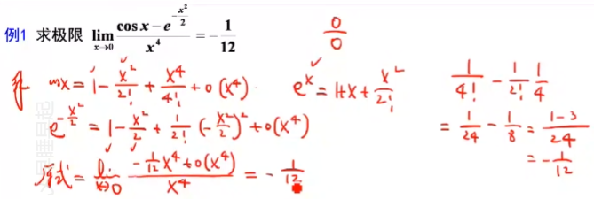

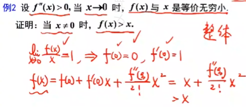

### 函数单调性

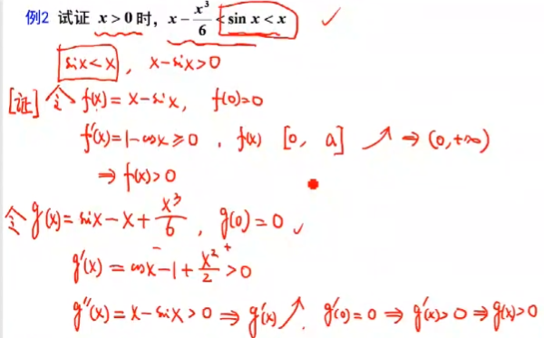

曲线的凹凸性与拐点

若函数$f(x)$在区间$I$上连续，如果对$I$上任意两点$x_1,x_2$恒有
$$
f(\frac{x_1+x_2}{2})<\frac{f(x_1)+f(x_2)}{2}
$$
则称$f(x)$在$I$上的图形是凹的

如果恒有
$$
f(\frac{x_1+x_2}{2})>\frac{f(x_1)+f(x_2)}{2}
$$
则称$f(x)$在$I$上的图形是凸的

若函数$f(x)$在区间$[a,b]$上连续,在$(a,b)$内二阶可导

1. 若在$(a,b)$内$f''(x)>0$，则$f(x)$在$[a,b]$上的图形是凹的
2. 若在$(a,b)$内$f''(x)<0$，则$f(x)$在$[a,b]$上的图形是凸的

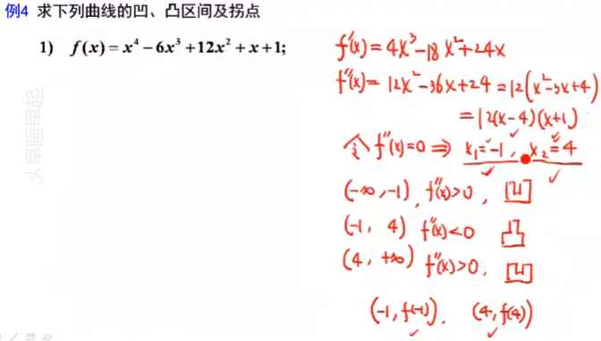

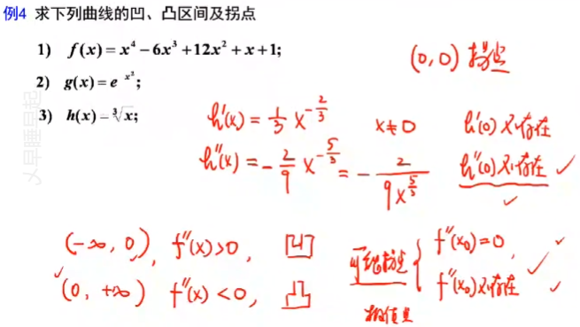

### 函数的极值与最值

#### 极大值和极小值

$$
\forall x \in \mathring{U}(x_0, \delta)恒有f(x)\geq f(x_0)，则称f(x)在
x_0取极小值~\\
\forall x \in \mathring{U}(x_0, \delta)恒有f(x)\leq f(x_0)，则称f(x)在
x_0取极大值~\\
$$

极值的必要条件：
$若f(x)在x_0处可导，且在x_0处取得极值，则f'(x_0)=0$

极值的充分条件（第一充分条件）
$设f(x)在\mathring{U}(x_0, \delta)处可导，且在f'(x_0)=0，则f'(x_0)=0$

1. $若x<x_0时，f'(x)\geq0；x>x_0时，f'(x)\leq0，则f在x_0处取极大值$
2. $若x<x_0时，f'(x)\leq0；x>x_0时，f'(x)\geq0，则f在x_0处取极小值$
3. $若f'(x)在x_0的两侧不变号，则f在x_0无极值$

极值的充分条件（第二充分条件）
$设f'(x)=0，f''(x)\neq0$

1. $当f''(x)<0，f(x)在x_0处取极大值$
2. $当f''(x)>0，f(x)在x_0处取极小值$

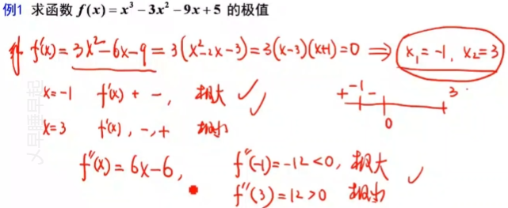

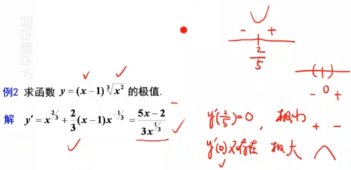

#### 最大值和最小值

求连续函数$f(x)$在$[a,b]$上的最值

1. 求出$f(x)$在$(a,b)$内的驻点和不可导的点
2. 求出函数值
3. 比较以上各点函数值

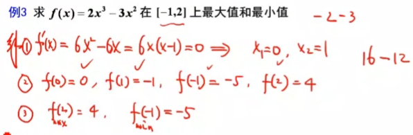

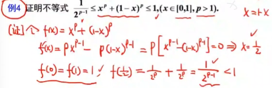

### 函数图形的描绘

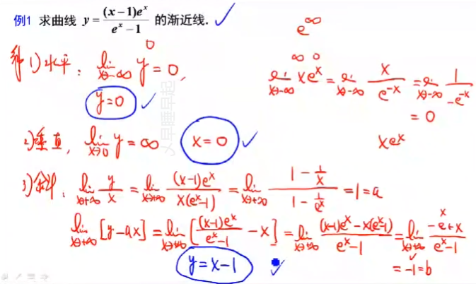

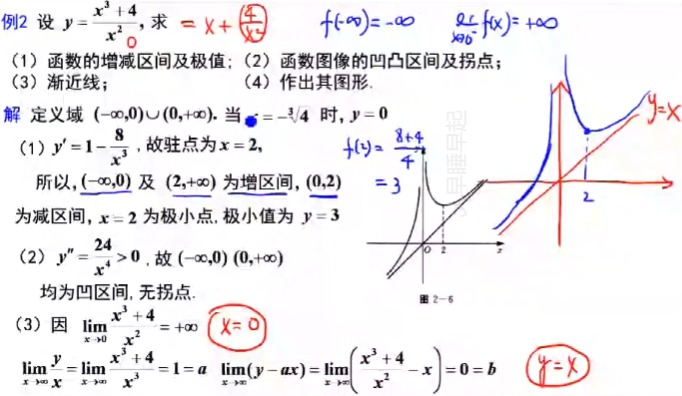

### 曲率

## 不定积分

### 不定积分的概念与性质

**原函数存在定理**：
$若f(x)在区间I连续，则f(x)在区间I上一定存在原函数$

**不定积分定义**：
$f(x)在区间I上所有原函数的一般表达式$
$$
\int f(x)dx=F(x)+C
$$

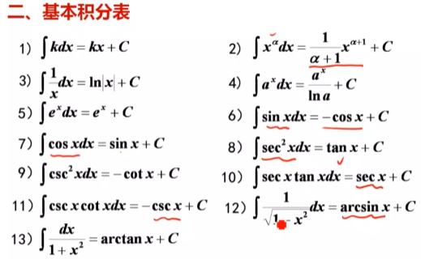

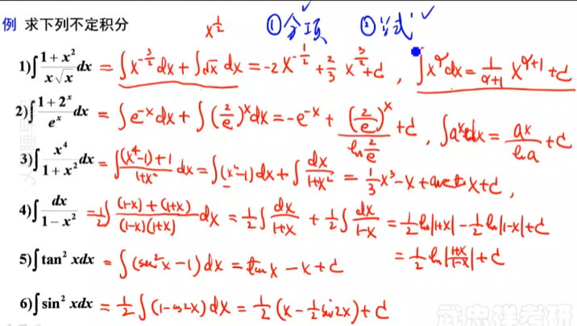

### 换元定积分法

#### 第一类换元法

定理1：
$$
若\int f(u)du=F(u)+C~\\
则\int f[\varphi(x)]\varphi'(x)dx=\int f[\varphi(x)]d\varphi(x)=F[\varphi(x)]+C
$$

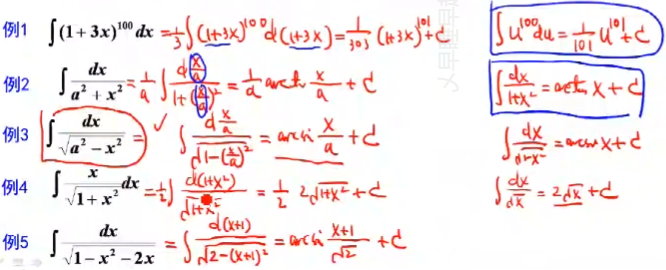

