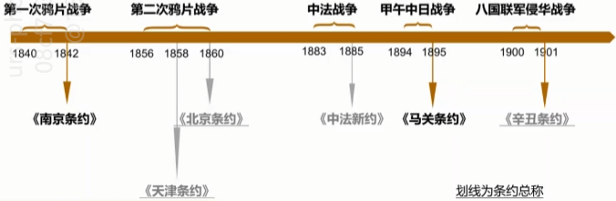
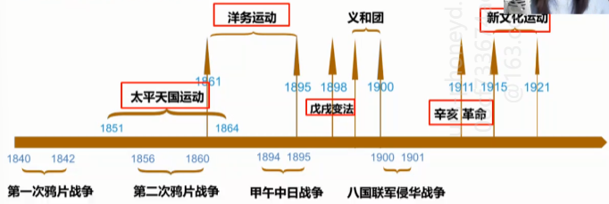
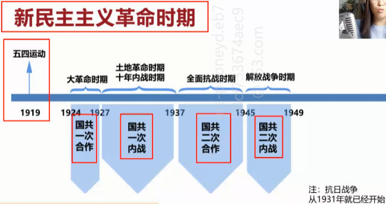

### 五种社会形态
原始社会  
奴隶社会(人身依附)  
封建社会  
资本主义社会(资本依附)  
社会主义社会  
**规律-无法创造or毁灭or改变**  

### 社会形态更迭

生产力与生产关系相互作用

*生产关系越先进,越可以促进生产力?* ==X==  

**生产力三要素**
$
\begin{cases}
劳动者-> 主体   \\
劳动资料 -> 客体 \\
劳动对象 -> 中介
\end{cases}
$

**生产关系**
$
\begin{cases}
生产资料归谁   \\
生产中人与人的关系 \\
产品分配关系
\end{cases}
$

### 不同社会制度

|              |                    |          |            |
|:------------:|:------------------:|:--------:|:----------:|
| 封建主义社会 | 封建地主土地所有制 | 地主阶级 |    皇权    |
| 资本主义社会 |   生产资料私有制   | 资产阶级 | 少数资本家 |
| 社会主义社会 |   生产资料公有制   | 无产阶级 |    人民    |

中国无产阶级产生----19世纪40-50年代

无产--没有生产资料  
劳动对象+劳动资料

无产阶级=工人阶级(在考研中)  
**代表谁的利益,就是什么阶级**

**生产资料**
$
\begin{cases}
劳动对象   \\
劳动资料
\end{cases}
$

## 世界资本主义制度的建立与发展

### 资产阶级革命

英国: 17世纪, 世界上第一个建立近代政治制度的国家  
美国: 18世纪. 推翻英国殖民统治, 建立近代政治体制  
法国: 19世纪, 结束了君主专制统治, 建立共和政体  
日本: 19世纪, 明治维新, 走上了资本主义道路  

### 工业革命  

18世纪60年代 - 20世纪初  
从手工劳动转向机器生产
建立资本主义大工厂制度  
**资产阶级** 和 **无产阶级** 逐渐成为社会两大阶级  
以工厂为中心开始形成城市  
世界的联系日益紧密

### 鸦片战争前的中国

满清王朝（还能做到GDP第一）  
经济:自然经济  
政治:中央集权、民族差异  
文化:封闭落后  
军事:腐败废弛  
外交:天下体系

### 鸦片战争 - 打开中国国门
**中国近代史的起点**  
1840-1842  
清政府战败，签 **《南京条约》**  
(1) 割让香港岛;  
(2) 赔偿鸦片烟价、商欠、军费2100万银元;  
(3) 开放广州、福州、厦门、宁波、上海为通商口岸，允许英人居住并设派领事;  
(4) 协定关税，中国海关无权自主;  

### 近代中国第一批不平等条约

英国
$
\begin{cases}
1842 《南京条约》（近代第一个不平等条约）   \\
1843 《虎门条约》、《五口通商章程》——（《南京条约补充条约》）
\end{cases}
$  
美国 —— 1844 《望厦条约》  
法国 —— 1844 《黄埔条约》  

### 帝国主义的侵略  

第一次鸦片战争——**开始**沦为半殖民地半封建国家  
第二次鸦片战争——**加深**沦为半殖民地半封建国家  
马关条约——中国半殖民地半封建程度**大大加深**  
辛丑条约——**彻底**沦为半殖民地半封建国家  

### 近代中国主要矛盾  

帝国主义 VS 中华民族$\,$最主要的  
封建主义 VS 人民大众  
贯穿整个中国半殖民地半封建社会的始终  
对中国近代社会的发展变化起着决定性的作用
>1840~1949

### 近代中国两大任务  

争取民族独立、人民解放  
实现国家富强人民富裕

### 近代化的探索

### 新民主主义革命

  
